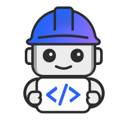

# Agentic SDLC

Automate the entire software development lifecycle with IBM Bob, an IDE-native agentic AI that transforms natural language requirements into production-grade code, services, and complete projects.

## Why This Matters

- **Manual coding is slow and repetitive.** Developers spend significant time on boilerplate, documentation, and routine refactoring instead of solving business problems.
- **Context switching breaks flow.** Moving between IDE, documentation, Stack Overflow, and code reviews fragments developer attention and reduces productivity.
- **Code quality degrades over time.** Without continuous refactoring and review, technical debt accumulates and maintenance becomes increasingly difficult.
- **Enterprise standards are hard to enforce.** Ensuring code follows organizational patterns, security practices, and style guides requires constant vigilance.
- **CI/CD pipelines need manual intervention.** Build failures, test issues, and deployment problems require developers to context-switch and troubleshoot.

## What's Covered

| Component | What It Provides |
|-----------|-----------------|
| **[IBM Bob](#powered-by-ibm-bob)** | IDE-native agentic AI for software development automation |
| **[Key Features & Capabilities](#key-features--capabilities)** | Intent-to-software generation, development modes, code intelligence, and CI/CD integration |

---

## Powered by IBM Bob

  

Agent Harness is powered by **IBM Bob**, an IDE-native agentic AI that serves as your SDLC partner, embedded directly in developer workflows with deep, continuous awareness of real codebases.

**What Makes Bob Different:**

- **IDE-Native** - Works directly in VS Code, not as a separate tool
- **Context-Aware** - Maintains continuous understanding of your entire codebase
- **Mode-Based** - Specialized modes for different development tasks
- **Pipeline-Integrated** - Extends beyond IDE into terminals and CI/CD
- **Enterprise-Ready** - Supports organizational standards and governance

---

## Key Features & Capabilities

### Intent-to-Software Generation

Transform natural language requirements into production-ready code:

- **Natural Language Input** - Describe what you want in plain English
- **Context-Aware Generation** - Code aligns with repository structure and dependencies
- **Complete Projects** - Generate entire applications, not just snippets
- **Incremental Development** - Extend existing systems with new features
- **Multiple Languages** - Support for Python, JavaScript, Java, Go, and more

### Agentic Development Modes

Purpose-built modes define Bob's behavior for different development tasks:

| Mode | Purpose | Use When |
|------|---------|----------|
| **Code Mode** | Create new code from requirements | Building new features or applications |
| **Ask Mode** | Refactor or enhance existing code | Improving code quality or adding functionality |
| **Plan Mode** | Design and strategize before implementation | Planning architecture or complex changes |
| **Advanced Mode** | Access to MCP and Browser tools | Complex integrations or web interactions |
| **Orchestrator Mode** | Coordinate multi-step workflows | Managing complex, multi-phase development tasks |

Modes enable efficient development without changing how developers communicate.

### In-Context Code Intelligence

Maintain continuous awareness of your codebase:

- **Full Repository Understanding** - Bob knows your entire project structure
- **Dependency Tracking** - Understands relationships between files and modules
- **Safe Refactoring** - Changes consider downstream impacts
- **Accurate Generation** - New code follows existing patterns and conventions
- **Error Prevention** - Reduces bugs from incomplete context

### Real-Time Code Review & Refactoring

Automated code quality and improvement:

- **Inline Analysis** - Detect complexity issues, code smells, and anti-patterns
- **Refactoring Suggestions** - Actionable recommendations to reduce technical debt
- **Security Scanning** - Identify potential security vulnerabilities
- **Performance Optimization** - Suggest improvements for better performance
- **Style Enforcement** - Ensure code follows organizational standards

### Pipeline-Wide Integration

Extend AI assistance beyond the IDE:

- **Terminal Integration** - AI assistance in command-line workflows
- **CI/CD Automation** - Automated build, test, and release support
- **Git Integration** - Intelligent commit messages and PR descriptions
- **Test Generation** - Automatic test creation and maintenance
- **Documentation** - Generate and update documentation automatically

---

## Use Cases

- **Greenfield Development** - Generate complete applications from requirements and architecture descriptions
- **Legacy Modernization** - Refactor and restructure legacy code with automated documentation updates
- **Feature Development** - Implement new features faster with fewer regressions
- **Code Quality** - Automated refactoring and debugging to reduce manual effort
- **Documentation** - Generate documentation from existing codebases for better maintainability
- **CI/CD Automation** - Automate repetitive engineering tasks and boilerplate code

---

## Resources

- **[Bob Website](https://bob.ibm.com/)** - Learn more about IBM Bob and its capabilities
- **[Download Bob](https://bob.ibm.com/download)** - Get started with IBM Bob for VS Code

!!! info "GitHub Repository"
    [Agentic SDLC Assets](https://github.com/ibm-self-serve-assets/building-blocks/tree/main/agents/agentic-sdlc)