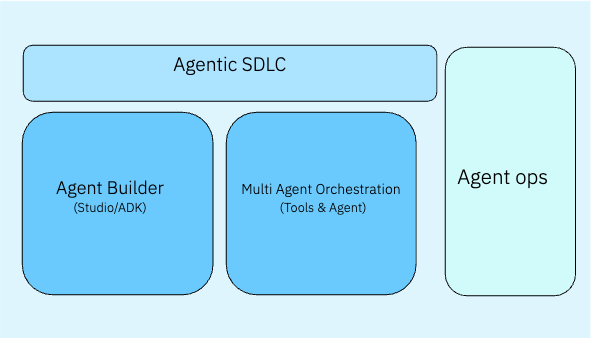

# Agents – AI Building Blocks

Enterprise-ready AI agents that automate business workflows, orchestrate complex tasks, and accelerate software development through intelligent automation. These building blocks provide the foundation for creating, deploying, and managing autonomous AI agents that integrate seamlessly with enterprise systems.

!!! info "GitHub Repository"
    The complete source code and examples are available in the GitHub repository:
    
    **[Agents Building Blocks](https://github.com/ibm-self-serve-assets/building-blocks/tree/main/agents)**

---

## Overview

The Agents building blocks provide ready-to-use accelerators that make it easier to operationalize AI and GenAI use cases. Each accelerator addresses a critical capability required to build, integrate, and scale AI-driven applications. These accelerators are designed to integrate seamlessly with enterprise systems, reducing time-to-value for AI projects. By standardizing agent creation, orchestration, and governance, the framework ensures scalability, trust, and efficiency across diverse workloads.

---

## Architecture

The Agents framework is organized into three core capabilities that work together to enable intelligent automation:

The architecture consists of:

- **Agent Builder (Studio/ADK)** - Create and deploy autonomous AI agents using the watsonx Orchestrate Agentic Development Kit
- **Multi-Agent Orchestration (Tools & Agent)** - Coordinate multiple specialized agents to collaborate on complex workflows
- **Agentic SDLC** - Automate software development lifecycle with IBM Bob
- **Agent Ops** - Evaluate, monitor, and optimize agents throughout their lifecycle

---

## Building Blocks

### [Agent Builder](agent-builder.md)

Create and deploy autonomous AI agents that interact with enterprise applications, tools, and data using the watsonx Orchestrate Agentic Development Kit (ADK).

**Key Features:**

- **Python-based ADK** - Build agents using Python library and CLI tools
- **Tool Integration** - Connect agents to enterprise systems and APIs
- **Prompt Configuration** - Define agent instructions, rules, and boundaries
- **Lifecycle Management** - Version, test, and deploy agents with confidence
- **Developer Edition** - Local development and rapid iteration

**Use Cases:**

- Customer service automation
- HR process automation
- IT support and troubleshooting
- Data analysis and reporting
- Workflow orchestration

---

### [Multi-Agent Orchestration](multi-agent-orchestration.md)

Coordinate multiple AI agents to collaborate intelligently on complex enterprise workflows, with support for external system integration through MCP and A2A protocols.

**Key Features:**

- **Dynamic Task Delegation** - Automatically route tasks to specialized agents
- **Shared Memory & Context** - Agents exchange knowledge through unified memory
- **Chained Reasoning** - Combine outputs from multiple agents
- **MCP Integration** - Connect to external systems via Model Context Protocol
- **A2A Protocol** - Enable agent-to-agent communication across platforms

**Use Cases:**

- Cross-functional business processes
- Complex decision-making workflows
- Enterprise data access and synchronization
- Distributed agent systems
- Third-party agent integration

---

### [Agentic SDLC](agentic-sdlc.md)

Transform software development with IBM Bob, an IDE-native agentic AI that automates the entire software development lifecycle from intent to production-ready code.

**Key Features:**

- **Intent-to-Software Generation** - Natural language to production code
- **Agentic Development Modes** - Specialized modes for different tasks
- **In-Context Code Intelligence** - Continuous codebase awareness
- **Real-Time Code Review** - Automated refactoring and quality checks
- **Pipeline Integration** - CI/CD automation and testing

**Use Cases:**

- Greenfield application development
- Legacy code modernization
- Feature development and enhancement
- Documentation generation
- CI/CD workflow automation

---

## Key Capabilities

### Agent Development

- **Low-Code Agent Creation** - Build agents with minimal coding using ADK
- **Tool & API Integration** - Connect agents to enterprise systems
- **Prompt Engineering** - Configure agent behavior and instructions
- **Testing & Validation** - Evaluate agent performance before deployment
- **Version Control** - Manage agent configurations as code

### Agent Orchestration

- **Multi-Agent Coordination** - Orchestrate multiple specialized agents
- **Context Management** - Share knowledge across agent interactions
- **Task Routing** - Intelligently delegate tasks to appropriate agents
- **External Integration** - Connect to systems via MCP and A2A protocols
- **Human-in-the-Loop** - Escalate to humans when needed

### Development Automation

- **Code Generation** - Transform requirements into production code
- **Refactoring** - Automated code improvement and modernization
- **Code Review** - AI-assisted quality and security analysis
- **Documentation** - Automatic documentation generation
- **CI/CD Integration** - Automated testing and deployment

---

## Getting Started

1. Choose the building block that matches your current need.
2. Explore the **assets** folder in the repository for ready-to-use code samples and SDKs.
3. Check **bob-modes** for AI-assisted agent development workflows.

!!! info "GitHub Repository"
    [Agents Building Blocks](https://github.com/ibm-self-serve-assets/building-blocks/tree/main/agents)
