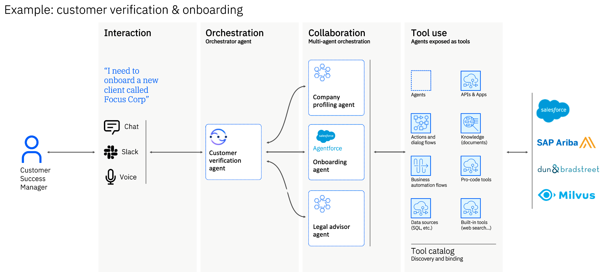

# Multi-Agent Orchestration

Coordinate multiple AI agents to collaborate intelligently on complex enterprise workflows, with support for external system integration through MCP and A2A protocols.

## Why This Matters

- **Single agents hit complexity limits.** Complex business processes span multiple domains—HR, IT, Finance, Legal—and no single agent can master all of them effectively.
- **Manual coordination doesn't scale.** Hand-coding agent interactions, context passing, and error handling creates brittle workflows that break when requirements change.
- **Enterprise systems are distributed.** Business data and logic live across Salesforce, SAP, Workday, and custom applications—agents need seamless access to all of them.
- **Cross-platform collaboration is hard.** Agents built on different frameworks (LangChain, CrewAI, custom) can't easily work together without standardized protocols.
- **Governance requires orchestration.** Multi-agent systems need centralized coordination, monitoring, and audit trails to maintain control and compliance.

## What's Covered

| Component | What It Provides |
|-----------|-----------------|
| **[Orchestration Flow](#orchestration-flow)** | Example showing customer verification and onboarding workflow |
| **[Key Capabilities](#key-capabilities)** | Dynamic task delegation, shared memory, chained reasoning, and external integration |
| **[Integration Standards](#integration-standards)** | MCP and A2A protocols for external system and agent collaboration |

---

## Orchestration Flow

Multi-agent orchestration enables seamless collaboration across specialized agents to handle complex workflows.

**Example: Customer Verification & Onboarding**

This workflow demonstrates how multiple agents collaborate to onboard a new client:

1. **Interaction** 
   - Customer Success Manager initiates request via Chat, Slack, or Voice
2. **Orchestration** 
   - Customer verification agent coordinates the workflow
3. **Collaboration** 
   - Specialized agents work together:
   - Company profiling agent - Gathers business information
   - Agentforce onboarding agent - Handles Salesforce integration
   - Legal advisor agent - Reviews compliance requirements
4. **Tool Use** 
   - Agents leverage various tools and systems:
   - APIs & Apps (Salesforce, SAP Ariba, Dun & Bradstreet, Milvus)
   - Actions and dialog flows
   - Knowledge bases and documents
   - Business automation flows
   - Data sources (SQL, etc.)
   - Built-in tools (web search, etc.)

---

## Key Capabilities

### Dynamic Task Delegation

Automatically route tasks to the most capable agent or external system:

- **Intelligent Routing** - Analyze task requirements and agent capabilities
- **Load Balancing** - Distribute work across available agents
- **MCP/A2A Integration** - Delegate to external systems when needed
- **Fallback Handling** - Reroute tasks when agents are unavailable

### Shared Memory & Context

Enable agents to exchange knowledge through unified memory:

- **Context Preservation** - Maintain conversation history across agent handoffs
- **Structured Knowledge** - Share data in standardized formats
- **Memory Layers** - Short-term (conversation) and long-term (knowledge base) memory
- **Cross-Agent Access** - All agents can read and write to shared context

### Chained Reasoning

Combine outputs from multiple agents for comprehensive responses:

- **Sequential Processing** - Pass results from one agent to the next
- **Parallel Execution** - Run multiple agents simultaneously
- **Result Synthesis** - Combine insights from different agents
- **Confidence Scoring** - Aggregate confidence levels across agents

### Goal-Driven Execution

Orchestrate end-to-end workflows from intent to completion:

- **Intent Detection** - Understand user goals and requirements
- **Task Decomposition** - Break complex goals into subtasks
- **Progress Tracking** - Monitor workflow execution status
- **Error Recovery** - Handle failures and retry logic

### External System Integration

**MCP Servers** - Connect to external systems and data sources:

- Secure gateways for enterprise systems
- Protocol mediation and data transformation
- Event bridging for real-time updates
- Controlled access to sensitive data

**A2A Servers** - Enable agent-to-agent collaboration:

- Workflow extension across platforms
- Transaction orchestration
- Scalable integration patterns
- Third-party agent discovery and binding

---

## Core Principles

### Interoperability
- Enable agents built on any framework to communicate and collaborate
- Support different agent styles (Default, ReAct, Planner) for task resolution

### Standardization
- Provide consistent interfaces and protocols using MCP and A2A standards
- Ensure predictable behavior across agent interactions

### Extensibility
- Allow for future expansion as agent technologies evolve
- Support new agent types and integration patterns

### Simplicity
- Make integration straightforward for business users and developers
- Minimize configuration and setup complexity

### Security
- Ensure secure communication and data handling between agents
- Implement authentication, authorization, and audit logging

---

## Use Cases

- **Employee Onboarding** - HR agent coordinates with IT and Finance agents for complete onboarding workflow
- **Customer Verification** - Verification agent collaborates with profiling, onboarding, and legal agents
- **Complex Decision-Making** - Multiple specialized agents analyze different aspects of business problems
- **Enterprise Data Access** - Agents connect to databases, knowledge bases, and document repositories via MCP
- **Cross-Platform Collaboration** - Agents built on different frameworks work together through A2A protocol
- **Third-Party Integration** - External AI agents join orchestrated workflows seamlessly

---

## Resources

- **[Bob Mode for Multi-Agent Orchestration](https://github.com/ibm-self-serve-assets/building-blocks/tree/main/agents/multi-agent-orchestration/bob-modes)** - AI-assisted workflow for building multi-agent systems

!!! info "GitHub Repository"
    [Multi-Agent Orchestration Assets](https://github.com/ibm-self-serve-assets/building-blocks/tree/main/agents/multi-agent-orchestration)