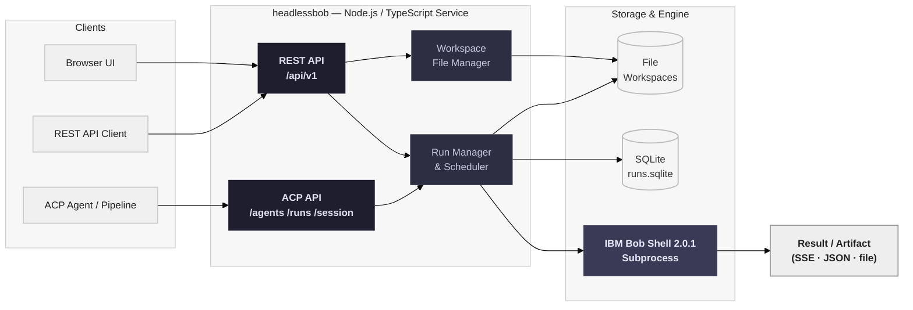

# Headless Bob

IBM Bob was built for the IDE — but engineering work doesn't stop at the developer's desk. The **Headless Bob building block** is the pattern for running Bob outside the IDE: in CI/CD pipelines, automation scripts, Slack workflows, and any system that needs to call Bob programmatically without a developer actively present.

The reference implementation is **headlessbob** — a TypeScript/Node.js service that runs **IBM Bob Shell 2.0.1** and exposes it through native **Agent Communication Protocol (ACP) 0.2.0** and thread-based **REST APIs**, with an integrated browser UI. Bob is the execution engine; no VS Code, Codex runtime, or OpenAI account is involved.

## Why This Matters

- **Not all engineering work happens interactively.** Code reviews, test generation, documentation sync, dependency audits, and deployment validations are repeatable tasks that should run automatically — not wait for a developer to open an IDE. Headless Bob makes these tasks a first-class engineering concern.
- **Bob needs an API boundary for automation.** Teams integrating Bob into CI pipelines, scheduled jobs, or multi-system workflows need a stable REST surface to call — headlessbob provides that boundary, wrapping Bob Shell in a managed, authenticated API without requiring changes to Bob itself.
- **Multi-agent interoperability requires a standard protocol.** ACP 0.2.0 lets any ACP-compatible agent or pipeline discover Bob, submit tasks, and consume results in a standardized way — making Headless Bob a first-class node in multi-agent architectures.
- **AI calls are asynchronous by nature.** Bob runs can take seconds to minutes depending on task complexity. Headless execution requires a queue-and-poll model — or live streaming — so systems can submit work and retrieve results without holding connections or blocking pipelines.
- **Persistent conversations enable multi-turn workflows.** Thread-based sessions carry workspace context across runs, letting Bob build on previous work — essential for iterative tasks like code generation, refactoring, and incremental deployments.
- **Visibility into cost and execution matters at scale.** headlessbob captures token counts, execution duration, tool call metrics, and session cost per run — giving teams the observability they need to govern autonomous Bob usage.

## What's Covered

| Area | What It Covers |
|------|---------------|
| **[How headlessbob Works](#how-headlessbob-works)** | Architecture: ACP + REST APIs, run manager, SQLite, workspace model, browser UI |
| **[Interaction Modes](#interaction-modes)** | Sync, async, and stream execution modes via ACP and REST |
| **[Browser UI](#integrated-browser-ui)** | Built-in chat interface with live streaming, file explorer, and run diagnostics |
| **[REST API Reference](#rest-api-reference)** | Full `/api/v1` endpoint surface for threads, runs, and files |
| **[ACP API Reference](#acp-api-reference)** | ACP 0.2.0 endpoints for agent discovery, runs, sessions, and events |
| **[Deployment](#deployment)** | Local (Node.js), Docker, and OpenShift setup |
| **[Client Examples](#client-examples)** | Python standard-library clients for REST, ACP, and cancellation |
| **[Use Cases](#use-cases)** | CI/CD integration, Slack automation, multi-agent orchestration |
| **[Bob Skills & Modes](#bob-skills)** | AI-assisted workflows for configuring headless pipelines from your IDE |

---

## How headlessbob Works

headlessbob sits between any API client and Bob Shell. Clients authenticate with a bearer token, submit work via REST or ACP, and receive results synchronously, asynchronously, or via live SSE streaming. Bob Shell runs in an isolated workspace directory per session, with all generated artifacts available for download.



**Key design decisions:**

- **TypeScript/Node.js runtime** — headlessbob is a Node.js 22.22+ service. Bob Shell 2.0.1 runs as a managed subprocess within it.
- **Dual protocol surface** — ACP 0.2.0 endpoints (`/agents`, `/runs`, `/session`) for agent interoperability, plus thread-based REST (`/api/v1`) for direct integration. Both share the same run manager and workspace layer.
- **Workspace isolation** — every session gets its own UUID workspace directory under `DATA_DIR/workspaces`. Bob's internal history lives under `$HOME/.bob`.
- **SQLite persistence** — run metadata, session ownership, task mappings, and ordered events are stored in `DATA_DIR/runs.sqlite`. Conversations survive service restarts.
- **Bearer token auth** — all endpoints require `Authorization: Bearer <TOKEN>`. Tokens are configured in `AUTH_TOKENS` in `.env`. No external IdP required.
- **Bounded resource usage** — concurrency, queue depth, timeouts, output buffer sizes, and Bob cost limits are all configurable and strictly enforced.

---

## Interaction Modes

headlessbob exposes Bob through three execution modes, available via both ACP and REST interfaces.

| Mode | What It Is | Use When |
|------|-----------|----------|
| **⚡ Sync** | Submit a task and wait — the HTTP response returns only after Bob completes. Returns full output and usage metrics in one response | Short tasks where the caller can hold the connection; simple integrations that don't need polling logic |
| **📡 Stream** | Submit a task and receive live output via Server-Sent Events (SSE). Text chunks and lifecycle events arrive in real time | Interactive integrations, browser UIs, Slack bots — any context where live feedback matters |
| **🔄 Async** | Submit a task and receive a `run_id` immediately (HTTP 202). Poll `/runs/{run_id}` for status, or consume `/runs/{run_id}/events` for SSE replay | CI/CD pipelines, scheduled jobs, long-running tasks — any system that cannot hold an HTTP connection |

**Multi-turn session continuation** — pass the `session_id` returned from any run back into a new run request. Bob resumes in the same workspace, retaining all generated files and context from previous turns.

---

## Integrated Browser UI

Open your deployment URL (or `http://127.0.0.1:8000` locally). The root page serves an interactive chat interface — no separate frontend deployment needed.

Connect using your **service token** (the `owner` key in `AUTH_TOKENS`). The token is held only in browser session memory — reloading or clicking Disconnect clears it.

### UI Features

| Feature | Description |
|---------|-------------|
| **Conversation Management** | Create, rename, search, archive/restore, and delete threads |
| **Live Output Streaming** | Real-time message streaming with sanitized Markdown rendering — headings, tables, syntax-highlighted code blocks |
| **Execution Controls** | Real-time **Cancel run** button to terminate active or queued runs immediately |
| **Workspace File Explorer** | Right-hand panel to browse all files generated by Bob in the workspace — download any file with one click |
| **Run Diagnostics & Cost** | Inspect full run JSON, tool calls, execution duration, and token/cost statistics reported by Bob Shell |
| **Integrated API Docs** | One-click modal linking to interactive OpenAPI specifications (`/api/openapi.json`, `/acp/openapi.json`) and downloadable Python samples |

---

## REST API Reference

All REST endpoints require `Authorization: Bearer <TOKEN>` and return structured JSON. Send an `Idempotency-Key` header when posting messages to safely retry without duplicate executions.

### Capabilities & Health

| Method | Path | Description |
|--------|------|-------------|
| `GET` | `/api/v1/capabilities` | Caller identity, readiness, features, and operational limits |
| `GET` | `/ping`, `/healthz` | Unauthenticated liveness probes |
| `GET` | `/readyz` | Authenticated Bob executable/version/key readiness check |

### Threads

| Method | Path | Description |
|--------|------|-------------|
| `POST` | `/api/v1/threads` | Create a thread — `{}` or `{"title":"Project Name"}` |
| `GET` | `/api/v1/threads` | List/search threads (`q`, `archived`, `limit`, `cursor`) |
| `GET` | `/api/v1/threads/{id}` | Retrieve thread metadata and status |
| `PATCH` | `/api/v1/threads/{id}` | Update `title` and/or `archived` state |
| `DELETE` | `/api/v1/threads/{id}` | Delete thread conversation records (returns 204) |
| `POST` | `/api/v1/threads/{id}/messages` | Send `{"content":"Your prompt"}` — returns 202 with run ID and events URL |
| `GET` | `/api/v1/threads/{id}/messages` | Read conversation turns (`limit`, `before`) |

### Runs

| Method | Path | Description |
|--------|------|-------------|
| `GET` | `/api/v1/runs/{id}` | Check run status, output, errors, and usage metrics |
| `GET` | `/api/v1/runs/{id}/events` | Live SSE stream with replay cursor support (`?after=` or `Last-Event-ID`) |
| `POST` | `/api/v1/runs/{id}/cancel` | Request cancellation of an active run |

### Workspace Files

| Method | Path | Description |
|--------|------|-------------|
| `GET` | `/api/v1/threads/{id}/files` | List files generated in the thread's workspace (`?path=folder`) |
| `GET` | `/api/v1/threads/{id}/files/{path}` | Download a workspace file as a binary attachment |

---

## ACP API Reference

headlessbob natively implements the text subset of **ACP 0.2.0**. ACP endpoints live at root routes and do not carry the `/api/v1` prefix. OpenAPI spec available at `/acp/openapi.json`.

For full protocol details, see the [IBM Bob ACP Documentation](https://bob.ibm.com/docs/shell/features/acp).

### Agent Discovery

| Method | Path | Description |
|--------|------|-------------|
| `GET` | `/agents` | Agent discovery — lists available agents |
| `GET` | `/agents/headlessbob` | Detailed agent capability manifest |

### Runs

| Method | Path | Description |
|--------|------|-------------|
| `POST` | `/runs` | Create a run — `mode: "sync"`, `"async"`, or `"stream"` |
| `GET` | `/runs/{run_id}` | Poll run status, output text, and usage metrics |
| `GET` | `/runs/{run_id}/events` | Fetch stored ACP JSON events in execution sequence |
| `POST` | `/runs/{run_id}/cancel` | Cancel an in-flight ACP run (returns HTTP 202) |

### Sessions

| Method | Path | Description |
|--------|------|-------------|
| `GET` | `/session/{session_id}` | Retrieve session workspace ID and run history URNs |
| `DELETE` | `/session/{session_id}` | Terminate an ACP session |

### ACP Run Modes — Quick Reference

**Synchronous** — waits for full completion:
```bash
curl -s -H "Authorization: Bearer $TOKEN" -H "Content-Type: application/json" \
  "$BASE/runs" -d '{
    "agent_name": "headlessbob",
    "input": [{"role": "user", "parts": [{"content_type": "text/plain", "content": "Create a file named hello.txt with content Hello World"}]}],
    "mode": "sync"
  }' | jq .
```

**Streaming** — live SSE output:
```bash
curl -N -s -H "Authorization: Bearer $TOKEN" -H "Content-Type: application/json" \
  "$BASE/runs" -d '{
    "agent_name": "headlessbob",
    "input": [{"role": "user", "parts": [{"content_type": "text/plain", "content": "Write a Python script that computes Fibonacci numbers."}]}],
    "mode": "stream"
  }'
```

**Asynchronous** — fire-and-poll:
```bash
# Start async run
RUN_RESP=$(curl -s -H "Authorization: Bearer $TOKEN" -H "Content-Type: application/json" \
  "$BASE/runs" -d '{
    "agent_name": "headlessbob",
    "input": [{"role": "user", "parts": [{"content_type": "text/plain", "content": "Analyze project files"}]}],
    "mode": "async"
  }')
RUN_ID=$(echo $RUN_RESP | jq -r .run_id)
SESSION_ID=$(echo $RUN_RESP | jq -r .session_id)

# Poll status
curl -s -H "Authorization: Bearer $TOKEN" "$BASE/runs/$RUN_ID" | jq .

# Fetch all recorded events
curl -s -H "Authorization: Bearer $TOKEN" "$BASE/runs/$RUN_ID/events" | jq .
```

**Multi-turn session continuation** — pass `session_id` to resume in the same workspace:
```bash
curl -s -H "Authorization: Bearer $TOKEN" -H "Content-Type: application/json" \
  "$BASE/runs" -d "{
    \"agent_name\": \"headlessbob\",
    \"session_id\": \"$SESSION_ID\",
    \"input\": [{\"role\": \"user\", \"parts\": [{\"content_type\": \"text/plain\", \"content\": \"Now add unit tests for the code generated earlier.\"}]}],
    \"mode\": \"sync\"
  }" | jq .
```

---

## Deployment

### Prerequisites

- Node.js 22.22 or newer
- Licensed **IBM Bob Shell 2.0.1** binary on your `PATH`
- `BOB_API_KEY` configured with valid credentials

### Key Configuration

| Variable | Default | Description |
|----------|---------|-------------|
| `BOB_API_KEY` | — | **Required.** Bob Shell authentication key |
| `AUTH_TOKENS` | — | **Required.** Bearer tokens for service access (JSON object — `owner` key is the UI token) |
| `DATA_DIR` | `./data` | Root for SQLite database and all Bob run workspaces |
| `CONCURRENCY` | `2` | Maximum concurrent Bob runs |
| `QUEUE_LIMIT` | `100` | Maximum queued tasks |
| `TIMEOUT_SECONDS` | `300` | Maximum runtime per Bob job |
| `MAX_TURNS` | `20` | Maximum conversation turns per run |
| `BOB_COST_LIMIT` | `1.00` | Maximum Bob cost (USD) per run |
| `KILL_GRACE_MS` | — | Grace period between SIGTERM and SIGKILL for subprocess cleanup |

### Local (Node.js)

```bash
cd assets/headlessbob
npm ci
cp .env.example .env
# Edit .env: set BOB_API_KEY and AUTH_TOKENS
npm run build
npm start
```

Access the UI at `http://127.0.0.1:8000`. Connect using your `owner` service token.

Run the test suite:
```bash
npm run check   # TypeScript type-check and fixture/HTTP unit tests
npm run smoke   # End-to-end smoke test invoking real Bob binary (consumes small credit)
```

### Docker

```bash
docker build -t headlessbob assets/headlessbob
docker run -d -p 8000:8000 \
  -e BOB_API_KEY="your-key" \
  -e AUTH_TOKENS='{"owner":"your-service-token"}' \
  headlessbob
```

### OpenShift

OpenShift manifests are in [`assets/headlessbob/openshift/`](https://github.com/ibm-self-serve-assets/building-blocks/tree/main/ai/ai-engineering/headless-bob/assets/headlessbob/openshift):

```bash
# Deploy BuildConfig and ImageStream
oc apply -n binb -f openshift/build.yaml

# Build image from local archive (including vendor Bob binary)
tar -czf /tmp/headlessbob-build.tgz Dockerfile package.json package-lock.json \
  tsconfig.json src browser spec public examples scripts/container-entrypoint.sh vendor/bobshell-2.0.1.tgz
oc start-build headlessbob -n binb --from-archive=/tmp/headlessbob-build.tgz --follow

# Generate Secrets/ConfigMap from local .env and deploy
node --env-file=.env scripts/configure-cluster.mjs
oc apply -n binb -f openshift/app.yaml
oc rollout status deployment/headlessbob -n binb
```

---

## Client Examples

Ready-to-use Python clients using only Python's standard library are in [`assets/headlessbob/examples/python/`](https://github.com/ibm-self-serve-assets/building-blocks/tree/main/ai/ai-engineering/headless-bob/assets/headlessbob/examples/python):

```bash
export HEADLESSBOB_URL="http://127.0.0.1:8000"
export HEADLESSBOB_TOKEN="your-service-token"

# ACP task with live streaming
python3 examples/python/acp.py --mode stream "Generate a quick HTTP server in Go"

# Continue a previous session in the same workspace
python3 examples/python/acp.py --session "<SESSION_ID>" "Add a health check endpoint to that server"

# Demonstrate async task cancellation
python3 examples/python/cancel.py

# REST thread conversation and workspace file downloads
python3 examples/python/rest.py
```

Interactive CLI test tool:
```bash
npm run client -- /agents
npm run client -- /runs examples/run.json
```

| Example | Description |
|---------|-------------|
| `rest.py` | Create threads, send tasks, stream output, and download generated files via REST |
| `acp.py` | Dispatch tasks using ACP protocol, consume SSE events, multi-turn sessions |
| `cancel.py` | Asynchronous cancellation of active executions |

---

## Operational Limits & Trust Model

| Limit | Default | Environment Variable |
|-------|---------|---------------------|
| Concurrent runs | `2` | `CONCURRENCY` |
| Queued tasks | `100` | `QUEUE_LIMIT` |
| Job timeout | `300s` | `TIMEOUT_SECONDS` |
| Max turns per run | `20` | `MAX_TURNS` |
| Bob cost limit | `$1.00` | `BOB_COST_LIMIT` |
| stdout/stderr buffer | `2 MiB` | `OUTPUT_BUFFER_SIZE` |
| Events per run | `10,000` | `MAX_EVENTS` |

**Trust boundary:** headlessbob is intended for deployment within trusted environments. Bob Shell executes code and terminal commands on the host or container. Workspace token checks prevent caller crossover between sessions, but the service does not provide an OS sandbox between mutually untrusted actors.

**Process cleanup:** Subprocesses are spawned in their own process groups and cleaned up with `SIGTERM` followed by `SIGKILL` escalation after `KILL_GRACE_MS`.

**Storage:** SQLite stores run metadata, session ownership, task mappings, and ordered events. Bob workspaces are UUID directories under `DATA_DIR/workspaces`. Bob's internal history database lives under `$HOME/.bob`.

---

## Use Cases

| Use Case | What Headless Bob Does |
|----------|----------------------|
| **CI/CD Pipeline Integration** | A GitHub Actions or Tekton pipeline POSTs a prompt to `/api/v1/threads/{id}/messages` after a PR is merged — Bob runs code review, generates test stubs, or updates documentation autonomously. The pipeline polls the run for completion and downloads generated artifacts |
| **Scheduled Engineering Tasks** | A cron job triggers nightly: Bob audits dependencies, generates a summary report, and posts it to Slack — without a developer touching anything |
| **Slack-Driven Workflows** | Developers use `/bob <prompt>` in Slack — headlessbob handles the slash command, runs Bob asynchronously, and posts the result back via `response_url`. No IDE required |
| **Multi-Agent Orchestration** | An orchestrating agent (Claude, watsonx, LangGraph) calls Bob via ACP 0.2.0 as a specialist node — Bob handles coding and engineering tasks while the orchestrator handles routing, memory, and business logic |
| **Multi-Turn Engineering Sessions** | A project intake tool creates an ACP session — Bob builds iteratively across multiple prompts in the same workspace, generating files that reference and extend each other across turns |
| **Automated Code Generation Pipelines** | A pipeline seeds a workspace with existing source files, then invokes Bob across multiple async runs to generate tests, documentation, and refactored code — each run building on the last via `session_id` continuation |

---

!!! info "GitHub Repository"
    [headlessbob — Headless Bob Reference Implementation](https://github.com/ibm-self-serve-assets/building-blocks/tree/main/ai/ai-engineering/headless-bob)

!!! note "ACP Protocol Reference"
    For full IBM Bob ACP 0.2.0 protocol capabilities, see the [IBM Bob ACP Documentation](https://bob.ibm.com/docs/shell/features/acp). OpenAPI specifications are available at `/api/openapi.json` (REST) and `/acp/openapi.json` (ACP) on any running headlessbob instance.
