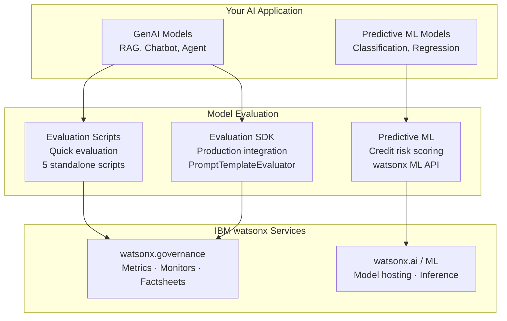

# Model Evaluation

Evaluate your AI and ML models for a range of key metrics — performance quality, fairness, reliability, drift, bias, and more — **before taking them to production**.

## Why This Matters

- **Unvalidated systems fail at the edges.** LLM pipelines can hallucinate, leak sensitive data, or degrade when upstream data changes. Evaluation surfaces these issues before release.
- **Production failures are costly.** Issues like PII leakage or ungrounded responses become significantly harder to diagnose once embedded in live workflows.
- **Compliance requires evidence.** Regulatory frameworks such as the EU AI Act and NIST AI RMF expect structured testing with reproducible scoring and stored evaluation artifacts.
- **Baselines enable monitoring.** Metrics captured at evaluation time become reference points for detecting drift and regression in production.

## Architecture

## Gen AI Evaluations

Evaluate generative AI applications — RAG pipelines, LLM outputs, chatbot safety, and agent tool-calling — using IBM watsonx governance metrics.

### Two Approaches

| Approach | Best For | What You Get |
|----------|----------|-------------|
| **[Evaluation Scripts](https://github.com/ibm-self-serve-assets/building-blocks/tree/main/ai-trust/model-evaluation/gen-ai-evaluations/assets/evaluation-scripts)** | Quick evaluation, experimentation | 5 standalone Python scripts — run independently, no package installation |
| **[Evaluation SDK](https://github.com/ibm-self-serve-assets/building-blocks/tree/main/ai-trust/model-evaluation/gen-ai-evaluations/assets/evaluation-sdk)** | Production integration | Importable Python package (`wx_gov_prompt_eval`) with SLM and LLM-as-Judge modes, OpenScale monitoring, factsheet tracking |

### Evaluation Scripts

| Script | What It Evaluates |
|--------|------------------|
| RAG Quality | Answer relevance, faithfulness, context relevance, retrieval precision, NDCG |
| Content Safety | HAP, PII, jailbreak, social bias, violence, profanity (15 metrics) |
| LLM-as-Judge | Evasiveness detection, topic relevance with system prompt boundaries |
| Readability | Text grade level, Flesch reading ease |
| Deployment Readiness | Combined quality + safety check with pass/fail verdict |

### Metrics Reference

| Metric | Category | Description |
|--------|----------|-------------|
| Faithfulness | Quality | Is the response grounded in the provided context? |
| Answer Relevance | Quality | Does the response address the user's question? |
| Answer Similarity | Quality | Semantic similarity to a ground-truth reference |
| Context Relevance | Retrieval | Are retrieved passages relevant to the query? |
| Retrieval Precision | Retrieval | Proportion of retrieved passages that are relevant |
| NDCG | Retrieval | Ranking quality of retrieved results |
| Hit Rate | Retrieval | Did at least one relevant passage get retrieved? |
| HAP | Safety | Hate, abuse, and profanity detection |
| PII | Safety | Personally identifiable information detection |
| Jailbreak | Safety | Prompt injection / jailbreak attempt detection |
| Social Bias | Safety | Stereotyping and discriminatory language |
| Evasiveness | Quality | Is the model dodging the question? |
| Topic Relevance | Quality | Is the response on-topic? |
| Text Grade Level | Readability | US school grade needed to understand the text |
| Text Reading Ease | Readability | Flesch Reading Ease score (0–100) |

## Predictive ML Evaluations

Evaluate predictive ML models deployed on IBM watsonx ML — scoring, confidence assessment, and interactive exploration.

### Available Assets

| Asset | What It Does |
|-------|-------------|
| **Credit Risk Prediction App** | Interactive Dash web app for credit risk scoring with real-time predictions |
| **Model Scoring API** | Direct REST API calls to deployed watsonx ML models — suitable for batch scoring and pipeline integration |

Both assets authenticate via IBM Cloud IAM and call deployed watsonx ML model endpoints.

## Bob Modes

A [Bob mode for Gen AI evaluation](https://github.com/ibm-self-serve-assets/building-blocks/tree/main/ai-trust/model-evaluation/gen-ai-evaluations/bob-modes) is available, providing an AI-assisted workflow that guides you through the evaluation process step by step.

!!! info "GitHub Repository"
    [Model Evaluation Assets](https://github.com/ibm-self-serve-assets/building-blocks/tree/main/ai-trust/model-evaluation)
