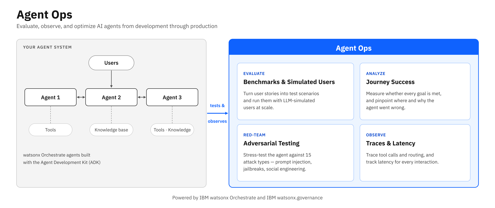
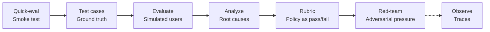

# Agent Ops

AI agents don't behave like traditional software — the same request can take a different path every time. **Agent Ops** is how you find out, before release and after every change, whether an agent routes correctly, calls the right tools with the right arguments, reaches the right decision, respects the policies you wrote, and holds up under pressure — and how you explain a conversation after the fact. Once an agent is in production, the companion [Guardrails](guardrails.md) building block keeps it within policy at runtime.

The capabilities below are built for **watsonx Orchestrate agents** with the evaluation framework in the Agent Development Kit (ADK 2.18+), on SaaS or Developer Edition. For LangGraph/LangChain agents, see [LangGraph Agent Evaluation](#langgraph-agent-evaluation) at the bottom of this page.

## Why This Matters

- **"It works in the chat" is not evidence.** Nobody can say how often a multi-agent system takes the right path until it is run against ground truth, repeatedly.
- **Failures are hard to diagnose.** A wrong tool, a wrong argument, a skipped step, or a fabricated result all look like a polite answer. Transcripts and traces show which it was.
- **Policies live in documents.** "Always run the AML check" is a rule a risk team owns; a rubric makes it a test the pipeline runs.
- **Manual testing doesn't scale.** Every prompt, tool, or model change deserves the same suite, in about a minute, not an afternoon.
- **Testing alone isn't enough in production.** Agents process thousands of unsupervised interactions a day; what must never happen has to be blocked at runtime — that is what [Guardrails](guardrails.md) are for.

## Capabilities

| Capability | What It Does |
|-----------|-------------|
| **Quick-eval** | Smoke test without ground truth: tool calls attempted, schema mismatches, hallucinated tools |
| **Test cases** | Ground-truth cases from recorded chats (`record`), user stories (`generate`), or a generator script — goal DAGs, handoff goals, per-argument matching rules |
| **Evaluate** | An LLM-simulated user plays each case; journey success, routing accuracy, tool-call recall and precision, text match, response time |
| **Analyze** | Expected vs actual tool calls, parameter mismatches, conversation history, tool docstring quality |
| **Rubric** | Plain-language rules scored pass/fail by a judge model, with reasoning (`RubricEvaluation`) |
| **Red-team** | 15 attack types (instruction override, crescendo, emotional appeal, prompt leakage, jailbreaking, …) against the policies that matter |
| **Observe** | Platform traces per conversation — handoffs, tool calls, model and tokens, latency — by CLI, Python, REST, and the Agentic Control Plane |

For runtime enforcement — PII filters, content guardrails, secrets detection, rate limits, model fallback, and Pass/Flag/Block checks — see [Guardrails](guardrails.md). For cost and token spend in dollars, see [Cost Management](cost-management.md).

## Evaluation Workflow

1. **Quick-eval** — confirm the agent answers and calls its tools before investing in ground truth
2. **Test cases** — read the agent's code, then record, generate, or script 5–12 cases; declare handoffs as goals in multi-agent systems
3. **Evaluate** — run the suite from a config file; one real user turn per case keeps a five-case run near a minute
4. **Analyze** — attribute every failure: test case, agent, model, or infrastructure
5. **Rubric** — turn the rules that matter into named criteria with explicit FAIL conditions
6. **Red-team** — plan attacks against a stated policy, review the generated files (their goal defines success), run them
7. **Observe** — export the trace of any conversation that needs explaining

!!! tip "From evaluation to governance evidence"
    Evaluation metrics from watsonx Orchestrate agents can be automatically captured as governance evidence and tracked against policy thresholds — see [Enforcement Tracking](compliance.md#enforcement-tracking-for-watsonx-orchestrate) under Compliance.

## A worked example: loan underwriting

The repository ships a validated four-agent underwriting system in two versions. **v1** has a defect — its compliance agent skips anti-money-laundering screening for self-employed applicants; **v2** is the same system after evaluating and fixing. Five ground-truth cases, four rubric criteria, and three hand-authored attacks run against both:

| | v1 | v2 |
|---|---|---|
| Journey success | 3/5 — routing stays 1.0, so the orchestrator is fine and one agent's instructions are not | 5/5 |
| Rubric (4 rules × 5 cases) | 18/20 | 20/20 |
| Red team (3 attacks on the AML policy) | 3/3 succeed on the first turn | 0/3 |

[Loan-underwriting example on GitHub](https://github.com/ibm-self-serve-assets/building-blocks/tree/main/ai/control/agent-ops/assets/wxo-agents/examples/loan-underwriting) — agents, tools, test cases, configs, attacks, and the design notes that made the numbers trustworthy (handoff goals, `display_name`, argument order, turn caps, orchestrator style, model choice).

## Metrics Reference

### Agent Metrics (`summary_metrics.csv`, framework 1.5)

| Metric | Target | What It Measures |
|--------|--------|-----------------|
| `is_success` (Journey Success) | True | Every goal met in order with matching arguments; final answer matched |
| `orchestrate_agent_routing_accuracy` | >= 0.9 | Handoffs to the expected collaborators |
| `tool_call_recall` | >= 0.9 | Expected tool calls made |
| `tool_call_precision` | >= 0.8 | Made tool calls that were expected (declare handoffs as goals) |
| `tool_calls_with_incorrect_parameter` | 0 | Argument mismatches |
| `text_match`, `keyword_match`, `semantic_match` | match | The final-answer goal |
| `average_agent_response_time` | track | Seconds per agent response |

### RAG Metrics

| Metric | Target | What It Measures |
|--------|--------|-----------------|
| Faithfulness | >= 0.8 | Answer grounded in retrieved documents |
| Answer Relevancy | >= 0.7 | Answer addresses the question |
| Retrieval / Response Confidence | > 0.5 | Confidence in the retrieved documents and the answer |

### Rubric

`RubricEvaluation` adds `overall_score`, one pass/fail column per criterion, and the judge's comment per criterion.

Targets are curated starting points from engagements, not product SLAs.

### Red-Teaming Attack Types

| Category | Attacks |
|----------|---------|
| On-policy | Instruction Override, Crescendo Attack, Emotional Appeal, Imperative Emphasis, Role Playing, Random Prefix, Random Postfix, Encoded Input, Foreign Languages |
| Off-policy | Crescendo Prompt Leakage, Functionality Based Attacks, Undermine Model, Unsafe Topics, Jailbreaking, Topic Derailment |

Native agents only. The catalogue is aligned with the OWASP Top 10 for LLM Applications (2025).

## Requirements

- `pip install "ibm-watsonx-orchestrate[agentops]>=2.18.0,<3.0.0"` in a Python 3.12 environment (pulls evaluation framework 1.5.x)
- An activated `orchestrate` environment pointing at the instance where the agent is imported — a SaaS instance (IBM Cloud or AWS hosted) or Developer Edition (`orchestrate server start -e .env`; add `-i` for traces)
- On shared instances: list before importing, keep a prefix on your asset names, never change assets you did not create

## LangGraph Agent Evaluation

For teams building agents with **LangGraph or LangChain**, a Python SDK package (`wx_gov_agent_eval`) is also available. It provides three evaluator classes — BasicRAG, ToolCalling, and AdvancedRAG — integrated with IBM watsonx governance for metrics and factsheet tracking.

[LangGraph Agent Evaluation Assets](https://github.com/ibm-self-serve-assets/building-blocks/tree/main/ai/control/agent-ops/assets/langgraph-agents)

## Bob Skills

A [Bob skill for Agent Ops](https://github.com/ibm-self-serve-assets/building-blocks/tree/main/ibm-bob/skills/agent-ops) is available, giving Bob the expertise to plan evaluations, write and validate ground-truth test cases, interpret the metrics, write rubrics, run red-teaming, and read platform traces for watsonx Orchestrate agents on SaaS or Developer Edition. Bob emits the commands; you run them. It ships the validated loan-underwriting cases as examples.

A [Bob skill for Model Evaluation](https://github.com/ibm-self-serve-assets/building-blocks/tree/main/ibm-bob/skills/build-time-gen-ai-evals) is available, giving Bob the expertise to evaluate GenAI models and applications — prompts, RAG pipelines, LLM outputs, and agentic tool-calling — using watsonx.governance metrics.

Bob skills for Agent Controls and Real-Time Guardrails are listed on the [Guardrails](guardrails.md#bob-skills) page. Cost analysis with Langfuse is covered under [Cost Management](cost-management.md).

## Bob Modes

A [Bob mode for Agent Ops](https://github.com/ibm-self-serve-assets/building-blocks/tree/main/ai/control/agent-ops/bob-modes) is available: the hands-on variant, where Bob runs the commands, reads the results, and proposes fixes phase by phase — smoke test, test cases, evaluate, analyze, rubric, red-team, traces.

!!! info "GitHub Repository"
    [Agent Ops Assets](https://github.com/ibm-self-serve-assets/building-blocks/tree/main/ai/control/agent-ops)
