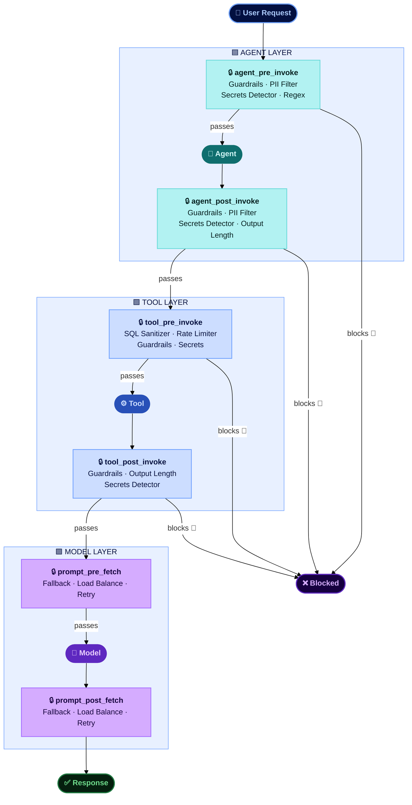
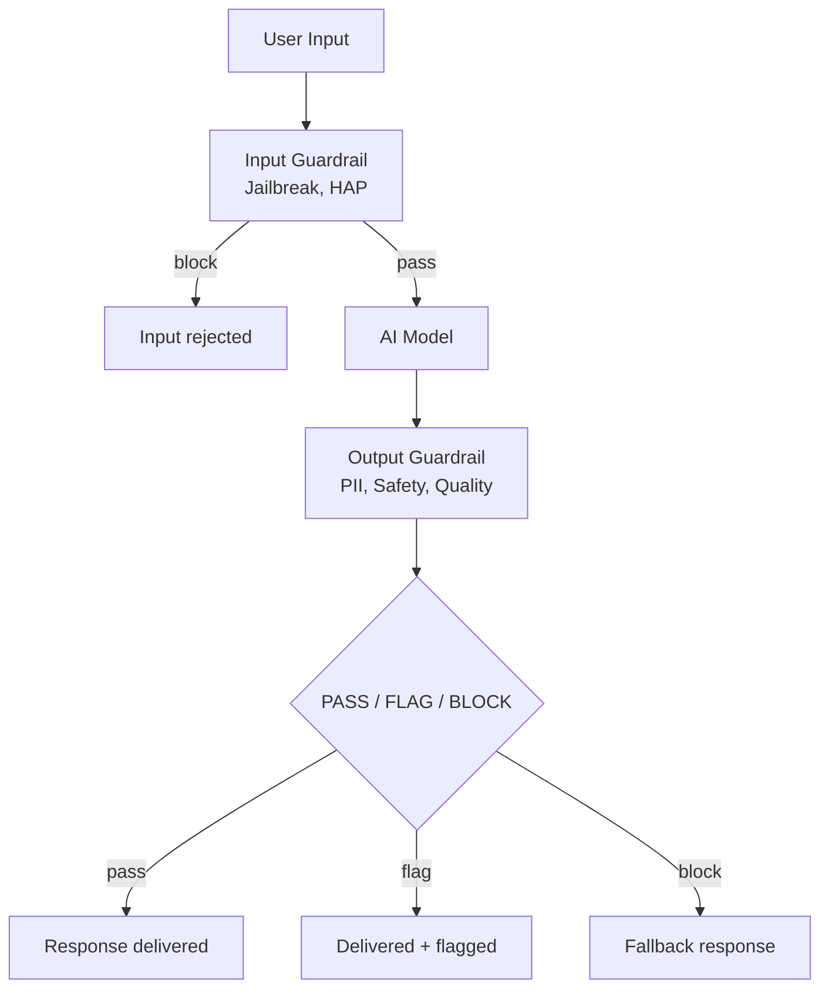

# Guardrails

Evaluation tells you how an AI agent behaves before release; **Guardrails** keep it within policy once it is live. Guardrails check every request and response in production — blocking, masking, flagging, or rerouting before anything reaches users, tools, or downstream systems.

There are two complementary ways to apply guardrails, and you can use them together:

| Approach | Best for | How it works |
|---|---|---|
| **[Agent Controls](#agent-controls-watsonx-orchestrate)** | Agents running on **watsonx Orchestrate** | Reusable policy artifacts — PII filters, content guardrails, secrets detection, rate limits, SQL sanitization, model fallback — attached to agents, tools, and models **as configuration, not code** |
| **[Real-Time Guardrails SDK](#real-time-guardrails-sdk-any-framework)** | Agents and RAG apps on **any framework** | watsonx.governance metrics with **Pass / Flag / Block** thresholds at input, retrieval, generation, and output — as a Python library, REST API, or MCP server, including custom LLM-as-judge checks |

## Why This Matters

- **Testing alone isn't enough in production.** Agents process thousands of unsupervised interactions a day — a single unguarded output containing PII, credentials, or harmful content creates risk that must be blocked at runtime, not found afterwards.
- **Production failures are visible and costly.** When a model generates harmful content, leaks PII, or returns irrelevant answers in front of customers, the impact is immediate — regulatory exposure, reputational damage, and loss of trust.
- **Safety can't be solved at design time alone.** Users will find ways to misuse AI systems that pre-deployment testing cannot anticipate. Real-time guardrails provide the last line of defense.
- **Compliance requires ongoing protection.** Regulatory frameworks expect organizations to demonstrate continuous safeguards, not just pre-deployment testing.

---

## Agent Controls — watsonx Orchestrate

**Agent Controls** keep watsonx Orchestrate agents within authorized boundaries once deployed. Powered by the watsonx Orchestrate Controls framework, controls are reusable policy artifacts — PII filters, content guardrails, secrets detection, rate limits, SQL sanitization, and model routing — attached to agents, tools, and models **as configuration, not code**. Policies can be added, changed, or removed without touching the agent's implementation, and the same agent can carry different policies per environment.

A control combines four things: a **policy artifact** (the rule), an **asset** (the agent, tool, or model it protects), an **execution hook** (the pipeline stage where it fires, e.g. `agent_pre_invoke`, `tool_pre_invoke`), and a **priority** (lower numbers run first). If a control blocks, the pipeline halts immediately and nothing downstream runs — so the most critical safety controls (jailbreak blocking, content safety) belong at the lowest priority numbers, and tool-layer protections like SQL sanitization at priority 1 on their hooks.

### Control Types

| Layer | Control | What It Enforces |
|-------|---------|-----------------|
| **Agent** | PII Filter | Detects and masks SSNs, emails, phone numbers, credit cards — redact, partial, hash, tokenize, or remove |
| **Agent** | Content Guardrails | Blocks jailbreaks, hate/abuse/profanity (HAP), violence, sexual content, and bias on input and output |
| **Agent** | Secrets Detector | Catches AWS keys, JWTs, API keys, private key blocks — redact or block |
| **Agent** | Output Length Guard / Regex Pattern | Enforces response size limits; redacts or blocks custom patterns (project codes, competitor names) |
| **Tool** | Rate Limiter | Caps tool invocations per minute, per tool and per tenant — stops runaway agent loops |
| **Tool** | SQL Sanitizer | Blocks destructive SQL (DROP, TRUNCATE, unscoped DELETE/UPDATE) and injection comments before execution |
| **Tool** | Guardrails / Secrets / Output Length | Same protections as the agent layer, applied at the tool input/output boundary |
| **Model** | Fallback / Retry | Routes to backup models on errors (429, 5xx) with configurable retries — no agent code change |
| **Model** | Load Balance | Distributes requests across providers using weighted ratios |

### Typical Enforcement Scenarios

- **Customer service — PII compliance**: PII Filter on pre- and post-invoke keeps SSNs and emails out of responses and logs, without changing the agent's prompt or code.
- **Data agents — SQL injection protection**: SQL Sanitizer at priority 1 blocks AI-generated destructive queries before a Text-to-SQL agent can execute them.
- **Finance — secrets leakage prevention**: Secrets Detector on agent and tool outputs stops API keys and tokens appearing in responses or audit logs.
- **High availability — model fallback**: Fallback and Retry controls keep agents operating when the primary model endpoint degrades, routing to a backup without redeployment.

---

## Real-Time Guardrails SDK — Any Framework

Enforce safety boundaries and operational constraints on any AI application. The SDK evaluates every AI input and output against configurable thresholds — blocking, flagging, or passing content before it reaches users.

### How It Works

**Three-tier response handling:**

- **PASS** — Content is within acceptable limits, serve normally
- **FLAG** — Content is borderline, serve but log for human review
- **BLOCK** — Content violates thresholds, serve a fallback response instead

### Guardrail Types

#### Built-in Content Safety

Detects harmful content using IBM watsonx governance pre-trained models. No additional setup beyond API credentials.

| Metric | What It Detects | Threshold Type |
|--------|----------------|---------------|
| HAP | Hate, abuse, and profanity | Upper-limit (block when exceeded) |
| PII | Names, emails, SSNs, phone numbers | Upper-limit |
| Jailbreak | Prompt injection and jailbreak attempts | Upper-limit |
| Social Bias | Stereotyping and discriminatory language | Upper-limit |
| Violence | Violent content | Upper-limit |
| Profanity | Profanity | Upper-limit |
| Harm | General harm | Upper-limit |
| Sexual Content | Sexual content | Upper-limit |
| Unethical Behavior | Unethical content | Upper-limit |
| Evasiveness | Evasive or non-committal responses | Upper-limit |

#### RAG Quality Guardrails

Real-time quality checks on RAG pipeline responses. Blocks responses that are hallucinated or off-topic.

| Metric | What It Checks | Threshold Type |
|--------|---------------|---------------|
| Answer Relevance | Does the response address the question? | Lower-limit (block when quality drops) |
| Context Relevance | Are retrieved passages relevant? | Lower-limit |
| Faithfulness | Is the response grounded in context? | Lower-limit |

#### Custom LLM-as-Judge Guardrails

Define your own guardrail criteria using an LLM evaluator. Two approaches:

- **Prompt template** — Full control over the evaluation prompt (e.g., answer completeness)
- **Criteria + Options** — Structured rubric with named options and scores (e.g., conciseness, helpfulness)

Uses `LLMAsJudgeMetric` with `WxAIFoundationModel` as the judge.

### Available Assets

| Script | What It Does |
|--------|-------------|
| Content Safety Guardrails | Screen inputs/outputs for 10 safety metrics with configurable BLOCK/FLAG/PASS thresholds |
| RAG Quality Guardrails | Real-time faithfulness, relevance, context quality checks with fallback responses |
| Custom Guardrails | Define custom LLM-as-judge guardrails (completeness, conciseness, helpfulness) |
| Guardrail Pipeline | End-to-end: validate input → call model → validate output → audit log |

All scripts use the `ibm_watsonx_gov` SDK with `MetricsEvaluator` and `GenAIConfiguration`.

The repository also ships a production package, `real-time-guardrails`, that wraps the same checks for use as a Python library, a REST server, or an MCP server, with JSONL audit logging.

!!! info "GitHub Repository"
    [Real-Time Guardrails Assets](https://github.com/ibm-self-serve-assets/building-blocks/tree/main/ai/ai-control-plane/agent-ops/real-time-guardrails)

## Bob Skills

A [Bob skill for Agent Controls](https://ibm-self-serve-assets.github.io/building-blocks-docs/ibm-bob/skills/) is available, covering artifact selection, hook assignment, priority layering, and defence-in-depth stacking across agent and tool boundaries.

A [Bob skill for Real-Time Guardrails](https://github.com/ibm-self-serve-assets/building-blocks/tree/main/ibm-bob/skills/real-time-guardrails) is available, giving Bob the expertise to add runtime safety and quality guardrails to GenAI apps, RAG agents, and watsonx Orchestrate tools using watsonx.governance — Pass/Flag/Block at input, retrieval, generation, and output.

## Bob Modes

A [Bob mode for Real-Time Guardrails](https://github.com/ibm-self-serve-assets/building-blocks/tree/main/ai/ai-control-plane/agent-ops/real-time-guardrails/bob-modes) is available, walking you through setup, integration design, implementation, threshold tuning, and deployment of guardrails for your agent.
