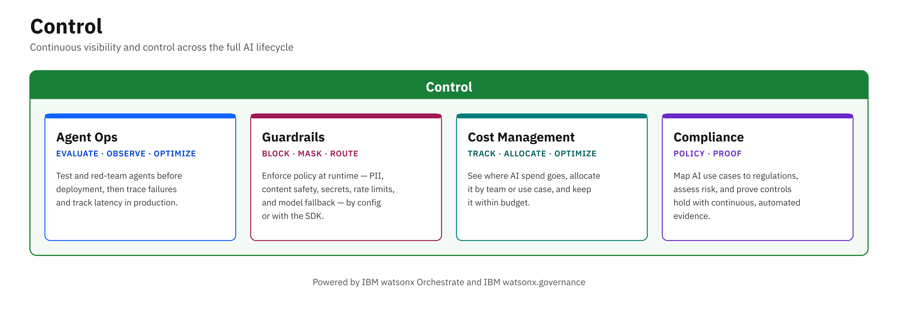

# Control

Control is part of the **[AI Control Plane](../index.md)**, alongside [Agents](../agents/index.md) and [Engineering](../engineering/index.md).

Running AI in production takes more than building agents — it takes continuous visibility and control across the full AI lifecycle: evaluating and observing agents, enforcing policies at runtime, managing cost, and proving regulatory compliance. These capabilities are powered by **IBM watsonx.governance** and **IBM watsonx Orchestrate**.

The Control building blocks provide frameworks, production-ready code samples, and tools to help you run AI that is reliable, transparent, and compliant. Whether you're evaluating and red-teaming agents before deployment, enforcing guardrails in production, tracking AI consumption and cost, or mapping AI use cases to regulations — Control has you covered.

## Building Blocks

| Building Block | What It Does |
|---------------|-------------|
| **[Agent Ops](agent-ops.md)** | Evaluate, observe, and optimize your AI agents throughout the lifecycle — benchmarking, red-teaming, failure analysis, traces, and latency |
| **[Guardrails](guardrails.md)** | Enforce runtime policy on agents, tools, and models — PII filters, content safety, secrets detection, rate limits, model fallback, and Pass/Flag/Block checks for any framework |
| **[Cost Management](cost-management.md)** | Track what watsonx Orchestrate agents cost — tokens per agent and conversation in the platform, and cost in dollars per trace, session, and evaluation scenario with Langfuse |
| **[Compliance](compliance.md)** | Ensure your AI applications meet regulatory requirements and industry standards for responsible AI use |

<!-- Hidden for now — restore these rows to the table above to bring the pages back:
| **[Lifecycle Management](lifecycle-management.md)** | Manage AI models and agents across their full lifecycle, from onboarding to retirement |
| **[Shadow AI Discovery](shadow-ai-discovery.md)** | Discover ungoverned agents, tools, MCP servers, and models across your AI estate and bring them into governed workflows |
| **[Model Evaluation](model-evaluation.md)** | Evaluate GenAI applications — RAG pipelines, LLM outputs, chatbot safety — for quality, safety, and readability before release |
-->

## Getting Started

1. Choose the building block that matches your current need.
2. Explore the **assets** folder in the repository for ready-to-use code samples and SDKs.
3. Check **bob-modes** for AI-assisted evaluation workflows.

!!! info "GitHub Repository"
    [Control Building Blocks](https://github.com/ibm-self-serve-assets/building-blocks/tree/main/ai/control)
