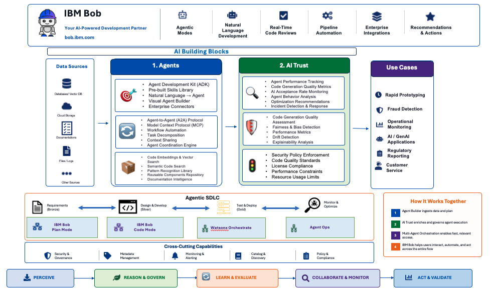

# AI Core - Building Blocks

Welcome to the **AI Core Building Blocks** documentation. This collection provides ready-to-use accelerators for building, deploying, and governing AI agents and applications with enterprise-grade trust and reliability.

## Overview

This framework provides ready-to-use accelerators that address critical capabilities required to build, deploy, and govern AI agents and applications. These accelerators are designed to integrate seamlessly with existing enterprise systems, reducing time-to-value for AI projects.



The AI Core building blocks provide a comprehensive framework organized into two core capabilities that work together to enable trustworthy, enterprise-grade AI:

!!! info "GitHub Repository"
    The complete source code and examples are available in the GitHub repository:
    
    **[Building Blocks - AI](https://github.com/ibm-self-serve-assets/building-blocks/tree/main)**

---

## Architecture

The AI Core building blocks are organized into two core capabilities:

### 1. Agents
**Build, orchestrate, and deploy intelligent AI agents**

Agent building blocks accelerate the design, development, and deployment of intelligent agents across business workflows. From low-code agent builders to multi-agent orchestration and IDE-native development, these capabilities enable teams to rapidly create production-ready AI agents.

**Key Capabilities:**
- Low-code agent development with IBM watsonx Orchestrate
- Multi-agent coordination and workflow orchestration
- IDE-native agentic SDLC with IBM Bob

### 2. AI Trust
**Ensure reliability, safety, and compliance throughout the AI lifecycle**

AI Trust building blocks provide comprehensive tools to evaluate models, monitor agents, enforce real-time guardrails, and maintain regulatory compliance. These capabilities ensure your AI solutions are trustworthy, transparent, and meet enterprise governance requirements.

**Key Capabilities:**
- Model evaluation for quality, fairness, and bias
- Agent operations monitoring and optimization
- Real-time safety guardrails and compliance management

---

## Agents Building Blocks

Agent capabilities focus on accelerating agent development and deployment.

### [Agent Builder](agents/agent-builder.md)

Build production-ready AI agents faster with low-code development tools powered by IBM watsonx Orchestrate. This accelerator provides pre-configured templates, skill libraries, and the Agent Development Kit (ADK) to streamline agent creation from concept to deployment.

**Key Features:**

- **Low-Code Development**: Visual builder with drag-and-drop interface for rapid agent creation
- **Pre-Built Skills**: Extensive library of ready-to-use skills and integrations
- **Agent Development Kit (ADK)**: Comprehensive SDK for custom agent development
- **Enterprise Integration**: Connect to IBM and third-party systems seamlessly
- **Deployment Flexibility**: Deploy agents across multiple channels and platforms

**Use Cases:** Customer service automation, IT operations, business process automation, knowledge management, workflow orchestration, data analysis

---

### [Multi-Agent Orchestration](agents/multi-agent-orchestration.md)

Coordinate multiple specialized agents to solve complex business problems through intelligent orchestration. This accelerator enables agents to collaborate, share context, and execute coordinated workflows using industry-standard protocols like MCP and A2A.

**Key Features:**

- **Agent Coordination**: Orchestrate multiple agents working together on complex tasks
- **Context Sharing**: Enable agents to share information and maintain conversation state
- **Workflow Automation**: Define and execute multi-step agent workflows
- **Protocol Standards**: Support for MCP (Model Context Protocol) and A2A (Agent-to-Agent)
- **Scalable Architecture**: Handle concurrent agent interactions with high reliability

**Use Cases:** Customer onboarding, complex approvals, multi-step troubleshooting, cross-functional workflows, intelligent routing, escalation management

---

### [Agentic SDLC](agents/agentic-sdlc.md)

Transform software development with IBM Bob, an IDE-native agentic AI that automates the entire development lifecycle. From natural language requirements to production-ready code, Bob accelerates development while maintaining code quality and enterprise standards.

**Key Features:**

- **Intent-to-Software**: Generate complete applications from natural language descriptions
- **IDE-Native**: Embedded directly in VS Code for seamless developer experience
- **Development Modes**: Specialized modes for coding, planning, debugging, and orchestration
- **Code Intelligence**: Continuous awareness of entire codebase for accurate generation
- **Pipeline Integration**: Extend AI assistance into terminals, CI/CD, and Git workflows

**Use Cases:** Greenfield development, legacy modernization, feature development, code quality improvement, documentation generation, CI/CD automation

---

## AI Trust Building Blocks

AI Trust capabilities focus on ensuring reliability, safety, and compliance.

### [Model Evaluation](ai-trust/model-evaluation.md)

Evaluate AI and ML models for performance quality, fairness, reliability, drift, and bias before deployment. This accelerator provides comprehensive testing frameworks and metrics to ensure your models meet quality standards and business requirements.

**Key Features:**

- **Performance Metrics**: Evaluate accuracy, precision, recall, and F1 scores
- **Fairness Testing**: Detect and measure bias across demographic groups
- **Drift Detection**: Monitor model performance degradation over time
- **Explainability**: Understand model decisions and feature importance
- **Automated Testing**: Continuous evaluation throughout the model lifecycle

**Use Cases:** Model validation, bias detection, performance monitoring, regulatory compliance, model comparison, quality assurance

---

### [Agent Ops](ai-trust/agent-ops.md)

Monitor, evaluate, and optimize AI agents throughout their lifecycle with comprehensive observability and testing capabilities. This accelerator provides real-time insights into agent behavior, performance metrics, and quality indicators.

**Key Features:**

- **Real-Time Monitoring**: Track agent performance, latency, and success rates
- **Quality Evaluation**: Assess response quality, accuracy, and relevance
- **Behavior Analysis**: Understand agent decision-making and interaction patterns
- **Performance Optimization**: Identify bottlenecks and optimization opportunities
- **Testing Frameworks**: Automated testing for agent capabilities and edge cases

**Use Cases:** Agent performance monitoring, quality assurance, behavior analysis, optimization, incident response, capacity planning

---

### [Real-Time Guardrails](ai-trust/real-time-guardrails.md)

Enforce safety boundaries and operational constraints to keep AI applications within desired behavior in production. This accelerator provides real-time content filtering, policy enforcement, and safety controls.

**Key Features:**

- **Content Filtering**: Block harmful, inappropriate, or off-topic content
- **Policy Enforcement**: Apply business rules and compliance policies in real-time
- **Safety Controls**: Prevent hallucinations, toxic content, and security risks
- **Custom Rules**: Define organization-specific guardrails and constraints
- **Low Latency**: Minimal impact on response times with efficient filtering

**Use Cases:** Content moderation, compliance enforcement, brand protection, security controls, risk mitigation, user safety

---

### [AI Compliance](ai-trust/ai-compliance.md)

Ensure your AI applications meet regulatory requirements and industry standards for responsible AI use. This accelerator provides frameworks, documentation templates, and assessment tools for AI governance and compliance.

**Key Features:**

- **Regulatory Mapping**: Map AI use cases to relevant regulations (GDPR, AI Act, etc.)
- **Risk Assessment**: Evaluate AI systems for compliance and ethical risks
- **Documentation**: Generate required documentation for audits and reviews
- **Governance Frameworks**: Implement AI governance policies and controls
- **Audit Trails**: Maintain comprehensive records of AI decisions and actions

**Use Cases:** Regulatory compliance, risk management, audit preparation, governance implementation, ethical AI, documentation management

---

## Getting Started

!!! tip "Quick Start Guide"
    Follow these steps to get started with any building block:

1. **Clone the repository:**
   ```bash
   git clone https://github.com/ibm-self-serve-assets/building-blocks.git
   cd building-blocks
   ```

2. **Navigate to the specific building block directory** (agents or ai-trust)

3. **Follow the README instructions** for setup and configuration

---

## Key Benefits

!!! success "Why Use AI Core Building Blocks?"
    
    - **Faster Development**: Pre-built accelerators reduce agent development time
    - **Enterprise Trust**: Built-in governance, monitoring, and compliance
    - **Production Ready**: Battle-tested patterns and best practices
    - **Flexibility**: Modular design allows mix-and-match capabilities
    - **Standards-Based**: Support for industry protocols (MCP, A2A)

---

## IBM Products Used

These building blocks leverage the following IBM products:

- **[IBM watsonx Orchestrate](https://www.ibm.com/products/watsonx-orchestrate)**: Agent development and orchestration platform
- **[IBM watsonx.ai](https://www.ibm.com/products/watsonx-ai)**: Foundation models and AI services
- **[IBM watsonx.governance](https://www.ibm.com/products/watsonx-governance)**: AI governance and compliance
- **[IBM Bob](https://bob.ibm.com/)**: IDE-native agentic AI for software development

---

## Contributing

We welcome contributions! Please fork the repository, create a feature branch, and open a pull request with your changes.

!!! note "Contribution Guidelines"
    - Follow existing code style and documentation patterns
    - Include tests for new features
    - Update documentation as needed
    - Ensure all tests pass before submitting

---

## License

This project is licensed under the Apache 2.0 License.