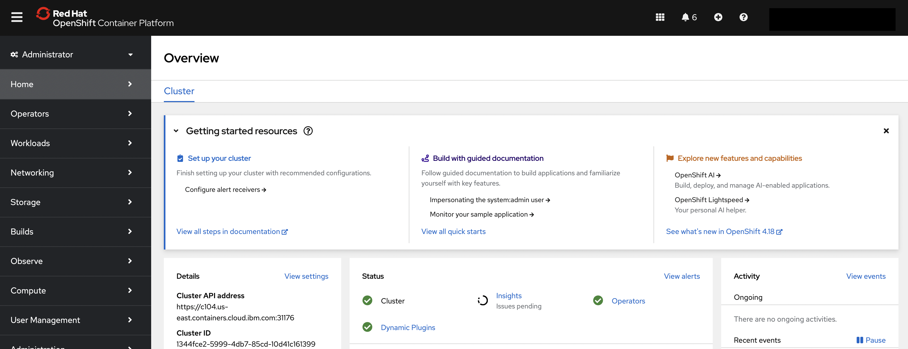
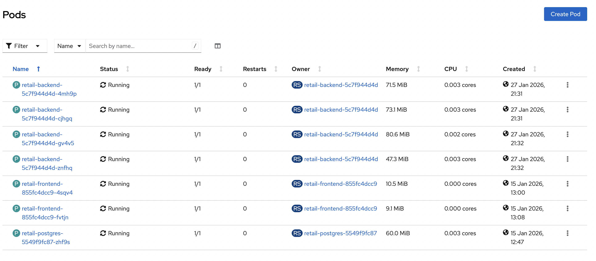
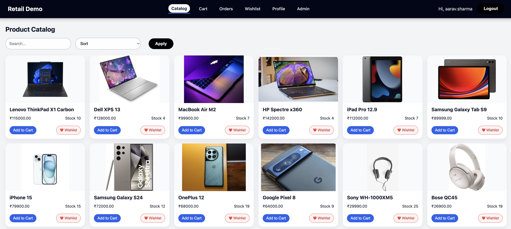

# Automating Enterprise Retail Application Deployment on IBM Cloud Red Hat OpenShift Using Terraform and Ansible

**Technologies:** IBM Cloud, Red Hat OpenShift, Terraform, Ansible,
Kubernetes, PostgreSQL

------------------------------------------------------------------------

## Overview

Modern enterprise platforms require repeatable, auditable, and scalable
automation across both infrastructure and application layers.
This tutorial demonstrates a production-ready automation model using:

-   **Terraform** to provision Red Hat OpenShift on IBM Cloud VPC Gen2\
-   **Ansible** to deploy and manage a cloud-native Retail application
    on OpenShift

This layered approach aligns with IBM Cloud architectural best practices
and supports CI/CD pipelines, compliance requirements, and
multi-environment portability.

------------------------------------------------------------------------

## Why Terraform and Ansible Together

Terraform and Ansible solve different enterprise automation problems.

### Terraform

Terraform is an Infrastructure as Code (IaC) tool that manages cloud
infrastructure using a declarative model and state file. It is best
suited for:

-   VPC and networking
-   OpenShift cluster provisioning
-   IAM and security components
-   Environment replication
-   Infrastructure drift control

Terraform should be used whenever infrastructure resources must be
created, modified, or destroyed.

### Ansible

Ansible is a configuration management and orchestration tool designed
for:

-   Application deployment
-   Platform configuration
-   Day-2 operational automation
-   CI/CD pipeline execution

Ansible should be used whenever application or configuration state must
be managed.

------------------------------------------------------------------------

## Real-World Usage Comparison

| Scenario                     | Terraform | Ansible |
| ---------------------------- | --------- | ------- |
| Create IBM Cloud VPC         | Yes       | No      |
| Create OpenShift cluster     | Yes       | No      |
| Create subnets and gateways  | Yes       | No      |
| Deploy Kubernetes workloads  | No        | Yes     |
| Configure namespaces         | No        | Yes     |
| Load database schema         | No        | Yes     |
| Restart deployments          | No        | Yes     |
| Perform upgrades             | No        | Yes     |
| Handle operational workflows | No        | Yes     |


------------------------------------------------------------------------

## IBM Recommended Automation Strategy

| Layer          | Tool      | Purpose                                |
| -------------- | --------- | -------------------------------------- |
| Infrastructure | Terraform | Provision IBM Cloud and OpenShift      |
| Platform       | Ansible   | Configure cluster namespaces, policies |
| Applications   | Ansible   | Deploy and manage workloads            |
| Operations     | Ansible   | Day-2 automation                       |


------------------------------------------------------------------------

## Phase 1: Provision OpenShift Using Terraform

## Provision Red Hat OpenShift on IBM Cloud Using Terraform

IBM provides an officially supported Terraform module to provision Red
Hat OpenShift on IBM Cloud VPC Gen2:

**Terraform Module:**\
https://github.com/terraform-ibm-modules/terraform-ibm-base-ocp-vpc

This module enables enterprises to provision production-grade OpenShift
clusters on IBM Cloud using Infrastructure as Code.

------------------------------------------------------------------------

## What This Module Provisions

The module automates the creation of the following components:

-   IBM Cloud VPC Gen2.
-   Networking and security configuration.
-   Red Hat OpenShift cluster.
-   Worker node pools.

Terraform outputs generated by this module are later consumed by Ansible
to perform application deployment and operational automation.

------------------------------------------------------------------------

## Module Overview

**terraform-ibm-base-ocp-vpc** is an official Terraform module
maintained under the **terraform-ibm-modules** organization. It
provisions a Red Hat OpenShift Container Platform (OCP) cluster on IBM
Cloud VPC Gen2 using a fully automated and repeatable approach.

This module eliminates the need for manual CLI-driven cluster
provisioning and enables consistent enterprise deployments.

------------------------------------------------------------------------

## What It Does

The module automates the creation of all IBM Cloud resources required to
run an OpenShift cluster on a Virtual Private Cloud.

Specifically, it:

-   Provisions an IBM Cloud VPC Gen2 environment.
-   Creates required subnets, security groups, and gateways.
-   Deploys and configures a Red Hat OpenShift cluster.
-   Optionally manages IBM Cloud Object Storage for cluster
    dependencies.
-   Provides advanced security group association controls.
-   Includes examples for:
    -   KMS encryption.
    -   Multi-zone cluster deployments.
    -   Compliance-oriented configurations

> **Note:**
> The module does not update existing OpenShift cluster nodes. This
> design prevents unintended destructive changes to running production
> clusters.



------------------------------------------------------------------------

## Key Capabilities

-   **VPC Creation**
    Automates all foundational VPC infrastructure components.

-   **Cluster Provisioning**
    Deploys OpenShift control plane and worker node pools.

-   **Security Controls**
    Supports advanced security group and network policy configuration.

-   **Multi-Zone Support**
    Enables highly available multi-zone cluster architectures.

-   **Key Management Support**
    Optional integration with IBM Key Management Service for encryption.

-   **Examples Provided**
    Includes both basic and advanced Terraform examples for multiple
    deployment scenarios.

------------------------------------------------------------------------

## Typical Enterprise Use Case

Enterprises use this module to automate the provisioning of
**production-ready OpenShift clusters** on IBM Cloud VPC as part of
their Infrastructure as Code pipelines.

This approach provides:

-   Environment consistency across regions.
-   Auditable infrastructure changes.
-   Repeatable deployments.
-   Compliance alignment.
-   CI/CD pipeline integration.

In real-world enterprise architectures, this Terraform module is
typically used in **Phase 1** to provision the OpenShift platform, while
tools such as **Ansible** are used in **Phase 2** to deploy and manage
applications and operational workflows.

------------------------------------------------------------------------

## Phase 2: Deploy Retail Application Using Ansible

Ansible handles:

-   Namespace creation
-   Image build and push
-   Secret creation
-   PostgreSQL, backend, and frontend deployment
-   Database initialization
-   Frontend rebuild with backend route
-   Rolling restarts
-   Validation

------------------------------------------------------------------------

## Architecture Components

### PostgreSQL

Stateful database deployed using StatefulSet.

### Backend Service

Stateless REST API consuming PostgreSQL credentials.

### Frontend Service

React-based UI configured dynamically with backend route.

### Ansible Control Plane

Executes all automation tasks using idempotent roles.

------------------------------------------------------------------------

## Prerequisites

-   Red Hat OpenShift 4.12+
-   oc CLI authenticated
-   Ansible 2.14+
-   Python 3.9+
-   Container registry account

------------------------------------------------------------------------

## Install Dependencies

``` bash
ansible-galaxy collection install kubernetes.core
pip install kubernetes openshift pyyaml
oc whoami
```

------------------------------------------------------------------------

## Project Structure

``` text
ansible-retailapp
├── inventory
│   ├── group_vars
│   │   └── all.yml
│   └── localhost.ini
├── playbooks
│   └── deploy-retailapp.yml
└── roles
    ├── database
    ├── frontend_rebuild
    ├── images
    ├── jmeter
    ├── oc_cli
    ├── openshift
    ├── prereqs
    └── source
```

------------------------------------------------------------------------

## Configuration File

``` yaml
oc_token: ""
oc_server: ""

docker_username: ""
docker_password: ""

namespace: retail-automation
postgres_label: "app=retail-postgres"

backend_image: "docker.io/{{ docker_username }}/retail-backend:1.0.0"
frontend_image: "docker.io/{{ docker_username }}/retail-frontend:1.0.0"

openshift_version: "4.18.28"
jmeter_version: "5.6.3"

github_zip_url: "https://github.com/SunilManika/retailapp/archive/refs/heads/main.zip"
workspace: "/root/retailapp"
```

------------------------------------------------------------------------

## Deploy the Application

``` bash
ansible-playbook -i inventory/localhost.ini playbooks/deploy-retailapp.yml
```

------------------------------------------------------------------------

## Verify Deployment

``` bash
oc get pods -n retail-automation
oc get svc -n retail-automation
oc get route -n retail-automation
```


------------------------------------------------------------------------

## Access the Application

``` bash
oc get route | grep retail-frontend | awk '{print $2}'
```

------------------------------------------------------------------------

## Clean Up

``` bash
oc delete namespace retail-automation
```

------------------------------------------------------------------------

## When to Use Which Tool

### Terraform

Use Terraform for infrastructure lifecycle management.

### Ansible

Use Ansible for application deployment and operational automation.

Never mix responsibilities between these two tools.

------------------------------------------------------------------------

## Summary

You learned how to:

-   Provision OpenShift using Terraform
-   Deploy applications using Ansible
-   Separate infrastructure from application automation
-   Follow IBM enterprise best practices

------------------------------------------------------------------------

## Next Steps

-   Integrate ArgoCD GitOps
-   Add Helm charts
-   Use IBM Cloud Secrets Manager
-   Implement blue-green deployments
