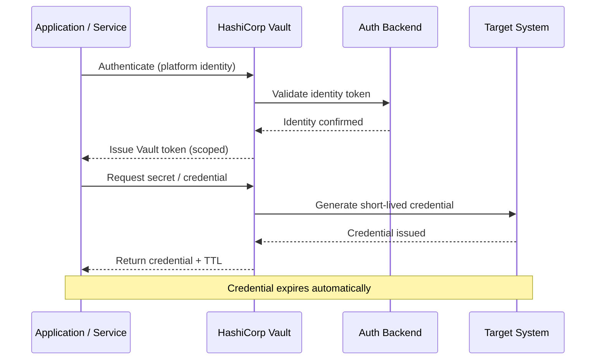

# Non-human Identity

[← Back to Secure](index.md)

> **Version**: 1.0.0 | **Last Updated**: 2025-07-14 | **Status**: Stable

## Table of Contents

- [Overview](#overview)
- [Key Features](#key-features)
- [Architecture](#architecture)
- [Use Cases](#use-cases)
- [Products & Services](#products--services)
- [Download Skills](#download-skills)
- [Download Custom Modes](#download-custom-modes)
- [Assets](#assets)
- [Call to Action](#call-to-action)

---

## Overview

Non-human Identity delivers enterprise-grade secrets management and machine identity authentication that eliminates hardcoded credentials and centralises access control for automated systems, applications, and services.

### What is Non-human Identity?

Modern enterprise architectures depend on hundreds of automated processes — microservices, CI/CD pipelines, Kubernetes workloads, and cloud services — each requiring credentials to communicate securely. Hardcoding those credentials creates serious security risks: exposed API keys, unrotated passwords, and sprawling secrets scattered across repositories and configuration files.

Non-human Identity solves this through two complementary approaches. **HashiCorp Vault** provides a centralised secrets store with dynamic credential generation, automated rotation, and identity-based access for machine workloads. **IBM Verify** extends the identity layer to cover human identities with SSO, MFA, and risk-based adaptive access — so both human and machine principals are managed under a unified security posture.

This building block is designed for platform engineers, security teams, and DevOps practitioners who need to replace static secrets with short-lived, auditable credentials — and who want a proven, policy-driven framework rather than a bespoke implementation.

### Why Non-human Identity?

- **Eliminate credential sprawl**: Replace hardcoded secrets in code, config files, and CI pipelines with dynamic, on-demand credentials that expire automatically.
- **Reduce blast radius**: Short-lived credentials limit the window of exposure if a token or key is compromised.
- **Enforce policy-based access**: Centralise access decisions so every service authenticates with a verifiable identity and receives only the permissions it needs.
- **Accelerate compliance**: Comprehensive audit logs of every secrets access operation make compliance reporting straightforward.

---

## Key Features

### Core Capabilities

<details>
<summary>
<strong>🔒 Dynamic Secrets Generation</strong>
</summary>

**On-demand Credentials**: HashiCorp Vault generates short-lived credentials for databases, cloud platforms, and services at request time — no static passwords required.

- **Database Secrets Engine**: Creates unique, time-limited database credentials per application instance.
- **Cloud IAM Integration**: Issues temporary AWS, Azure, and GCP credentials scoped to specific roles.
- **PKI Certificates**: Generates and signs X.509 certificates on demand with configurable TTLs.

**Use Case**: A Kubernetes microservice requests a PostgreSQL credential at startup, uses it for its session lifetime, and the credential is automatically revoked when the pod terminates.

</details>
<details>
<summary>
<strong>⚡ Automated Secrets Rotation</strong>
</summary>

**Zero-downtime Rotation**: Vault automatically rotates static credentials on a defined schedule, removing the operational burden of manual rotation.

- **Database Password Rotation**: Rotates database root and service account passwords without application downtime.
- **API Key Lifecycle**: Manages the renewal and revocation of API keys for third-party services.
- **Certificate Renewal**: Auto-renews TLS certificates before expiry using the PKI secrets engine.

**Use Case**: A legacy application relying on a static database password is migrated to Vault-managed rotation, removing the credential from source control entirely.

</details>
<details>
<summary>
<strong>🎯 Identity-Based Machine Authentication</strong>
</summary>

**Platform-Native Auth Methods**: Applications and services authenticate to Vault using their existing platform identity — no shared secrets needed to bootstrap trust.

- **Kubernetes Auth**: Pods authenticate using their native service account JWT, validated against the Kubernetes API.
- **AWS IAM Auth**: EC2 instances and Lambda functions authenticate using their IAM instance profile.
- **AppRole**: Lightweight role-based authentication for CI/CD systems and automation tools.

**Use Case**: A GitHub Actions workflow authenticates to Vault using JWT OIDC federation and retrieves deployment credentials scoped to a specific environment — no long-lived secrets stored in GitHub.

</details>

---

## Architecture

### High-Level Architecture

```
┌─────────────────────────────────────────────────────────────┐
│                      Client Layer                            │
│  ┌──────────────┐  ┌──────────────┐  ┌──────────────┐      │
│  │  Kubernetes  │  │  CI/CD       │  │  Application │      │
│  │  Workloads   │  │  Pipelines   │  │  Services    │      │
│  └──────────────┘  └──────────────┘  └──────────────┘      │
└─────────────────────────────────────────────────────────────┘
                              ↓
┌─────────────────────────────────────────────────────────────┐
│               Authentication & Policy Layer                  │
│  • Platform Identity Verification  • Policy Enforcement      │
│  • Audit Logging  • Token Issuance                           │
└─────────────────────────────────────────────────────────────┘
                              ↓
┌─────────────────────────────────────────────────────────────┐
│                  HashiCorp Vault Core                        │
│  ┌──────────────┐  ┌──────────────┐  ┌──────────────┐      │
│  │  Secrets     │  │  PKI Engine  │  │  Transit     │      │
│  │  Engines     │  │              │  │  (Encrypt)   │      │
│  └──────────────┘  └──────────────┘  └──────────────┘      │
└─────────────────────────────────────────────────────────────┘
                              ↓
┌─────────────────────────────────────────────────────────────┐
│                  Target Systems Layer                        │
│  ┌──────────────┐  ┌──────────────┐  ┌──────────────┐      │
│  │  Databases   │  │  Cloud APIs  │  │  Certificates│      │
│  └──────────────┘  └──────────────┘  └──────────────┘      │
└─────────────────────────────────────────────────────────────┘
```

### System Components

| Component | Purpose | Technology | Scalability |
|-----------|---------|------------|-------------|
| **Auth Methods** | Verify machine and user identities | Kubernetes, AWS IAM, OIDC, AppRole | Horizontal |
| **Secrets Engines** | Generate and manage secrets | KV, Database, PKI, AWS, Azure | Horizontal |
| **Policy Engine** | Enforce access controls | HCL policies | Horizontal |
| **Audit Backends** | Record all access events | File, Syslog, Socket | Horizontal |
| **IBM Verify** | Human identity & SSO | SAML, OIDC, MFA | Horizontal |

### Data Flow



---

## Use Cases

### Who Should Use Non-human Identity?

#### Target Personas

<details>
<summary>
<strong>👨‍💻 Platform & DevOps Engineers</strong>
</summary>

Platform engineers use Non-human Identity to remove static secrets from infrastructure and enable secure, automated credential management.

**Common Tasks:**
- Configure Vault auth methods for Kubernetes and CI/CD systems
- Define secrets engines and access policies per environment
- Integrate Vault into GitOps and IaC workflows

**Benefits:**
- No secrets in Git repositories or environment variables
- Self-service credential access for development teams

</details>
<details>
<summary>
<strong>🏢 Security & Compliance Teams</strong>
</summary>

Security teams use Non-human Identity to enforce least-privilege access and satisfy audit requirements for credential management.

**Common Tasks:**
- Define and review Vault access policies
- Monitor audit logs for anomalous secrets access
- Drive secrets rotation schedules and compliance reporting

**Benefits:**
- Complete audit trail of every credential request
- Policy-as-code for consistent, reviewable access control

</details>
<details>
<summary>
<strong>🎯 Application Developers</strong>
</summary>

Developers integrate Non-human Identity to retrieve credentials at runtime rather than managing secrets manually.

**Common Tasks:**
- Use Vault SDKs or agent sidecar to fetch credentials
- Migrate hardcoded secrets to Vault KV or dynamic engines
- Configure application startup to authenticate via platform identity

**Benefits:**
- No credential management burden in application code
- Automatic credential renewal without application restarts

</details>

### Real-World Scenarios

#### Scenario 1: Migrate Secrets from Source Control to Vault

**Challenge**: API keys and database passwords are committed to Git repositories, creating a significant security exposure every time code is pushed or cloned.

**Solution**: Use the Vault Secret Migrator Bob skill to identify secrets in existing configuration, write them to Vault KV, and update application configuration to read from Vault at runtime.

**Results**:
- ✅ Zero hardcoded credentials in source repositories
- ✅ Centralized audit trail for all secrets access
- ✅ Secrets rotation without redeploying applications

#### Scenario 2: Dynamic Database Credentials for Microservices

**Challenge**: A Kubernetes-based platform uses a shared database password across all services, making rotation risky and breach impact broad.

**Solution**: Enable the Vault Database secrets engine, configure per-service roles, and have each pod request its own short-lived credential on startup using Kubernetes auth.

**Benefits**:
- Each service gets a unique, time-limited credential
- A compromised credential affects only one service
- Rotation is automatic — no change management required

---

## Products & Services

#### HashiCorp Vault

**Description**: Enterprise secrets management platform that centrally stores, generates, and controls access to credentials, certificates, and encryption keys for both human and machine identities.

**Key Features:**
- Dynamic secrets generation for databases, cloud, and PKI
- Identity-based authentication for Kubernetes, AWS, Azure, GCP
- Encryption as a service via the Transit secrets engine

**Links:**
- 📖 [Documentation](https://developer.hashicorp.com/vault/docs)
- 🚀 [Get Started](https://developer.hashicorp.com/vault/tutorials)
- 💻 [GitHub Repository](https://github.com/hashicorp/vault)

---

#### IBM Verify

**Description**: Unified identity and access management platform that secures human identities with SSO, MFA, and risk-based adaptive access across cloud, hybrid, and on-premises environments.

**Key Features:**
- Single sign-on (SSO) across enterprise and SaaS applications
- Multi-factor authentication (MFA) with adaptive risk policies
- Federation support via SAML 2.0 and OIDC

**Links:**
- 📖 [Documentation](https://docs.verify.ibm.com)
- 🚀 [Get Started](https://www.ibm.com/products/verify-identity)
- 💻 [GitHub Repository](https://github.com/ibm-security-verify)

---

## Download Skills

Download pre-built Bob skills to accelerate your Non-human Identity implementation:

| Skill Name | Description | Download Link |
|------------|-------------|---------------|
| **Vault Secret Migrator** | Automates the discovery and migration of existing secrets into HashiCorp Vault KV stores, updating application configurations to read from Vault at runtime | [📥 Download](https://github.com/ibm-self-serve-assets/building-blocks/blob/main/secure/non-human-identity/secrets-management/bob-skills/vault-secret-migrator.zip) |

### Skills Resources

- 📦 [All Skills Repository](https://github.com/ibm-self-serve-assets/building-blocks/tree/main/secure/non-human-identity/secrets-management/bob-skills)

---

## Download Custom Modes

Extend Bob's functionality with custom modes tailored for Non-human Identity workflows:

| Mode Name | Description | Download Link |
|-----------|-------------|---------------|
| **Vault Secret Migrator** | A purpose-built Bob mode that guides users through Vault setup, secrets engine configuration, auth method setup, and end-to-end secret migration workflows | [📥 Download](https://github.com/ibm-self-serve-assets/building-blocks/blob/main/secure/non-human-identity/secrets-management/bob-modes/base-modes/vault-secret-migrator.zip) |

### Custom Modes Resources

- 🔧 [All Modes Repository](https://github.com/ibm-self-serve-assets/building-blocks/tree/main/secure/non-human-identity/secrets-management/bob-modes)

---

## Assets

### Demo Videos

#### Getting Started Videos

| Video Title | Description | Link |
|-------------|-------------|------|
| **Vault Secret Migrator Demo** | End-to-end walkthrough of migrating existing secrets into HashiCorp Vault using the Bob custom mode and skill | [▶️ Watch on YouTube](https://www.youtube.com/watch?v=ENm91laCBb8) |

---

## Additional Resources

### Related Capabilities

**Within Secure:**

- [Quantum-Safe Cryptography](quantum-safe.md) - Cryptographic key management

**Other Building Blocks:**

- [Platform as a Service (iPaaS)](../build/ipaas.md) - Secure application integration
- [Infrastructure as Code](../build/infrastructure-as-code.md) - Automated infrastructure with identity controls
- [Code Modernization](../build/middleware-modernization.md) - Modernize authentication middleware
- [Automated Resilience & Compliance](../optimize/automated-resilience.md) - Continuous security posture monitoring

---

## Call to Action

### Ready to Build with Non-human Identity?

Take the next step by choosing the path that best fits your needs:

- **Explore the fundamentals** in the [Overview](#overview), [Architecture](#architecture), and [Key Features](#key-features) sections
- **Download reusable assets** from [Download Skills](#download-skills) and [Download Custom Modes](#download-custom-modes)
- **Watch the demo** in the [Assets](#assets) section to see the Vault Secret Migrator in action

---

<div align="center">

**[Overview](#overview)** • **[Download Skills](#download-skills)** • **[Download Custom Modes](#download-custom-modes)** • **[Assets](#assets)**

Made with ❤️ by IBM

</div>

---

[← Back to Secure](index.md)
