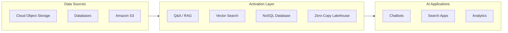

# Activation - Building Blocks

Welcome to the **Activation Building Blocks** documentation. These accelerators enable AI applications to access, query, and interact with prepared data through various interfaces and storage mechanisms.

## Overview

Activation capabilities provide the "data access layer" for AI applications, enabling natural language queries, semantic search, and efficient data retrieval. These building blocks bridge the gap between prepared data and AI-powered applications.

---

## Available Building Blocks

### [Question & Answer (Q&A)](q-and-a/index.md)

Build grounded enterprise Q&A over documents and data using retrieval-augmented generation with configurable retrieval and response pipelines.

**Key Components:**

- **RAG Accelerator**: Complete RAG pipeline with document processing, embedding generation, and semantic search
- **Text-to-SQL**: Convert natural language questions into executable SQL queries using watsonx.data intelligence

**Key Features:**

- Ingestion pipeline with chunking and embedding
- Hybrid search with reranking (weighted, RRF, cross-encoder)
- LLM integration with configurable models
- Governance integration with watsonx.governance

**IBM Products:**

- IBM watsonx.ai
- IBM watsonx.data
- IBM watsonx.data Intelligence
- IBM Cloud Object Storage (COS)
- Milvus Vector Database

---

### [Vector Search](vector-search/index.md)

Vector ingestion, embedding, retrieval; smaller scale, elastic search.

**Key Features:**

- Document parsing and extraction
- Multiple embedding strategies (dense, hybrid, dual)
- Flexible chunking strategies
- REST API with authentication
- Support for multiple vector databases

**Supported Databases:**

- **[Milvus](vector-search/milvus.md)**: High-performance vector database (Available Now)
- **[OpenSearch](vector-search/opensearch.md)**: Hybrid vector and keyword search (Planned)
- **[DataStax Astra DB](vector-search/datastax-astra-db.md)**: Cloud-native vector database (Planned)

**IBM Products:**

- IBM watsonx.ai
- IBM watsonx.data
- IBM Cloud Object Storage (COS)
- Milvus

---

### [No SQL Database](no-sql-database/index.md)

NoSQL - huge scale, Cassandra. Provides large-scale NoSQL storage with Cassandra compatibility and optional vector capabilities for AI and application workloads.

**Key Features:**

- Apache Cassandra-based serverless database
- Vector collections for AI applications
- Data API and CQL support
- Scalable and highly available

**IBM Products:**

- DataStax Astra DB
- Apache Cassandra

---

### [Zero-Copy Lakehouse](zero-copy-lakehouse/index.md)

Federated analytics without copying data. Query data across distributed sources with open lakehouse architecture and federated access without copying all source data into a single repository.

**Key Features:**

- Query across multiple data sources without duplication
- Federated query capability (S3, COS, Db2, external warehouses)
- Built on open table formats (Iceberg/Delta)
- Cost savings by eliminating data movement

**Key Benefits:**

- **Cost Savings**: No redundant storage costs
- **Faster Insights**: Avoids ETL delays
- **Single Source of Truth**: Reduces data inconsistencies
- **Flexibility**: Multiple engines access the same data
- **Governance**: Centralized access control

**IBM Products:**

- IBM watsonx.data
- IBM Cloud Object Storage (COS)
- IBM Db2 Database
- Amazon S3 (integration)
- Presto Query Engine

---

## Use Cases

!!! example "Common Activation Scenarios"
    - **Semantic Search**: Find documents based on meaning, not just keywords
    - **Question Answering**: Build Q&A systems over enterprise documents
    - **Multi-Cloud Analytics**: Query data across AWS, IBM Cloud, and on-premises
    - **Real-Time Insights**: Access live data without ETL delays
    - **Knowledge Discovery**: Find similar documents across large collections

---

## Getting Started

!!! tip "Quick Start"
    1. Choose the building block that matches your use case
    2. Ensure your data is prepared using Enrichment building blocks
    3. Follow the specific setup instructions in each building block
    4. Configure your IBM watsonx environment
    5. Start querying and activating your data

---

## Key Benefits

!!! success "Why Use Activation Building Blocks?"
    - **Natural Language Access**: Query data using plain language
    - **Semantic Understanding**: Find relevant information based on meaning
    - **Zero Data Movement**: Access data where it lives
    - **Scalability**: Handle enterprise-scale queries
    - **Integration**: Seamless integration with IBM watsonx platform

---

## Architecture Pattern

---

## Resources

- [GitHub Repository](https://github.com/ibm-self-serve-assets/building-blocks/tree/main/data-for-ai)
- [IBM watsonx.data Documentation](https://www.ibm.com/docs/en/watsonxdata)
- [IBM watsonx.ai Documentation](https://www.ibm.com/docs/en/watsonx-as-a-service)

---

## Support

For issues or questions, please refer to the [GitHub repository](https://github.com/ibm-self-serve-assets/building-blocks/tree/main/data-for-ai) or contact IBM support.