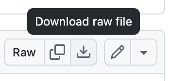
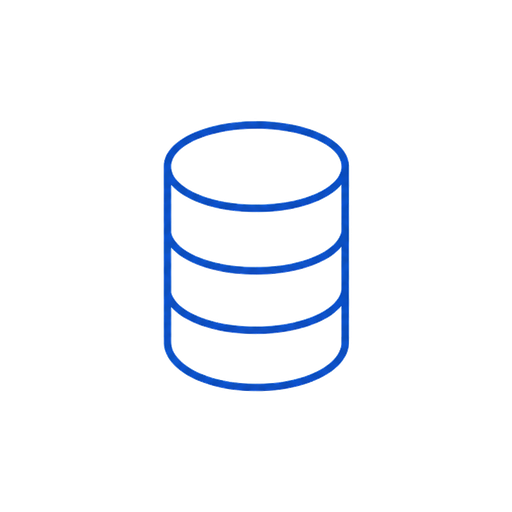

# Bob+ Skills and Modes – Data

IBM Bob ships with purpose-built **Skills** and **Custom Modes** for every Data building block, giving engineers an AI-assisted workflow to plan, build, configure, and operate real-time streaming, stream processing, integration pipelines, lakehouse analytics, and vector retrieval directly from their IDE.

## How to install the Skills
The Skills have been packed into a single .zip that you can easily download and install. Go to the [skills.zip page](https://github.com/ibm-self-serve-assets/building-blocks/blob/main/ibm-bob/skills.zip) and click the `Download raw file` icon at the upper-right of the page. Copy all skill folders at either the global, `~/.bob/skills`, or project-level, `<project>/.bob/skills`.

## Skill Taxonomy

Each Skill for IBM Building Blocks often aligns with an IBM product but not always. For specifics on how each skill works, read through the associated SKILL.md.

  <table class="skill-card" style="--accent:#aacaff; --header:#edf4ff; --th:#dfeaff; --first-td:#f3f7ff; --grid:#c9dcff; --text:#031040;">
    <tbody>
      <thead><tr><th colspan="2">
        
Data Skills

      </th></tr></thead>
      <tr>
        <td>
Streamhouse
</td>
        <td>
            
<a href="https://github.com/ibm-self-serve-assets/building-blocks/blob/main/ibm-bob/skills/data-streaming-confluent/SKILL.md">Data-streaming: Confluent</a>
             Works with IBM Confluent for real-time data streaming, Kafka topic management, Schema Registry contracts, stream processing configuration, and event pipeline setup.

            
<a href="https://github.com/ibm-self-serve-assets/building-blocks/blob/main/ibm-bob/skills/data-streaming-confluent-terraform/SKILL.md">Data-streaming: Confluent plus Terraform</a>
             Expert guidance for building real-time streaming systems on Confluent Cloud using Infrastructure-as-Code (Terraform), Apache Flink SQL, and Python producers.

            
<a href="https://github.com/ibm-self-serve-assets/building-blocks/blob/main/data/streamhouse/serve/bob-skills/streamhouse-continuous-rag.zip">Streamhouse Continuous RAG</a>
             Combines Streamhouse live operational state with RAG enterprise knowledge — design and implement continuous RAG pipelines that keep AI agents grounded in live context.

        </td>
      </tr>
      <tr>
        <td>
Pipelines
</td>
        <td>
            
<a href="https://github.com/ibm-self-serve-assets/building-blocks/tree/main/data/pipelines/rag/bob-skills">RAG Pipeline Builder</a>
             Complete RAG pipeline design — IBM watsonx.ai embedding integration, OpenSearch HNSW + hybrid search design, chunking strategy selection, and evaluation with RAGAS metrics.

            
<a href="https://github.com/ibm-self-serve-assets/building-blocks/tree/main/data/pipelines/rag/bob-skills">RAG MCP Server Builder</a>
             MCP server development (SSE transport, FastMCP), RAG ingestion + retrieval tool design, IBM Bob / Claude integration, and deployment to IBM Code Engine.

            
<a href="https://github.com/ibm-self-serve-assets/building-blocks/tree/main/data/pipelines/udi/bob-skills">Data Ingestion: Unstructured (UDI + Docling)</a>
             IBM Docling document parsing, UDI pipeline configuration, multi-format chunking (PDF, DOCX, HTML, images), metadata extraction, and Python automation scripts.

            
<a href="https://github.com/ibm-self-serve-assets/building-blocks/tree/main/data/pipelines/udi/bob-skills">Data Ingestion: UDI + OpenSearch</a>
             IBM UDI + OpenSearch integration, document search pipeline setup, and OpenSearch index provisioning for UDI output into IBM watsonx.data.

            
<a href="https://github.com/ibm-self-serve-assets/building-blocks/tree/main/data/pipelines/text2sql/bob-skills">Text2SQL: Metadata Enrichment</a>
             watsonx.data Intelligence project onboarding, table/column description enrichment, synonym design, query example authoring, and accuracy measurement.

            
<a href="https://github.com/ibm-self-serve-assets/building-blocks/tree/main/data/pipelines/text2sql/bob-skills">Text2SQL: Query Optimizer</a>
             Model selection, SQL safety validation, accuracy evaluation (exact-match + execution accuracy), error pattern diagnosis, and SQL dialect tuning.

            
<a href="https://github.com/ibm-self-serve-assets/building-blocks/tree/main/data/pipelines/etl/bob-skills">Data Ingestion: Structured (DataStage)</a>
             IBM DataStage connector config, CDC pipeline design, schema mapping, batch and incremental load strategies into IBM watsonx.data lakehouse tables.

        </td>
      </tr>
      <tr>
        <td>
Lakehouse
</td>
        <td>
            
<a href="https://github.com/ibm-self-serve-assets/building-blocks/tree/main/data/lakehouse/metadata-enrichment/bob-skills">Data Quality: Rules</a>
             Data quality rule authoring, watsonx.data Intelligence quality checks, profiling automation, threshold design, and compliance reporting patterns for AI-ready data.

            
<a href="https://github.com/ibm-self-serve-assets/building-blocks/tree/main/data/lakehouse/metadata-enrichment/bob-skills">Data Lineage: OpenLineage Instrumentation</a>
             OpenLineage event design, Python/DataStage/Spark instrumentation patterns, IBM Databand lineage API integration, and lineage graph authoring.

            
<a href="https://github.com/ibm-self-serve-assets/building-blocks/tree/main/data/lakehouse/data-observability/bob-skills">Data Observability: Databand Pipeline Setup</a>
             IBM Databand pipeline onboarding, OpenLineage event design (START / COMPLETE / FAIL), alert policy authoring (null-rate, schema-drift, SLA-breach), and IAM auth patterns.

            
<a href="https://github.com/ibm-self-serve-assets/building-blocks/tree/main/data/lakehouse/zero-copy-lakehouse/bob-skills">Zero-Copy Lakehouse</a>
             Presto SQL optimization, Spark job configuration on watsonx.data, cross-catalog federation design, and Iceberg table maintenance.

            
<a href="https://github.com/ibm-self-serve-assets/building-blocks/tree/main/data/lakehouse/serverless-vector/bob-skills">Vector Search: AstraDB</a>
             Astra DB vector collection creation, IBM watsonx.ai embedding integration, ANN cosine search queries via `astrapy` Data API, and metadata filtering.

            
<a href="https://github.com/ibm-self-serve-assets/building-blocks/tree/main/data/lakehouse/serverless-vector/bob-skills">Vector Search: OpenSearch</a>
             IBM watsonx.data OpenSearch k-NN index design, HNSW parameter tuning (`ef_construction`, `m`), and hybrid search (vector + BM25) score fusion.

        </td>
      </tr>
    </tbody>
  </table>

---

## Data Modes

Instructions and related files for these custom modes can be found in their respective repository.

  <table class="skill-card" style="--accent:#aacaff; --header:#edf4ff; --th:#dfeaff; --first-td:#f3f7ff; --grid:#c9dcff; --text:#031040;">
    <tbody>
      <thead><tr><th colspan="2">
        
Data Modes

      </th></tr></thead>
      <tr>
        <td>
Streamhouse
</td>
        <td>
            
<a href="https://github.com/ibm-self-serve-assets/building-blocks/tree/main/data/streamhouse/real-time-streaming/bob-modes">Data Ingestion</a>
             AI-generated data pipeline mode for streaming (Kafka / Flink), CDC, and structured/unstructured sources. Describe your data source and target — Bob generates the complete pipeline automatically.

        </td>
      </tr>
      <tr>
        <td>
Pipelines
</td>
        <td>
            
<a href="https://github.com/ibm-self-serve-assets/building-blocks/tree/main/data/pipelines/text2sql/bob-modes">Text-to-SQL</a>
             Natural language to SQL using IBM watsonx.data Intelligence Text2SQL API. Bob helps build the FastAPI application, enrich database metadata (table/column descriptions, synonyms), and evaluate SQL accuracy across Presto, PostgreSQL, Oracle, and Snowflake dialects.

            
<a href="https://github.com/ibm-self-serve-assets/building-blocks/tree/main/data/pipelines/rag/bob-modes">RAG Builder</a>
             End-to-end RAG architect — pipeline architecture, hybrid search design, chunking strategy, IBM watsonx.ai embedding model choice, MCP server design, and RAG evaluation (RAGAS).

            
<a href="https://github.com/ibm-self-serve-assets/building-blocks/tree/main/data/pipelines/rag/bob-modes">RAG Ingestion Builder</a>
             Focused ingestion specialist — IBM COS document loading, chunking, watsonx.ai embedding, OpenSearch indexing, and MCP ingestion tool design (`ingest_from_cos`).

            
<a href="https://github.com/ibm-self-serve-assets/building-blocks/tree/main/data/pipelines/rag/bob-modes">RAG Retrieval Builder</a>
             Focused retrieval and generation specialist — hybrid search queries, reranking, watsonx.ai Granite generation, RAGAS evaluation, streaming SSE responses, and MCP retrieval tools.

        </td>
      </tr>
      <tr>
        <td>
Lakehouse
</td>
        <td>
            
<a href="https://github.com/ibm-self-serve-assets/building-blocks/tree/main/data/lakehouse/metadata-enrichment/bob-modes">Data Lineage Builder</a>
             End-to-end lineage tracking with IBM Manta and watsonx.data Intelligence. Bob assists with OpenLineage instrumentation, impact analysis, compliance reporting, and lineage visualization.

            
<a href="https://github.com/ibm-self-serve-assets/building-blocks/tree/main/data/lakehouse/metadata-enrichment/bob-modes">Data Quality Builder</a>
             Data quality rule authoring and monitoring with watsonx.data Intelligence. Bob helps define validation rules, configure profiling, set quality thresholds, and build compliance reports.

            
<a href="https://github.com/ibm-self-serve-assets/building-blocks/tree/main/data/lakehouse/data-observability/bob-modes">Data Observability Builder</a>
             IBM Databand pipeline onboarding, OpenLineage instrumentation for Python/DataStage/Spark, alert policy design, and quality threshold tuning.

            
<a href="https://github.com/ibm-self-serve-assets/building-blocks/tree/main/data/lakehouse/serverless-vector/bob-modes">OpenSearch Builder</a>
             IBM watsonx.data OpenSearch k-NN index design, HNSW parameter tuning, hybrid search score fusion, and IBM watsonx.ai embedding integration.

            
<a href="https://github.com/ibm-self-serve-assets/building-blocks/tree/main/data/lakehouse/serverless-vector/bob-modes">Astra DB Vector Builder</a>
             DataStax Astra DB vector collection design, `astrapy` ANN search patterns, IBM watsonx.ai embedding integration, and IBM COS ingestion for serverless global vector storage.

        </td>
      </tr>
    </tbody>
  </table>

---

For the complete list of all Building Block skills across AI, Data, and Automation, see the [Bob+ Skills page](../ibm-bob/skills/index.md).
