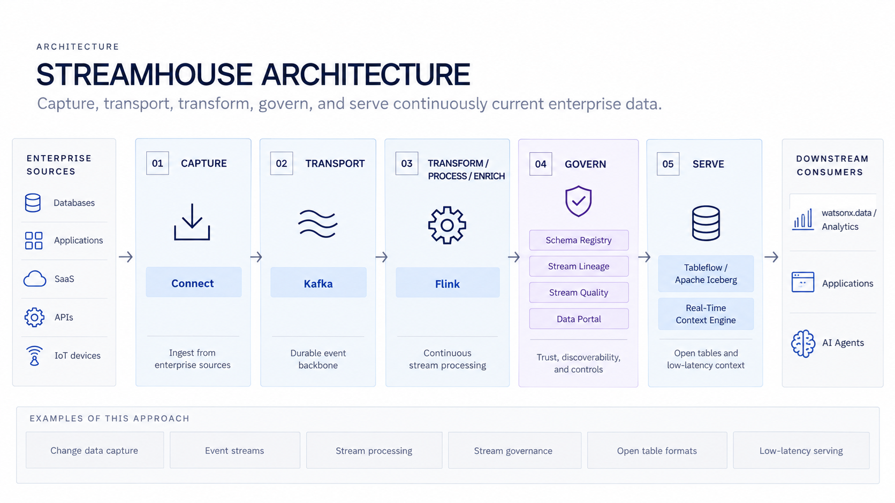
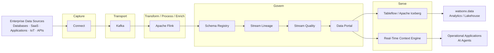

# Streamhouse

Use **IBM Confluent** to continuously capture, transport, transform, govern, and serve enterprise data for production applications, analytics, and AI.

!!! info "Product mapping"
    **IBM Confluent** — Connect + Kafka + Apache Flink + Schema Registry + Stream Lineage + Stream Quality + Data Portal + Tableflow + Real-Time Context Engine

!!! info "Architecture vs. technology"
    **Streamhouse** is an architectural pattern — a category. **IBM Confluent** provides the core IBM technology capabilities used to implement it. Kafka and Confluent are important parts of the implementation, but Streamhouse represents the broader end-to-end architecture.

!!! info "GitHub Repository"
    The complete source code and examples are available in the GitHub repository:

    [Building Blocks - Streamhouse](https://github.com/ibm-self-serve-assets/building-blocks/tree/main/data/context/streamhouse)

---

## Included Assets

| Asset | Description |
|---|---|
| **[supply-chain-risk-control-tower](https://github.com/ibm-self-serve-assets/building-blocks/tree/main/data/context/streamhouse/assets/supply-chain-risk-control-tower)** | End-to-end supply chain risk streaming reference — Kafka topics, Schema Registry contracts, Python risk engine, Flink SQL, Terraform, and IBM Carbon dashboard |
| **[live-context-for-supply-chain-resilience](https://github.com/ibm-self-serve-assets/building-blocks/tree/main/data/context/streamhouse/assets/live-context-for-supply-chain-resilience)** | Full-stack AI demo combining real-time risk detection, watsonx Orchestrate agents, and a Carbon React control tower |

---

## Bob Skills

| Skill | Description |
|---|---|
| **[data-streaming-confluent](https://github.com/ibm-self-serve-assets/building-blocks/tree/main/data/context/streamhouse/bob-skills/data-streaming-confluent.zip)** | Works with IBM Confluent for Kafka topic management, stream processing configuration, Schema Registry, Flink SQL, and event-driven pipeline setup |
| **[confluent-iac-terraform](https://github.com/ibm-self-serve-assets/building-blocks/tree/main/data/context/streamhouse/bob-skills/confluent-iac-terraform.zip)** | Expert guidance for building Streamhouse infrastructure on Confluent Cloud using Terraform, Apache Flink SQL, and Python producers — adapts to any streaming use case |
| **[streamhouse-continuous-rag](https://github.com/ibm-self-serve-assets/building-blocks/blob/main/data/context/streamhouse/bob-skills/streamhouse-continuous-rag.zip)** | Combines Streamhouse live business state with RAG enterprise knowledge — design and implement continuous RAG pipelines that keep AI agents grounded in current operational context |

!!! tip "Installing skills"
    Download the skills `.zip` files and copy the skill folders to `~/.bob/skills` (global) or `<project>/.bob/skills` (project-level). See the [Data Skills and Modes](../../bob-skills-and-modes.md) page for full installation instructions.

---

## Why It Matters

Most enterprise data platforms are built for data at rest. Business events — orders, transactions, sensor readings, user actions — happen continuously, but batch pipelines delay that context by hours or days. Streamhouse eliminates that gap, making continuously current operational state available to applications, AI agents, and analytics the moment it is generated — in a governed, discoverable, and reusable form.

---

## Business Value

!!! success "Key outcomes"
    | Outcome | What It Means |
    |---|---|
    | **React to events as they happen** | Replace polling and batch delays with live event-driven flows |
    | **Reduce custom integration code** | Managed Connect connectors to databases, SaaS, IoT and cloud systems eliminate bespoke glue code |
    | **Transform data in motion** | Fully managed Apache Flink handles filtering, joining, enrichment and aggregation continuously |
    | **Govern streaming data** | Schema Registry, Stream Lineage, Stream Quality and Data Portal make data in motion trustworthy and reusable |
    | **Serve analytics and AI from a single stream** | One governed stream can power open-table lakehouse analytics via Tableflow/Iceberg and live operational context via the Real-Time Context Engine |

---

## When to Use

Use Streamhouse when:

- Applications or AI agents require **continuously current business state** rather than yesterday's batch snapshot.
- You need **Change Data Capture (CDC)** with low-latency delivery to downstream consumers.
- Events from databases, SaaS, IoT or APIs must be **ingested, enriched and governed in motion**.
- The same data stream must support **both real-time operational use and lakehouse analytics**.
- Streaming data needs to be **discoverable and governed** across teams, not siloed in engineering.

!!! note "When batch is better"
    A traditional batch ETL pipeline is usually a better fit when freshness requirements are measured in hours or days and the operational complexity of streaming is not justified. See [ETL / ELT](../../pipelines/etl/index.md).

---

## Core Capabilities

| Layer | Capability | What It Does |
|---|---|---|
| **Capture** | Connect | Managed connectors that bring enterprise data from databases, SaaS, IoT, APIs and mainframes into Kafka |
| **Transport** | Kafka | Durable, scalable event-streaming backbone — topics, producers, consumers, retention, replay |
| **Transform / Process / Enrich** | Apache Flink | Serverless stream processing — filter, join, enrich, aggregate and derive new streams in real time |
| **Govern** | Schema Registry | Schema definition, compatibility enforcement and safe schema evolution across producers and consumers |
| **Govern** | Stream Lineage | End-to-end visibility from source through Kafka topics and Flink processing to downstream consumers |
| **Govern** | Stream Quality | Data contracts and field-level quality validation — prevents invalid data from reaching downstream consumers |
| **Govern** | Data Portal | Self-service discovery of governed streaming data products — schemas, ownership, metadata and access |
| **Serve** | Tableflow / Apache Iceberg | Materializes Kafka topics as open Iceberg tables for SQL analytics in watsonx.data, Presto or Spark |
| **Serve** | Real-Time Context Engine | Low-latency access to continuously current operational state via MCP or REST for applications and AI agents |

---

## Reference Architecture

---

## Why It Matters for AI

Streamhouse provides the **live business state** that complements RAG-based enterprise knowledge:

| RAG | Streamhouse |
|---|---|
| Provides enterprise knowledge | Provides continuously current business state |
| Documents, policies, product information | Orders, transactions, inventory, alerts |
| Relatively stable over time | Changes event by event, continuously |

Together they give AI agents complete context — not just what the enterprise knows, but what is happening right now:

- *What is the current status of this order?*
- *Which machine has just generated an anomaly?*
- *Has the payment been received?*
- *Which shipment is currently delayed?*

The Real-Time Context Engine in the Serve layer exposes this live state to agents and applications via MCP or REST.

---

## Streamhouse and the Lakehouse

Streamhouse does not replace the lakehouse — it works alongside it:

| Streamhouse | Lakehouse |
|---|---|
| Continuously current business state | Historical and analytical data |
| Event-driven | Query-driven |
| Data in motion | Data at rest |
| Kafka / Flink processing | SQL / Spark analytical processing |
| Real-Time Context Engine | Analytical query engines |
| Tableflow publishes streams as open tables | Iceberg provides open analytical tables |

**Tableflow / Iceberg** connects the two worlds — streaming events written as Iceberg tables are immediately queryable in watsonx.data, Presto or Spark.

---

## What to Demonstrate

1. Show an enterprise source change (database update, application event, or IoT reading).
2. Show **Connect** capturing the change and publishing it to a Kafka topic.
3. Show a **Flink** SQL job filtering, joining, or enriching the stream in real time.
4. Show **Schema Registry** enforcing the event schema and **Stream Lineage** tracing the event from source to consumer.
5. Show **Stream Quality** — data contract validation and quality signals.
6. Show **Data Portal** — browse and discover the governed streaming data product.
7. Show **Tableflow** materializing the stream as an Iceberg table queryable in watsonx.data.
8. Show **Real-Time Context Engine** delivering current state to an AI agent or application via MCP/REST.

---

## Design Considerations

!!! tip "Design for production from day one"
    - Define event schemas and compatibility rules **before** scaling producer teams.
    - Choose partitions based on throughput and ordering requirements.
    - Make event keys intentional — they affect partitioning, joins and state.
    - Design idempotent consumers where duplicate delivery creates business risk.
    - Use dead-letter / error handling patterns for malformed records.
    - Treat retention as an architectural decision, not just a storage setting.
    - Establish data contracts (Stream Quality) early to prevent schema drift propagating downstream.
    - Use the Data Portal to make streams discoverable before announcing them to consumers.

---

## IBM Products Used

| Product | Role |
|---|---|
| **[IBM Confluent](https://www.ibm.com/products/confluent)** | Managed platform delivering all Streamhouse capabilities — Connect, Kafka, Flink, Stream Governance, Tableflow, Real-Time Context Engine |
| **[Confluent Cloud — Connect](https://docs.confluent.io/cloud/current/connectors/overview.html)** | Fully managed connectors for the Capture layer |
| **[Confluent Cloud — Apache Kafka](https://docs.confluent.io/cloud/current/kafka/overview.html)** | Durable, scalable event-streaming backbone for the Transport layer |
| **[Confluent Cloud — Apache Flink](https://docs.confluent.io/cloud/current/flink/overview.html)** | Serverless stream processing for the Transform / Process / Enrich layer |
| **[Confluent Stream Governance — Schema Registry](https://docs.confluent.io/cloud/current/stream-governance/schemas-manage.html)** | Schema definition, compatibility enforcement and evolution |
| **[Confluent Stream Governance — Stream Lineage](https://docs.confluent.io/cloud/current/stream-governance/stream-lineage.html)** | End-to-end data lineage across the streaming pipeline |
| **[Confluent Stream Governance — Stream Quality](https://docs.confluent.io/cloud/current/stream-governance/stream-quality.html)** | Data contracts and quality validation for governed streams |
| **[Confluent Data Portal](https://docs.confluent.io/cloud/current/stream-governance/data-portal.html)** | Self-service discovery and access for streaming data products |
| **[Confluent Tableflow](https://docs.confluent.io/cloud/current/tableflow/overview.html)** | Materializes Kafka topics as open Apache Iceberg tables for lakehouse analytics |
| **[Real-Time Context Engine](https://docs.confluent.io/cloud/current/)** | Low-latency access to continuously current operational state via MCP / REST |
