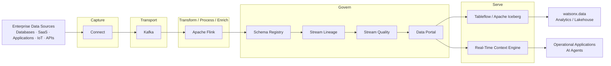

# Streamhouse

**Streamhouse** provides an architecture for continuously capturing, transporting, transforming, governing, and serving the current state of enterprise data for production applications, analytics, and AI.

!!! info "Architecture vs. technology"
    **Streamhouse** is an architectural pattern — a category. **IBM Confluent** provides the core IBM technology capabilities used to implement the Streamhouse architecture. Kafka and Confluent are important parts of the implementation, but Streamhouse represents the broader end-to-end picture.

!!! info "Product mapping"
    **IBM Confluent** — Connect + Kafka + Apache Flink + Schema Registry + Stream Lineage + Stream Quality + Data Portal + Tableflow + Real-Time Context Engine

!!! info "GitHub Repository"
    The complete source code and examples are available in the GitHub repository:

    [Building Blocks - Streamhouse](https://github.com/ibm-self-serve-assets/building-blocks/tree/main/data/context/streamhouse)

---

## Why It Matters

Most enterprise data platforms are built for data at rest. Business events — orders, transactions, sensor readings, user actions — happen continuously, but batch pipelines delay that context by hours or days. Streamhouse eliminates that gap, making continuously current operational state available to applications, AI agents, and analytics the moment it is generated — in a governed, discoverable, and reusable form.


---

## Business Value

!!! success "Key outcomes"
    | Outcome | What It Means |
    |---|---|
    | **React to events as they happen** | Replace polling and batch delays with live event-driven flows |
    | **Reduce custom integration code** | Managed Connect connectors to databases, SaaS, IoT and cloud systems eliminate bespoke glue code |
    | **Transform data in motion** | Fully managed Apache Flink handles filtering, joining, enrichment and aggregation continuously |
    | **Govern streaming data** | Schema Registry, Stream Lineage, Stream Quality and Data Portal make data in motion trustworthy and reusable |
    | **Serve analytics and AI from a single stream** | One governed stream can power open-table lakehouse analytics via Tableflow/Iceberg and live operational context via the Real-Time Context Engine |

---

## Streamhouse Architecture

The five layers of the Streamhouse architecture form an end-to-end pipeline from enterprise data sources to analytics and operational consumers:



---

## Capture — Connect

**Connect** is responsible for bringing enterprise data and events into the Streamhouse architecture. It provides a broad catalog of managed connectors that read from operational sources and publish data to Kafka topics — without requiring custom ingestion code or connector infrastructure to operate.

Typical sources include:

- **Operational databases** — relational and NoSQL systems via JDBC or native connectors
- **Enterprise applications** — ERP, CRM, and line-of-business systems
- **SaaS platforms** — Salesforce, ServiceNow, and other cloud applications
- **APIs** — HTTP-based event feeds and webhooks
- **IoT and telemetry systems** — device data, sensor readings, and operational metrics
- **Cloud services** — object stores, event buses, and managed data services
- **Files and object stores** — batch files that need to be streamed into the pipeline
- **Mainframe and transactional systems** — high-volume transaction logs and system-of-record events

**Change Data Capture (CDC)** is an especially important capture pattern. CDC detects row-level inserts, updates, and deletes directly from database transaction logs, delivering a continuous stream of operational changes to Kafka without polling the source system.

```
Enterprise Sources → Connect → Kafka
```

---

## Transport — Kafka

**Kafka** is the durable, scalable event-streaming backbone at the center of the Streamhouse architecture. Every event captured by Connect flows through Kafka topics before being processed, governed, or served.

Key Kafka concepts in Streamhouse:

| Concept | What It Does |
|---|---|
| **Topics** | Named, durable, append-only event logs that act as the central channel for each data stream |
| **Producers** | Applications and connectors that publish events to topics |
| **Consumers** | Applications, Flink jobs, and connectors that read from topics |
| **Durable event streams** | Events are persisted to disk and replicated — not lost after consumption |
| **Partitioning** | Topics are divided into partitions for horizontal scalability and parallelism |
| **Ordering** | Events within a partition are strictly ordered |
| **Replay** | Consumers can re-read events from any offset — enabling reprocessing and recovery |
| **Retention** | Configurable retention policies allow events to be held for seconds, days, or indefinitely |
| **Multiple independent consumers** | Multiple consumer groups can independently read the same topic at different positions |
| **Scalability** | Throughput scales by adding partitions and brokers without changing producers or consumers |

Kafka is specifically the **Transport** layer. It does not filter, enrich, or serve data — those responsibilities belong to the layers above and below it.

---

## Transform / Process / Enrich — Apache Flink

**Apache Flink** continuously processes data while it is in motion — between Kafka ingestion and governed serving. Rather than waiting for a batch window, Flink operates on streams as they arrive, applying transformations in real time.

Common Flink operations in Streamhouse:

| Operation | Example |
|---|---|
| **Filtering** | Discard events that do not meet criteria before they reach downstream consumers |
| **Joining** | Correlate two streams — e.g. join order events with customer profiles |
| **Aggregation** | Compute running totals, counts, or averages across a stream |
| **Enrichment** | Look up reference data and attach it to events in motion |
| **Windowed processing** | Compute metrics over tumbling, sliding, or session time windows |
| **Event processing** | Detect patterns, sequences, and anomalies across event streams |
| **Derived streams** | Produce new, purpose-built Kafka topics from existing ones |
| **Real-time calculations** | Execute scoring, ranking, or alerting logic on live data |

The pattern:

```
Kafka → Flink → Governed / reusable streaming data
```

Flink SQL is the primary interface for defining stream processing logic in a declarative, familiar syntax. Serverless managed Flink means no cluster infrastructure to operate.

---

## Govern

Governance in Streamhouse is not a single capability — it is a set of four complementary controls that together make streaming data trustworthy, discoverable, and reusable across teams and AI systems.

### Schema Registry

**Schema Registry** stores and enforces the schema for every Kafka topic. Producers register schemas before publishing; consumers retrieve schemas to deserialize events correctly. Compatibility rules (backward, forward, full) are enforced automatically so that producers and consumers can evolve independently without breaking each other.

- Define event schemas (Avro, JSON Schema, Protobuf)
- Enforce compatibility rules across schema versions
- Enable safe schema evolution without coordination delays
- Ensure producers and consumers agree on event structure at all times

### Stream Lineage

**Stream Lineage** provides end-to-end visibility into where data originates, how it moves, and where it is consumed across the Streamhouse pipeline:

```
Source → Kafka Topic → Flink Processing → Downstream Consumer
```

Users can answer questions such as: Which source system produced this event? Which Flink job transformed it? Which applications or analytics systems consume it? If an upstream source changes, which downstream consumers are affected?

### Stream Quality

**Stream Quality** enforces data contracts and validates data quality at the stream level:

- Define data contracts that specify what valid events look like
- Validate schema conformance and field-level quality rules as events flow
- Enforce schema rules so invalid or malformed events do not reach downstream consumers
- Surface quality violations for operational monitoring and remediation

### Data Portal

**Data Portal** provides self-service discovery of governed streaming data products. Users — including data engineers, analysts, and AI developers — can browse available topics, understand their schemas, check ownership and stewardship, review metadata and tags, and request access through a governed workflow.

The Data Portal makes the Streamhouse visible and consumable across the organization rather than being a system only the engineering team understands.

---

## Serve

The Serve layer exposes governed streaming data to downstream consumers. Two capabilities deliver the Streamhouse output:

### Tableflow / Apache Iceberg

**Tableflow** materializes Kafka topics as open Apache Iceberg tables, making continuously changing streaming data available to analytical workloads without manual ETL:

```
Kafka
  ↓
Tableflow
  ↓
Apache Iceberg
  ↓
watsonx.data / Analytics / Lakehouse consumers
```

This bridges the streaming and lakehouse worlds. The same events that flow through Kafka and Flink become queryable as Iceberg tables — enabling SQL analytics in watsonx.data, Presto, Spark, or any Iceberg-compatible engine.

**watsonx.data** is a consumer of the open table data produced through Tableflow/Iceberg — it is not part of the Streamhouse Serve layer itself.

### Real-Time Context Engine

**Real-Time Context Engine** provides low-latency, continuously current access to operational state, exposed through MCP or REST interfaces:

```
Kafka
  ↓
Real-Time Context Engine
  ↓
MCP / REST
  ↓
Applications / AI Agents
```

Rather than querying a database that reflects yesterday's state, applications and AI agents query the Real-Time Context Engine to get the current state of any entity — an order, a customer, a machine, an inventory record — as it exists right now.

**AI Agents and Applications** are downstream consumers of the Real-Time Context Engine — they are not part of the Serve layer itself.

---

## Streamhouse + AI / Live Context

Traditional AI architectures use RAG (Retrieval-Augmented Generation) to ground agents with enterprise knowledge. Streamhouse adds the complementary capability: **continuously current business state**.

| RAG | Streamhouse |
|---|---|
| Provides enterprise knowledge | Provides continuously current business state |
| Documents, policies, product information | Orders, transactions, inventory, alerts |
| Relatively stable over time | Changes event by event, continuously |

Together they form complete AI context:

```
Enterprise Knowledge (RAG)
        +
Live Business State (Streamhouse)
        ↓
      Context
        ↓
AI Applications / Agents
```

Examples of questions that require live context:

- *What is the current status of this order?*
- *Which machine has just generated an anomaly?*
- *Has the payment been received?*
- *Which shipment is currently delayed?*
- *What is the current inventory level?*

Traditional RAG and Streamhouse are **complementary**. RAG alone answers "what do we know?". Streamhouse answers "what is happening right now?". Combining both gives AI agents the full picture.

---

## Streamhouse + Lakehouse

Streamhouse does not replace the lakehouse — it works alongside it. The two architectures serve different purposes and are connected through Tableflow/Iceberg:

| Streamhouse | Lakehouse |
|---|---|
| Continuously current business state | Historical and analytical data |
| Event-driven | Query-driven |
| Data in motion | Data at rest |
| Kafka / Flink processing | SQL / Spark analytical processing |
| Operational / live context | Historical analytical context |
| Real-Time Context Engine | Analytical query engines |
| Tableflow publishes streams as open tables | Iceberg provides open analytical tables |

**Tableflow / Iceberg connects the streaming and lakehouse worlds.** Streaming events written as Iceberg tables are immediately queryable through watsonx.data, Presto, or Spark — making the same data available for both real-time operational use and analytical workloads.

---

## Use Cases

Streamhouse addresses a broad range of use cases that require continuously current data:

| Use Case | Description |
|---|---|
| **Change Data Capture** | Stream row-level changes from operational databases to downstream systems with low latency |
| **IoT / telemetry** | Ingest and process device and sensor data at scale in real time |
| **Real-time analytics** | Make live operational metrics available for dashboards and reporting |
| **Fraud / anomaly detection** | Detect suspicious patterns and anomalies as events occur |
| **Event-driven applications** | Build services that react to business events without polling |
| **Operational monitoring** | Track operational state and trigger alerts based on stream conditions |
| **Real-time personalization** | Adapt recommendations and experiences based on current user behavior |
| **Live context for AI agents** | Give agents access to continuously current business facts via Real-Time Context Engine |
| **Continuous RAG / live RAG context** | Supplement enterprise knowledge with live business state for richer AI responses |
| **Streaming data to lakehouse analytics** | Publish governed streams as Iceberg tables for SQL analytics in watsonx.data |
| **Need continuously current business state** | Any application, analytics workload, or AI agent that requires current data — not yesterday's snapshot |

---

## What to Demonstrate

A complete Streamhouse demo should walk through all five layers, showing how one governed stream can support both analytics and operational/AI use cases:

```
1. Enterprise source changes
          ↓
2. Connect captures the change
          ↓
3. Kafka transports the event
          ↓
4. Flink transforms / processes / enriches it
          ↓
5. Schema Registry + Stream Lineage +
   Stream Quality + Data Portal govern it
          ↓
6A. Tableflow / Iceberg serves it to analytics       6B. Real-Time Context Engine serves current state
          ↓                                                    ↓
    watsonx.data                                         MCP / REST
                                                              ↓
                                                    AI Agent / Application
```

Recommended demo steps:

1. Show an enterprise source change (database record update, application event, or IoT reading).
2. Show **Connect** capturing the change and publishing to a Kafka topic.
3. Show the event flowing through a **Kafka** topic — producer, topic, consumer group.
4. Show a **Flink** SQL job filtering, joining, or enriching the stream in real time.
5. Show **Schema Registry** enforcing the event schema.
6. Show **Stream Lineage** — trace the event from source to consumer.
7. Show **Stream Quality** — data contract validation and quality signals.
8. Show **Data Portal** — browse and discover the governed streaming data product.
9. Show **Tableflow** materializing the stream as an Iceberg table queryable in watsonx.data.
10. Show **Real-Time Context Engine** delivering current state to an AI agent or application via MCP/REST.

---

## Design Considerations

!!! tip "Design for production from day one"
    - Define event schemas and compatibility rules **before** scaling producer teams.
    - Choose partitions based on throughput and ordering requirements.
    - Make event keys intentional — they affect partitioning, joins and state.
    - Design idempotent consumers where duplicate delivery creates business risk.
    - Use dead-letter / error handling patterns for malformed records.
    - Treat retention as an architectural decision, not just a storage setting.
    - Establish data contracts (Stream Quality) early to prevent schema drift from propagating downstream.
    - Use the Data Portal to make streams discoverable before announcing them to consumers.

---

## IBM Products Used

| Product | Role |
|---|---|
| **[IBM Confluent](https://www.ibm.com/products/confluent)** | Managed Kafka platform, Connect connectors, Apache Flink, and complete Stream Governance |
| **[Confluent Cloud — Connect](https://docs.confluent.io/cloud/current/connectors/overview.html)** | Fully managed connectors to external systems for the Capture layer |
| **[Confluent Cloud — Apache Kafka](https://docs.confluent.io/cloud/current/kafka/overview.html)** | Durable, scalable event-streaming backbone for the Transport layer |
| **[Confluent Cloud — Apache Flink](https://docs.confluent.io/cloud/current/flink/overview.html)** | Serverless stream processing for the Transform / Process / Enrich layer |
| **[Confluent Stream Governance — Schema Registry](https://docs.confluent.io/cloud/current/stream-governance/schemas-manage.html)** | Schema definition, compatibility enforcement, and schema evolution |
| **[Confluent Stream Governance — Stream Lineage](https://docs.confluent.io/cloud/current/stream-governance/stream-lineage.html)** | End-to-end data lineage across the streaming pipeline |
| **[Confluent Stream Governance — Stream Quality](https://docs.confluent.io/cloud/current/stream-governance/stream-quality.html)** | Data contracts and quality validation for governed streams |
| **[Confluent Data Portal](https://docs.confluent.io/cloud/current/stream-governance/data-portal.html)** | Self-service discovery and access for streaming data products |
| **[Confluent Tableflow](https://docs.confluent.io/cloud/current/tableflow/overview.html)** | Materializes Kafka topics as open Apache Iceberg tables for lakehouse analytics |
| **[Real-Time Context Engine](https://docs.confluent.io/cloud/current/)** | Low-latency access to continuously current operational state via MCP / REST |
