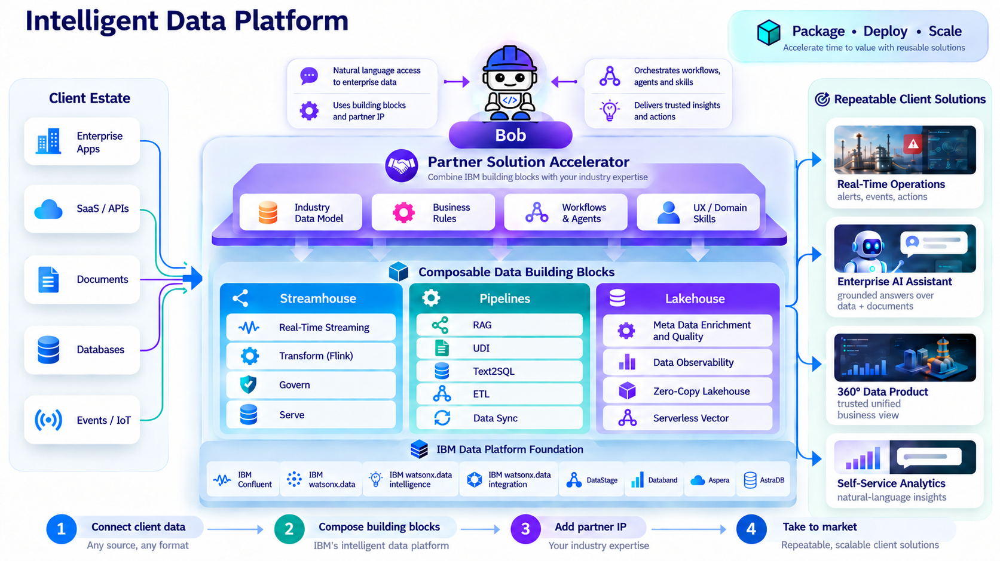
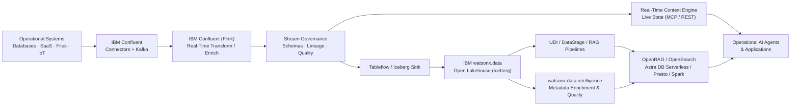

# Data – Intelligent Data Platform

**The Data Building Blocks** provide a practical, composable foundation for making enterprise data **connected, contextual, trusted, and ready for analytics and AI**. The model is organized around three primary pillars: **Streamhouse**, **Pipelines**, and **Lakehouse**.

!!! info "How to use this section"
    Start with the business outcome you need, then choose the smallest building block that solves it. The blocks are designed to work independently or together in an end-to-end data and AI architecture.

---

## Building Block Map

| Pillar | Building Block | Primary Products | What It Enables |
|---|---|---|---|
| **Streamhouse** | [Real-Time streaming](streamhouse/real-time-streaming/index.md) | IBM Confluent — Connectors and Kafka | Capture and transport enterprise event streams and CDC from databases, SaaS, and IoT into a durable event backbone |
| **Streamhouse** | [Transform](streamhouse/transform/index.md) | IBM Confluent (Flink) | Execute real-time stream processing, event enrichment, filtering, and windowed aggregations on data in motion |
| **Streamhouse** | [Govern](streamhouse/govern/index.md) | IBM Confluent — Stream governance | Enforce schema contracts, trace end-to-end stream lineage, evaluate stream quality rules, and catalog data products |
| **Streamhouse** | [Serve](streamhouse/serve/index.md) | IBM Confluent — RTCE | Deliver low-latency live state to AI agents via Real-Time Context Engine (MCP/REST) and open Iceberg tables for analytics |
| **Pipelines** | [RAG](pipelines/rag/index.md) | IBM watsonx.data (OpenRAG / OpenSearch) | Ground applications and agents with governed enterprise documents, vector search, and hybrid retrieval |
| **Pipelines** | [UDI](pipelines/udi/index.md) | IBM watsonx.data integration, IBM Docling | Ingest, parse, cleanse, chunk, and structure complex unstructured documents for RAG and AI |
| **Pipelines** | [Text2SQL](pipelines/text2sql/index.md) | IBM watsonx.data intelligence | Convert natural-language questions into SQL queries using vectorized and enriched metadata context |
| **Pipelines** | [ETL](pipelines/etl/index.md) | IBM watsonx.data (DataStage) | Build governed visual batch integration flows across source systems, transformations, and lakehouse targets |
| **Pipelines** | [Data Sync](pipelines/data-sync/index.md) | Aspera | Synchronize large file sets, media, and AI repositories securely across WAN and hybrid environments at wire speed |
| **Lakehouse** | [Meta Data Enrichment and Quality](lakehouse/metadata-enrichment/index.md) | IBM watsonx.data intelligence | Add business glossary terms, automated descriptions, profiling, quality rules, and lineage to lakehouse assets |
| **Lakehouse** | [Data Observability](lakehouse/data-observability/index.md) | watsonx.data Integration (Databand) | Detect pipeline failures, data drift, volume anomalies, and SLA breaches before downstream AI and analytics are impacted |
| **Lakehouse** | [Zero-Copy Lakehouse](lakehouse/zero-copy-lakehouse/index.md) | IBM watsonx.data (Presto, Spark, Iceberg) | Query and process distributed data in place without unnecessary copying using open Apache Iceberg tables |
| **Lakehouse** | [Serverless Vector](lakehouse/serverless-vector/index.md) | IBM watsonx.data, AstraDB | Elastic, serverless vector storage and similarity search for RAG and autonomous AI agent memory |

---

## 1. Streamhouse

> **Goal:** capture, transport, transform, govern, and serve the continuously current state of the business to production applications, analytics, and AI agents.

!!! success "Business Value"
    - **Sub-second freshness** — replace delayed batch snapshots with continuously updated operational events.
    - **Production-native reliability** — engineered to mission-critical SLAs for autonomous AI agents and core applications.
    - **Decentralized data access** — meets data where it lives across databases, SaaS, and edge devices without monolithic consolidation.
    - **Single stream for ops and analytics** — powers both real-time operational applications (RTCE) and open lakehouse tables (Tableflow/Iceberg).
    - **Strict stream governance** — enforce schema contracts and track end-to-end data lineage in motion.

**Use Streamhouse when:**

- AI agents or applications need **live operational facts** in addition to historical knowledge.
- You need **Change Data Capture (CDC)** or high-frequency event streaming.
- Continuous filtering, enrichment, or aggregation is required directly in motion.
- Streaming data must be published as open **Apache Iceberg tables** for lakehouse analytics.

[Explore Streamhouse →](streamhouse/index.md)

---

## 2. Pipelines

> **Goal:** prepare, transform, move, and index structured and unstructured data into forms that applications, search engines, analytics, and AI models can consume.

!!! success "Business Value"
    - **Faster AI readiness** — convert complex PDFs, presentations, and raw sources into structured, chunked, enriched content.
    - **More reliable RAG** — combine layout-aware document preparation (Docling) with enterprise retrieval (OpenRAG + OpenSearch).
    - **Democratized analytics** — let business users express analytical intent in natural language with Text2SQL while retaining SQL governance.
    - **Standardized batch integration** — visual ETL/ELT flows, enterprise connectors, and operational scheduling with DataStage.
    - **High-speed data movement** — synchronize multi-terabyte repositories across clouds and data centers via Aspera Sync.

**Use Pipelines when:**

- Data must be **ingested, transformed, enriched, replicated, or indexed** before consumption.
- You are building a **RAG pipeline, enterprise search, or agent grounding** service.
- You need **governed batch ETL/ELT** across diverse enterprise systems.
- Large files or datasets must be synchronized across high-latency WAN links.

[Explore Pipelines →](pipelines/index.md)

---

## 3. Lakehouse

> **Goal:** execute analytics, ML processing, metadata governance, data observability, and vector retrieval workloads on the engines best suited to each latency and data profile.

!!! success "Business Value"
    - **Reduce unnecessary data movement** — query external platforms in place with Presto federation without redundant copies.
    - **Open table interoperability** — Apache Iceberg enables Presto, Spark, and Flink to share the same governed tables without vendor lock-in.
    - **Fit-for-purpose compute** — interactive ANSI SQL on Presto; heavy distributed transformations on Spark.
    - **Automated metadata and data quality** — watsonx.data intelligence enriches raw tables with business terms, automated classifications, and quality scores.
    - **Proactive data observability** — Databand detects pipeline failures, run anomalies, and SLA breaches before users notice.
    - **Elastic serverless vector retrieval** — Astra DB Serverless scales on demand for semantic search and AI agent memory.

**Use Lakehouse when:**

- The same dataset must support **interactive SQL, large-scale processing, and AI retrieval**.
- You want to eliminate data duplication and query distributed sources in place.
- You need automated **data profiling, business glossary mapping, and quality rules**.
- You need **vector similarity search** at application scale without cluster management.

[Explore Lakehouse →](lakehouse/index.md)

---

## Recommended End-to-End Pattern

---

## Selection Guide

| If your primary problem is… | Start with… |
|---|---|
| "My AI agents need the latest business events or live operational state" | [Real-Time streaming](streamhouse/real-time-streaming/index.md) + [Serve (RTCE)](streamhouse/serve/index.md) |
| "I need to filter, join, or aggregate high-volume data streams in real time" | [Transform](streamhouse/transform/index.md) |
| "Streaming schema changes break downstream applications and consumers" | [Govern](streamhouse/govern/index.md) |
| "Users cannot understand or trust the available data in the lakehouse" | [Meta Data Enrichment and Quality](lakehouse/metadata-enrichment/index.md) |
| "Pipelines break, run slow, or breach SLAs without early alerts" | [Data Observability](lakehouse/data-observability/index.md) |
| "I need reliable enterprise RAG over complex documents and PDFs" | [UDI](pipelines/udi/index.md) + [RAG](pipelines/rag/index.md) |
| "Business users need to query governed lakehouse data in plain English" | [Meta Data Enrichment and Quality](lakehouse/metadata-enrichment/index.md) + [Text2SQL](pipelines/text2sql/index.md) |
| "I need repeatable batch transformation across enterprise systems" | [ETL](pipelines/etl/index.md) |
| "I need to synchronize very large file repositories globally over WAN" | [Data Sync](pipelines/data-sync/index.md) |
| "I want to query distributed data without creating another copy" | [Zero-Copy Lakehouse](lakehouse/zero-copy-lakehouse/index.md) |
| "I need an elastic serverless vector store for GenAI and agents" | [Serverless Vector](lakehouse/serverless-vector/index.md) |

---

## IBM Products Used

| Product | Role |
|---|---|
| **[IBM Confluent](https://www.ibm.com/products/confluent)** | Complete Streamhouse platform — Connectors, Kafka, Apache Flink, Stream Governance, Tableflow, and Real-Time Context Engine |
| **[IBM watsonx.data](https://www.ibm.com/products/watsonx-data)** | Open hybrid lakehouse platform — Presto, Spark, Apache Iceberg, and OpenRAG |
| **[IBM watsonx.data intelligence](https://www.ibm.com/docs/en/watsonx/wdi/2.4.x?topic=data-enriching-your-assets)** | Metadata enrichment, business glossary, data quality rules, lineage, and Text2SQL |
| **[IBM watsonx.data integration](https://www.ibm.com/docs/en/watsonx/wdi/2.4.x?topic=data-integration)** | DataStage visual ETL/ELT, UDI document pipelines, and Databand data observability |
| **[IBM Data Observability by Databand](https://www.ibm.com/products/watsonx-data-integration/data-observability)** | Continuous pipeline and dataset monitoring, anomaly detection, and SLA tracking |
| **[Docling for IBM watsonx](https://www.ibm.com/products/docling)** | Deep learning document conversion for complex PDFs, tables, and unstructured layouts |
| **[IBM Aspera Sync](https://www.ibm.com/products/aspera/sync)** | High-speed WAN file, dataset, and repository synchronization |
| **[Astra DB Serverless](https://docs.datastax.com/en/astra-db-serverless/databases/create-database.html)** | Serverless vector database for embeddings and high-scale similarity search |
