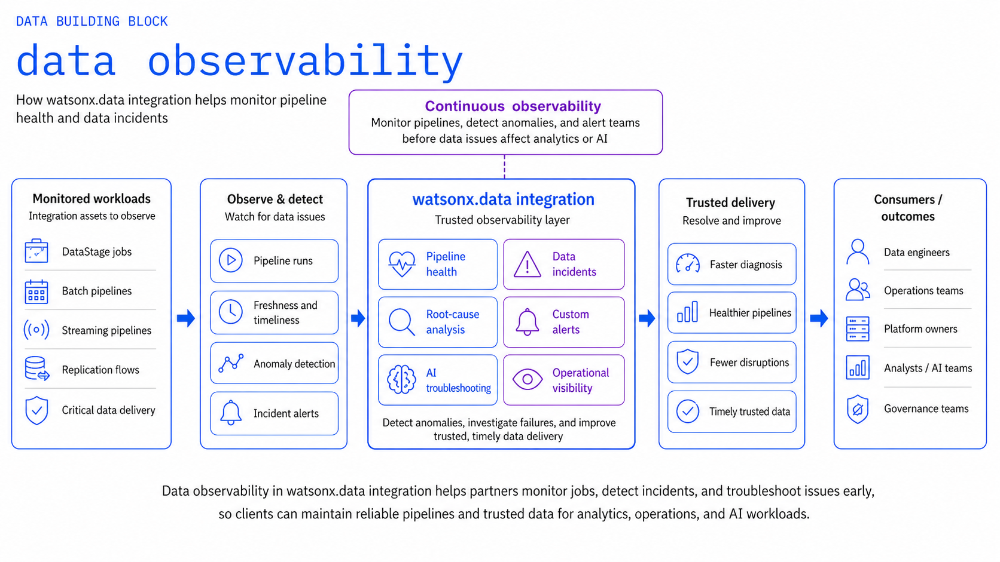
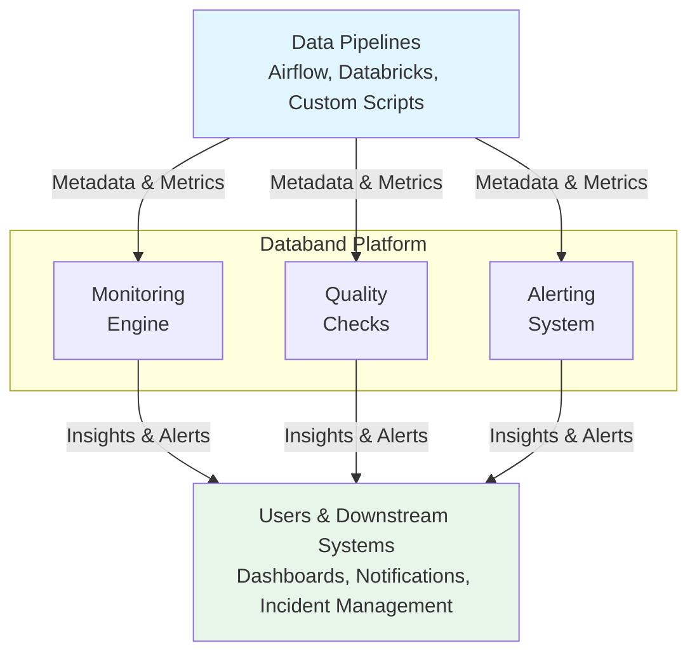

# Data Observability

Monitor and ensure data pipeline quality and reliability with comprehensive observability capabilities powered by Databand.

## Overview

Data Observability provides comprehensive monitoring, alerting, and quality validation for data pipelines. This building block helps teams detect, diagnose, and resolve data quality issues before they impact downstream applications and AI models.



## Key Features

### Pipeline Monitoring
- Real-time pipeline execution tracking
- Performance metrics and bottleneck identification
- Historical trend analysis
- Custom dashboards and visualizations

### Data Quality Validation
- Automated data quality checks
- Schema validation and drift detection
- Data freshness monitoring
- Anomaly detection

### Alerting and Notifications
- Configurable alert rules
- Multi-channel notifications (email, Slack, PagerDuty)
- Incident management integration
- SLA monitoring and reporting

### Integration Capabilities
- Native integration with IBM watsonx.data
- Support for popular orchestration tools (Airflow, Databricks)
- API-first architecture for custom integrations
- Metadata collection and lineage tracking

## IBM Products

- **Databand**: Data observability and pipeline monitoring platform
- **IBM watsonx.data**: Open lakehouse platform
- **IBM Cloud Object Storage**: Scalable object storage

## Use Cases

!!! example "Common Observability Scenarios"
    - **Pipeline Health Monitoring**: Track pipeline execution status and performance
    - **Data Quality Assurance**: Validate data quality before AI consumption
    - **Incident Response**: Quickly identify and resolve data issues
    - **Compliance Reporting**: Generate audit trails and compliance reports

## Getting Started

### Prerequisites

- IBM watsonx.data instance
- Databand account or installation
- Access to data pipelines and sources

### Quick Start

1. **Configure Databand Integration**
   ```bash
   # Set up Databand connection
   export DATABAND_URL="your-databand-url"
   export DATABAND_TOKEN="your-api-token"
   ```

2. **Install Databand SDK**
   ```bash
   pip install dbnd
   ```

3. **Instrument Your Pipeline**
   ```python
   from dbnd import task, pipeline
   
   @task
   def process_data(input_path: str) -> str:
       # Your data processing logic
       return output_path
   
   @pipeline
   def data_pipeline():
       result = process_data("/path/to/data")
       return result
   ```

4. **Monitor Pipeline Execution**
   - Access Databand dashboard
   - View pipeline runs and metrics
   - Configure alerts and notifications

## Architecture



## Best Practices

1. **Define Quality Metrics Early**: Establish data quality standards before pipeline deployment
2. **Set Appropriate Alert Thresholds**: Balance between noise and missing critical issues
3. **Monitor Data Freshness**: Track data arrival times and processing delays
4. **Document Pipeline Dependencies**: Maintain clear lineage and dependency maps
5. **Regular Review**: Periodically review and update monitoring rules

## Resources

- [GitHub Repository](https://github.com/ibm-self-serve-assets/building-blocks/tree/main/data/integration/data-observability)
- [Databand Documentation](https://docs.databand.ai/)
- [IBM watsonx.data Documentation](https://www.ibm.com/docs/en/watsonxdata)

## Support

For issues or questions, please refer to the [GitHub repository](https://github.com/ibm-self-serve-assets/building-blocks/tree/main/data/integration/data-observability) or contact IBM support.