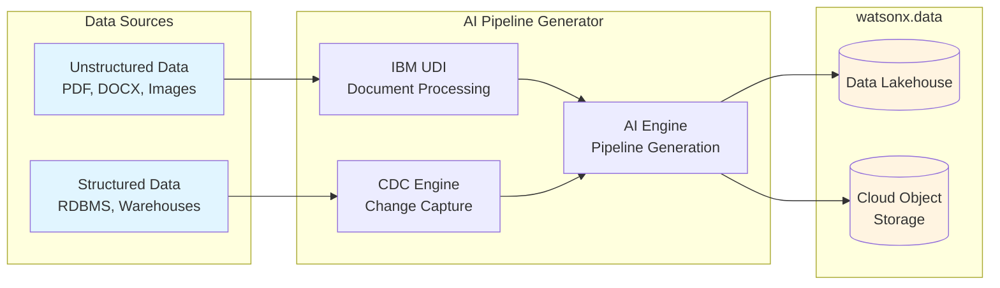

# Data Pipeline (AI Generated)

AI-powered data pipeline generation and automation for IBM watsonx.data covering unstructured and structured data sources.

!!! info "GitHub Repository"
    The complete source code and examples are available in the GitHub repository:
    
    **[Building Blocks - Data Pipeline (AI Generated)](https://github.com/ibm-self-serve-assets/building-blocks/tree/main/data/integration/data-pipeline-ai-generated)**

---

## Overview

The Data Pipeline (AI Generated) building block provides an intelligent framework for automatically generating and managing data pipelines for IBM watsonx.data. It leverages AI to understand data sources, recommend optimal ingestion strategies, and automate pipeline creation, reducing manual effort and accelerating time-to-value.

---

## IBM Products Used

This building block leverages the following IBM products and services:

- **[watsonx.data](https://www.ibm.com/products/watsonx-data)**: Data lakehouse platform for storing and managing ingested data
- **[IBM Cloud Object Storage (COS)](https://www.ibm.com/cloud/object-storage)**: Scalable object storage for data staging and archival
- **[IBM UDI (Unstructured Data Ingestion)](https://www.ibm.com/docs/en/watsonx/watsonxdata)**: Purpose-built solution for ingesting unstructured data
- **[Db2](https://www.ibm.com/products/db2)**: Relational database for structured data sources
- **[IBM Cloud Pak for Data](https://www.ibm.com/products/cloud-pak-for-data)**: Unified data and AI platform for data integration

---

## Features

### Unstructured Data Ingestion

- Document processing (PDF, DOCX, TXT, HTML)
- Image and media file handling
- Email and messaging data extraction
- Web scraping and crawling capabilities

### Structured Data Ingestion

- RDBMS connectors (DB2, PostgreSQL, MySQL, Oracle)
- Data warehouse integration
- CDC (Change Data Capture) pipelines
- Batch and streaming ingestion modes

---

## Architecture



---

## Components

### IBM UDI (Unstructured Data Ingestion)

IBM UDI provides specialized capabilities for ingesting unstructured data from various sources:

- **Document Ingestion**: Process documents in multiple formats
- **Media Processing**: Handle images, videos, and audio files
- **Content Extraction**: Extract text and metadata from unstructured sources
- **Format Conversion**: Convert between different file formats

**Repository Path**: [`integration/data-pipeline-ai-generated/`](https://github.com/ibm-self-serve-assets/building-blocks/tree/main/data/integration/data-pipeline-ai-generated)

### Structured Data Ingestion

Connect to and ingest data from relational databases and data warehouses:

- **Database Connectors**: Pre-built connectors for major RDBMS platforms
- **CDC Support**: Real-time change data capture for incremental updates
- **Batch Processing**: Efficient bulk data loading
- **Schema Mapping**: Automatic schema detection and mapping

**Repository Path**: [`integration/data-pipeline-ai-generated/`](https://github.com/ibm-self-serve-assets/building-blocks/tree/main/data/integration/data-pipeline-ai-generated)

---

## Getting Started

### Prerequisites

!!! info "Requirements"
    1. IBM watsonx.data environment
    2. IBM Cloud Object Storage (COS) credentials
    3. Source system credentials (database, API keys, etc.)
    4. Python 3.12+ installed locally
    5. git installed locally

### Installation

1. Clone the repository:
   ```bash
   git clone https://github.com/ibm-self-serve-assets/building-blocks.git
   cd building-blocks/data/integration/data-pipeline-ai-generated/
   ```

2. Choose your ingestion type and navigate to the appropriate directory:
   - For unstructured data: `cd assets/unstructured-data/`
   - For structured data: `cd assets/structured-data/`

3. Follow the specific README instructions in each directory for setup and configuration.

---

## Use Cases

- **Data Lake Population**: Ingest diverse data sources into watsonx.data
- **Real-time Data Pipelines**: Stream data from operational systems
- **Document Processing**: Extract and index document content
- **Database Migration**: Move data from legacy systems to watsonx.data
- **API Data Integration**: Pull data from external APIs and services
- **Log Analytics**: Ingest and analyze application and system logs

---

## Architecture Patterns

### Batch Ingestion Pattern
```
Source System → Staging (COS) → Transformation → watsonx.data
```

### Streaming Ingestion Pattern
```
Source System → CDC → Real-time Processing → watsonx.data
```

### Hybrid Pattern
```
Source System → Batch/Stream Router → Processing → watsonx.data
```

---

## Best Practices

!!! tip "Ingestion Best Practices"
    - **Data Quality**: Implement validation checks at ingestion time
    - **Error Handling**: Design robust retry and error recovery mechanisms
    - **Performance**: Use parallel processing for large-scale ingestion
    - **Monitoring**: Track ingestion metrics and set up alerts
    - **Security**: Encrypt data in transit and at rest
    - **Schema Evolution**: Plan for schema changes in source systems

---

## Performance Considerations

- **Batch Size**: Optimize batch sizes for your data volume
- **Parallelization**: Use multiple workers for concurrent ingestion
- **Network Bandwidth**: Consider network capacity for large data transfers
- **Resource Allocation**: Allocate sufficient compute and memory resources
- **Incremental Loading**: Use CDC for efficient incremental updates

---

## Resources

- [GitHub Repository](https://github.com/ibm-self-serve-assets/building-blocks/tree/main/data/integration/data-pipeline-ai-generated)

---

## Support

For issues or questions, please refer to the [GitHub repository](https://github.com/ibm-self-serve-assets/building-blocks/tree/main/data/integration/data-pipeline-ai-generated) or open an issue.
