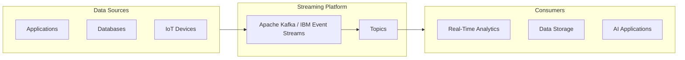

# Data Streaming Building Block

Real-time data streaming capabilities for continuous data flow into AI pipelines.

## Overview

The Data Streaming building block provides real-time event ingestion, streaming pipelines, and stream processing capabilities for operational and analytical use cases. It enables continuous data flow from various sources into your AI and analytics systems.

---

## IBM Products Used

This building block leverages the following IBM products and services:

- **[IBM Event Streams](https://www.ibm.com/cloud/event-streams)**: Enterprise-grade Apache Kafka service for event streaming
- **[Apache Kafka](https://kafka.apache.org/)**: Distributed event streaming platform
- **[IBM Cloud Pak for Data](https://www.ibm.com/products/cloud-pak-for-data)**: Unified data and AI platform

---

## Features

### Real-Time Event Ingestion

- High-throughput event streaming
- Support for multiple data formats
- Scalable message processing
- Fault-tolerant architecture

### Stream Processing

- Real-time data transformation
- Event filtering and routing
- Aggregation and windowing
- Complex event processing

### Integration Capabilities

- Apache Kafka topics and connectors
- IBM Integration with Apache Kafka
- Support for various data sources and sinks
- REST API and native protocol support

---

## Use Cases

- **Real-Time Analytics**: Process and analyze streaming data in real-time
- **Event-Driven Architectures**: Build reactive systems based on events
- **IoT Data Ingestion**: Collect and process sensor data streams
- **Log Aggregation**: Centralize logs from distributed systems
- **Change Data Capture**: Stream database changes to downstream systems

---

## Getting Started

### Prerequisites

!!! info "Requirements"
    1. IBM Event Streams or Apache Kafka cluster
    2. IBM Cloud account (for IBM Event Streams)
    3. Python 3.12+ or Java 11+ for client applications
    4. Network connectivity to Kafka brokers

### Basic Setup

1. **Set up IBM Event Streams or Kafka cluster**

2. **Create topics for your data streams**

3. **Configure producers and consumers**

4. **Implement stream processing logic**

---

## Architecture Pattern

---

## Best Practices

!!! tip "Streaming Best Practices"
    - **Partitioning**: Design appropriate partition strategies for scalability
    - **Retention**: Configure retention policies based on use case
    - **Monitoring**: Implement comprehensive monitoring and alerting
    - **Error Handling**: Design robust error handling and retry mechanisms
    - **Security**: Enable encryption and authentication
    - **Schema Management**: Use schema registry for data governance

---

## Coming Soon

!!! note "Upcoming Features"
    - Detailed implementation guides
    - Sample applications and code examples
    - Integration patterns with watsonx.data
    - Performance tuning guidelines
    - Advanced stream processing patterns

---

## Resources

- [IBM Event Streams Documentation](https://cloud.ibm.com/docs/EventStreams)
- [Apache Kafka Documentation](https://kafka.apache.org/documentation/)
- [GitHub Repository](https://github.com/ibm-self-serve-assets/building-blocks/tree/main/data/intelligence/data-streaming)

---

## Support

For issues or questions, please refer to the [GitHub repository](https://github.com/ibm-self-serve-assets/building-blocks/tree/main/data/intelligence/data-streaming) or contact IBM support.