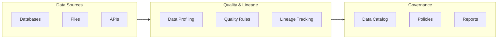

# Quality and Lineage

Data quality management and lineage tracking capabilities for ensuring data integrity and traceability.

## Overview

The Quality and Lineage building block provides comprehensive data quality assessment, monitoring, and lineage tracking capabilities. It enables organizations to maintain high data quality standards and understand data flow throughout their systems.

---

## IBM Products Used

This building block leverages the following IBM products and services:

- **[IBM watsonx.data Intelligence](https://www.ibm.com/docs/en/watsonx/wdi/saas)**: AI-powered data intelligence and governance platform
- **[IBM Knowledge Catalog](https://www.ibm.com/docs/en/cloud-paks/cp-data/4.8.x?topic=services-watson-knowledge-catalog)**: Enterprise catalog for data governance
- **[IBM Cloud Pak for Data](https://www.ibm.com/products/cloud-pak-for-data)**: Unified data and AI platform

---

## Features

### Data Quality Management

- Automated data quality assessment
- Data profiling and validation
- Quality rule definition and enforcement
- Quality metrics and reporting

### Data Lineage Tracking

- End-to-end data lineage visualization
- Impact analysis for data changes
- Dependency tracking across systems
- Automated lineage capture

### Governance Integration

- Integration with data catalogs
- Policy enforcement and compliance
- Audit trail and change tracking
- Metadata management

---

## Use Cases

- **Data Quality Monitoring**: Continuously monitor data quality across systems
- **Regulatory Compliance**: Track data lineage for compliance requirements
- **Impact Analysis**: Understand downstream impacts of data changes
- **Data Governance**: Enforce data quality standards and policies
- **Root Cause Analysis**: Trace data issues back to their source

---

## Getting Started

### Prerequisites

!!! info "Requirements"
    1. IBM watsonx.data Intelligence environment
    2. IBM Cloud account with appropriate permissions
    3. Python 3.12+ for automation scripts
    4. Access to data sources for lineage tracking

### Basic Setup

1. **Set up watsonx.data Intelligence environment**

2. **Configure data quality rules and policies**

3. **Enable lineage tracking for data sources**

4. **Set up monitoring and alerting**

---

## Architecture Pattern

---

## Best Practices

!!! tip "Quality & Lineage Best Practices"
    - **Automated Profiling**: Regularly profile data to detect quality issues
    - **Clear Rules**: Define clear, measurable data quality rules
    - **Lineage Capture**: Automate lineage capture at all integration points
    - **Impact Analysis**: Perform impact analysis before making changes
    - **Documentation**: Document data quality standards and lineage
    - **Monitoring**: Set up alerts for quality threshold violations

---

## Coming Soon

!!! note "Upcoming Features"
    - Detailed implementation guides
    - Sample quality rules and templates
    - Advanced lineage visualization
    - Machine learning-based quality prediction
    - Integration with additional data sources

---

## Resources

- [IBM watsonx.data Intelligence Documentation](https://www.ibm.com/docs/en/watsonx/wdi/saas)
- [IBM Knowledge Catalog Documentation](https://www.ibm.com/docs/en/cloud-paks/cp-data/4.8.x?topic=services-watson-knowledge-catalog)
- [GitHub Repository](https://github.com/ibm-self-serve-assets/building-blocks/tree/main/data/intelligence/quality-and-lineage)

---

## Support

For issues or questions, please refer to the [GitHub repository](https://github.com/ibm-self-serve-assets/building-blocks/tree/main/data/intelligence/quality-and-lineage) or contact IBM support.