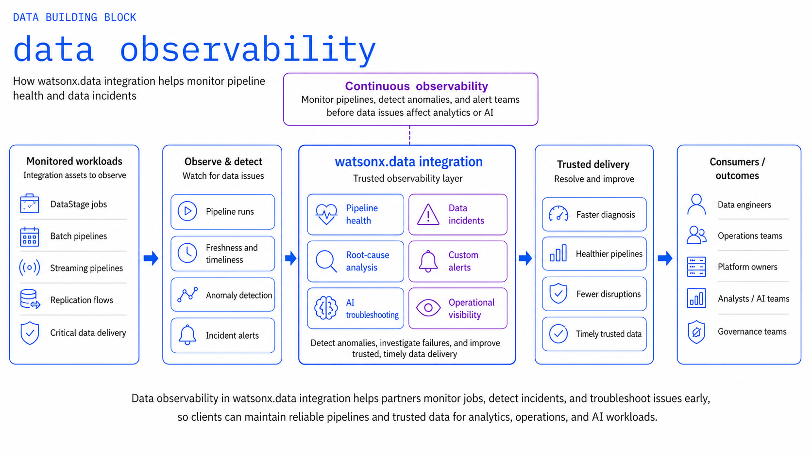
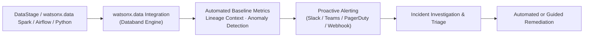

# Data Observability

Use **watsonx.data Integration (Databand)** and **IBM Data Observability by Databand** to detect, investigate, and resolve data incidents, SLA breaches, and data anomalies before unreliable data impacts downstream analytics, lakehouse tables, or AI agents.

!!! info "Product mapping"
    **watsonx.data Integration (Databand)** — continuous pipeline, job, task, and dataset monitoring, anomaly detection, SLA tracking, and alerting; integrates natively with watsonx.data Spark engines and DataStage flows.

!!! info "GitHub Repository"
    The complete source code and examples are available in the GitHub repository:

    [Building Blocks - Data Observability](https://github.com/ibm-self-serve-assets/building-blocks/tree/main/data/lakehouse/data-observability)

---

## Included Assets

| Asset | Description |
|---|---|
| **[databand-pipeline-monitor](https://github.com/ibm-self-serve-assets/building-blocks/tree/main/data/lakehouse/data-observability/assets/databand-pipeline-monitor)** | Databand monitoring blueprints — OpenLineage event emitters for Python, Spark, and DataStage, custom alerting rule definitions, and metric dashboards |

---

## Bob Skills

| Skill | Description |
|---|---|
| **[databand-pipeline-setup](https://github.com/ibm-self-serve-assets/building-blocks/tree/main/data/lakehouse/data-observability/bob-skills/databand-pipeline-setup.zip)** | Databand pipeline onboarding, OpenLineage event design (START / COMPLETE / FAIL), alert policy authoring (null-rate, schema-drift, SLA-breach), and IAM auth patterns |

!!! tip "Installing skills"
    Download the skill `.zip` files and copy the skill folders to `~/.bob/skills` (global) or `<project>/.bob/skills` (project-level). See the [Data Skills and Modes](../../bob-skills-and-modes.md) page for full installation instructions.

---

## Why It Matters

Data quality issues in modern lakehouses are discovered in two ways: proactively through automated monitoring and anomaly detection, or reactively when executive dashboards break and AI agents produce incorrect actions. **Data Observability** provides the proactive safeguard, automatically detecting failed runs, abnormal run durations, schema drift, unexpected data volume drops, and data quality degradation across lakehouse pipelines.

---

## Business Value

!!! success "Key outcomes"
    | Outcome | What It Means |
    |---|---|
    | **Early incident detection** | Catch pipeline run failures, dataset volume drops, and schema drift before downstream consumers are impacted |
    | **Drastically reduced MTTR** | Correlate alerts with full pipeline run history, source logs, and execution parameters for rapid root-cause diagnosis |
    | **Protect critical data SLAs** | Ensure essential lakehouse datasets and Iceberg tables arrive, refresh, and finalize within target windows |
    | **Safeguard AI model reliability** | Prevent AI agents and ML models from ingesting incomplete, stale, or malformed training and inference data |
    | **Unified observability pane** | Single pane of glass across DataStage, Apache Spark, Airflow, and custom Python integration jobs |

---

## When to Use

Use Data Observability when:

- Lakehouse data pipelines and batch transformations are **mission-critical** to business operations.
- You need automated alerting on run duration, task failure, row-count anomalies, or freshness delays.
- Data workflows span multiple runtimes (e.g., DataStage ETL, watsonx.data Spark, Airflow DAGs).
- Engineering teams need a **shared incident management view** with historical baselines.
- Spark workloads in watsonx.data require deep execution, task-level, and dataset-level tracking.

---

## What to Observe

| Area | Monitored Metrics & Signals |
|---|---|
| **Pipeline Health** | Failed runs, task states, execution duration, unexpected retry loops |
| **Data Health** | Freshness lag, dataset row counts, schema drift, column null rates, distribution anomalies |
| **Dependencies** | Upstream and downstream dataset lineage, cross-pipeline impact mapping |
| **Operational Context** | Error logs, job parameters, cluster resource utilization, alert severity tiers |

---

## Reference Flow

---

## What to Demonstrate

1. Register or instrument a sample DataStage flow or Spark job in Databand using OpenLineage.
2. View active and historical execution runs in the Databand dashboard.
3. Configure an automated alert policy for a realistic anomaly (e.g., run duration > 2x baseline, 30% row drop).
4. Trigger a simulated pipeline failure or data volume anomaly.
5. Inspect the generated alert, error traceback, and upstream dataset impact.
6. Walk through the guided triage and resolution flow.

---

## Design Considerations

!!! tip "Observability design guidelines"
    - Focus observability alerts on high-impact data products and datasets tied to explicit SLAs.
    - Set dynamic thresholding based on historical baselines rather than static hardcoded limits to prevent alert fatigue.
    - Instrument OpenLineage at both the job level and dataset level for complete root-cause visibility.
    - Establish clear escalation and on-call routing for critical lakehouse pipeline incidents.

---

## IBM Products Used

| Product | Role |
|---|---|
| **[IBM watsonx.data integration](https://www.ibm.com/docs/en/watsonx/wdi/2.4.x?topic=data-integration)** | Enterprise data integration platform including built-in Data Observability capability |
| **[IBM Data Observability by Databand](https://www.ibm.com/docs/en/dobd?topic=getting-started)** | Full-stack data observability, pipeline and dataset monitoring, anomaly detection, and SLA tracking |
| **[IBM watsonx.data](https://www.ibm.com/products/watsonx-data)** | Open lakehouse platform providing managed Spark execution tracked by Databand |
