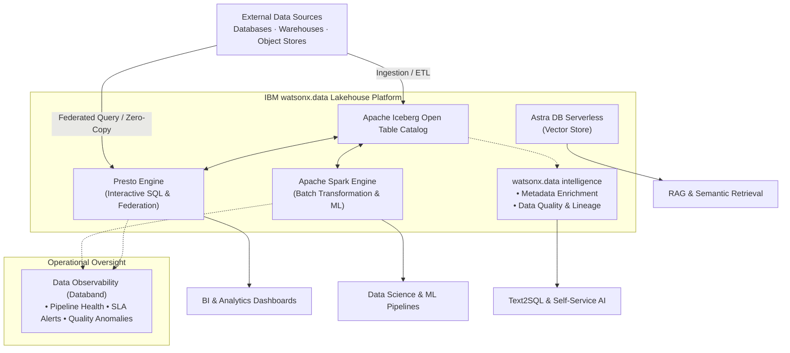

# Lakehouse – Building Blocks

The **Lakehouse** use case provides fit-for-purpose execution for SQL analytics, large-scale processing, open lakehouse interoperability, metadata governance, data observability, and vector retrieval — matching the engine and governance tool to the workload rather than routing everything through a single technology.

!!! info "Core principle"
    Do not force every workload through one engine. Use **Presto** for interactive SQL, **Spark** for distributed processing and complex transformation, and a **vector engine (Astra DB)** for similarity retrieval. Apache Iceberg keeps analytic data interoperable across all of them, while **watsonx.data intelligence** and **Data Observability (Databand)** ensure data trust, metadata quality, and pipeline reliability.

---

## Available Building Blocks

| Capability | Products | Best Fit |
|---|---|---|
| **[Meta Data Enrichment and Quality](metadata-enrichment/index.md)** | IBM watsonx.data intelligence | Add business terms, AI descriptions, data profiling, classifications, quality rules, and lineage to lakehouse assets |
| **[Data Observability](data-observability/index.md)** | watsonx.data Integration (Databand) | Detect anomalies, run failures, SLA breaches, and data drift across pipelines and Spark workloads |
| **[Zero-Copy Lakehouse](zero-copy-lakehouse/index.md)** | IBM watsonx.data (Presto, Spark, Iceberg) | Federated access, interactive SQL, large-scale data processing, and open Apache Iceberg tables without data duplication |
| **[Serverless Vector](serverless-vector/index.md)** | IBM watsonx.data, AstraDB | Elastic vector similarity search for semantic search, RAG, and AI agent memory patterns |

---

## Business Value

!!! success "Why Lakehouse matters"
    - **Reduce unnecessary data movement** — query supported external platforms in place via Presto federation, removing redundant ETL hops.
    - **Use open table formats** — Apache Iceberg lets multiple engines (Presto, Spark, Flink) share the same governed tables without proprietary lock-in.
    - **Fit-for-purpose compute** — use Presto for sub-second interactive SQL and Spark for heavy distributed transformations and ML data prep.
    - **Automated trust and governance** — watsonx.data intelligence enriches raw tables with business terms, automated classifications, and quality scores.
    - **End-to-end operational visibility** — Databand tracks pipeline health, data freshness, and anomalies across lakehouse workflows.
    - **Elastic serverless vector search** — Astra DB Serverless scales on demand for embedding retrieval without vector cluster maintenance.

---

## When to Use

| If you need to… | Use… |
|---|---|
| Add business glossary terms, automated descriptions, profiling, or quality checks to data | [Meta Data Enrichment and Quality](metadata-enrichment/index.md) |
| Monitor lakehouse pipelines, detect anomalies, and prevent stale or broken data incidents | [Data Observability](data-observability/index.md) |
| Query distributed data across platforms in place or run interactive SQL on Iceberg tables | [Zero-Copy Lakehouse](zero-copy-lakehouse/index.md) — Presto |
| Run large-scale data transformation, cleansing, or ML preparation across open tables | [Zero-Copy Lakehouse](zero-copy-lakehouse/index.md) — Spark |
| Store embeddings and perform vector similarity search for AI applications without cluster ops | [Serverless Vector](serverless-vector/index.md) — Astra DB |

---

## Reference Architecture

---

## IBM Products Used

| Product | Role |
|---|---|
| **[IBM watsonx.data](https://www.ibm.com/products/watsonx-data)** | Open hybrid lakehouse platform hosting Presto, Spark, Iceberg, and integrated ecosystem services |
| **[IBM watsonx.data intelligence](https://www.ibm.com/docs/en/watsonx/wdi/2.4.x?topic=data-enriching-your-assets)** | Business glossary, semantic term assignment, data profiling, classifications, quality rules, and lineage |
| **[IBM Data Observability by Databand](https://www.ibm.com/products/watsonx-data-integration/data-observability)** | Continuous pipeline monitoring, SLA tracking, run anomaly detection, and dataset observability |
| **[Presto on watsonx.data](https://www.ibm.com/docs/en/watsonxdata/saas?topic=overview)** | High-concurrency, distributed SQL query engine for federated and lakehouse analytics |
| **[Apache Spark on watsonx.data](https://www.ibm.com/docs/en/watsonxdata/saas?topic=spark-introduction-watsonxdata)** | Fully managed Spark service for large-scale data engineering and ML data preparation |
| **[Astra DB Serverless](https://docs.datastax.com/en/astra-db-serverless/databases/create-database.html)** | Managed serverless vector database integrated into watsonx.data for embedding storage and similarity search |
