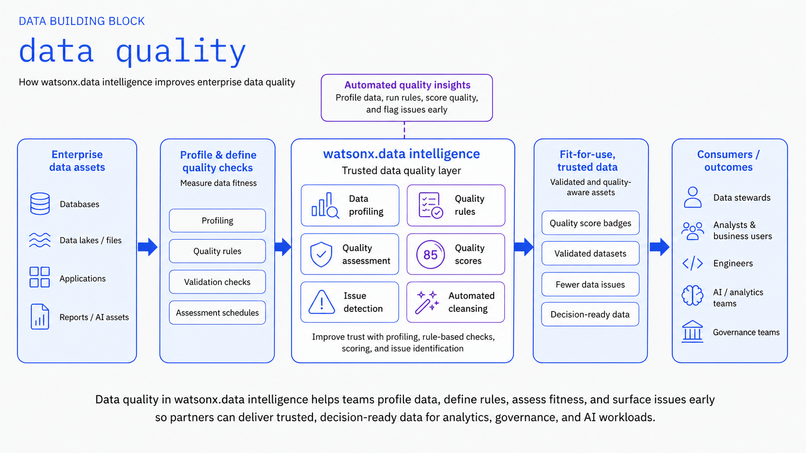
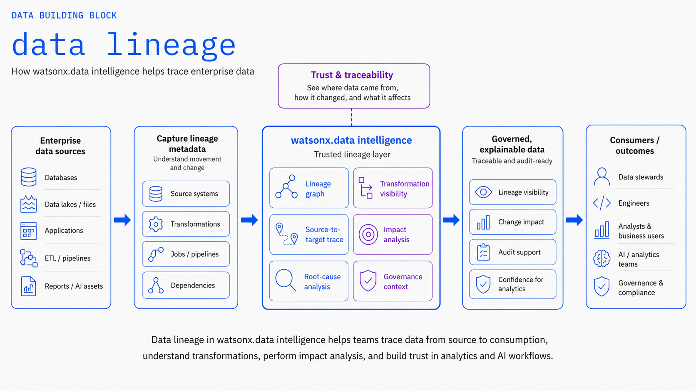
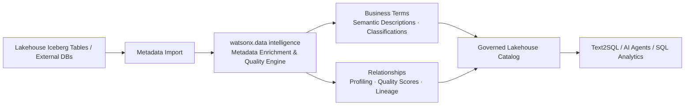

# Meta Data Enrichment and Quality

Use **IBM watsonx.data intelligence** to add business and governance context, semantic classifications, data quality rules, and lineage to technical lakehouse data assets so users and AI systems can find, understand, trust, and consume data effectively.

!!! info "Product mapping"
    **IBM watsonx.data intelligence** — metadata enrichment, business glossary, profiling, classifications, relationships, quality rules, and data lineage.

!!! info "GitHub Repository"
    The complete source code and examples are available in the GitHub repository:

    [Building Blocks - Meta Data Enrichment and Quality](https://github.com/ibm-self-serve-assets/building-blocks/tree/main/data/lakehouse/metadata-enrichment)

---

## Included Assets

| Asset | Description |
|---|---|
| **[metadata-enrichment-quality-rules](https://github.com/ibm-self-serve-assets/building-blocks/tree/main/data/lakehouse/metadata-enrichment/assets/metadata-enrichment-quality-rules)** | Governance reference templates — automated profiling configurations, business glossary mapping, data quality rule sets, and OpenLineage instrumentation |

---

## Bob Skills

| Skill | Description |
|---|---|
| **[data-quality-rules](https://github.com/ibm-self-serve-assets/building-blocks/tree/main/data/lakehouse/metadata-enrichment/bob-skills/data-quality-rules.zip)** | Data quality rule authoring, watsonx.data intelligence quality checks, profiling automation, threshold design, and compliance reporting patterns for AI-ready data |
| **[openlineage-instrumentation](https://github.com/ibm-self-serve-assets/building-blocks/tree/main/data/lakehouse/metadata-enrichment/bob-skills/openlineage-instrumentation.zip)** | OpenLineage event design, Python/DataStage/Spark instrumentation patterns, IBM Databand lineage API integration, and lineage graph authoring for end-to-end data traceability |

!!! tip "Installing skills"
    Download the skill `.zip` files and copy the skill folders to `~/.bob/skills` (global) or `<project>/.bob/skills` (project-level). See the [Data Skills and Modes](../../bob-skills-and-modes.md) page for full installation instructions.

---

## Why It Matters

Raw data assets in data lakes and warehouses often contain cryptic column names, abbreviations, and missing documentation. AI systems — especially Text2SQL, semantic search, and RAG pipelines — depend heavily on rich, meaningful metadata to produce accurate answers. **Meta Data Enrichment and Quality** closes this gap by automating data profiling, assigning business terms, generating AI descriptions, applying data quality rules, and tracing end-to-end lineage across all lakehouse tables.

---

## Business Value

!!! success "Key outcomes"
    | Outcome | What It Means |
    |---|---|
    | **Improve discoverability** | Semantic display names, descriptions, and business glossary terms make complex tables and columns understandable |
    | **Automate data stewardship** | Automates column profiling, term assignment, relationship discovery, and recurring quality evaluations |
    | **Establish data trust** | Data quality scores, classifications, and lineage signals help consumers verify if data is AI-ready |
    | **Supercharge Text2SQL accuracy** | Enriched business metadata provides the exact semantic context LLMs require for precise SQL generation |
    | **Ensure regulatory compliance** | Classifications and term mappings directly drive automated access control and data protection policies |

---

## When to Use

Use Meta Data Enrichment and Quality when:

- Source schemas in the lakehouse contain abbreviations or technical names that users or AI models cannot interpret.
- You need a unified **business glossary** applied consistently across distributed tables and catalogs.
- **Text2SQL accuracy** is degraded due to lack of descriptive column definitions and synonyms.
- You need automated **data quality rules** and profiling metrics executed on a regular schedule.
- Regulatory audits require complete column-level **data lineage** from ingestion to consumption.

---

## Key Capabilities

| Capability | What It Does |
|---|---|
| **Profile Data** | Analyzes value distributions, data types, formats, null rates, and suggests data classes |
| **Expand Metadata** | Generates semantic display names and AI-assisted descriptions for technical assets |
| **Assign Terms & Classifications** | Automatically maps business glossary terms and data sensitivity classifications |
| **Identify Relationships** | Discovers primary keys, foreign keys, and entity relationships across tables |
| **Quality Rules & Checks** | Evaluates data against declarative business quality rules and SLA thresholds |
| **Automated Scheduling** | Runs enrichment and quality jobs periodically to keep metadata current with changing data |

---

## Why It Matters for AI

!!! important "AI context starts with metadata"
    Large language models require deep semantic understanding beyond raw table and column names. Business descriptions, synonyms, and relationships provide the grounding context that allows Text2SQL and RAG agents to generate correct queries and accurate answers. IBM documentation identifies metadata enrichment as the critical prerequisite for high Text2SQL accuracy.

---

## Reference Flow

---

## What to Demonstrate

1. Import metadata from an Apache Iceberg table or relational database in watsonx.data.
2. Run an enrichment job enabling **Profile data**, **Expand metadata**, and **Assign terms and classifications**.
3. Compare the original technical column names with the generated business display names and descriptions.
4. Show suggested business glossary terms and data classification tags.
5. Display data quality scores and rule execution results.
6. Use the enriched catalog assets as context to run a Text2SQL query and verify generation accuracy.

---

## Design Considerations

!!! tip "Continuous governance practices"
    - Curate a foundational business glossary for core business entities before running large-scale automated enrichment.
    - Set confidence thresholds for automated term assignment and review borderline mappings with data stewards.
    - Schedule recurring enrichment runs for frequently modified or newly appended lakehouse tables.
    - Treat data quality rules as living contracts that evolve with business requirements.

---

## IBM Products Used

| Product | Role |
|---|---|
| **[IBM watsonx.data intelligence — Enrichment](https://www.ibm.com/docs/en/watsonx/wdi/2.4.x?topic=data-enriching-your-assets)** | Automated profiling, metadata expansion, business term assignment, quality scoring, and classification |
| **[watsonx.data intelligence — Text2SQL](https://www.ibm.com/docs/en/watsonx/wdi/2.4.x?topic=tools-data-intelligence)** | Leverages enriched metadata context to convert natural language queries into accurate SQL |
