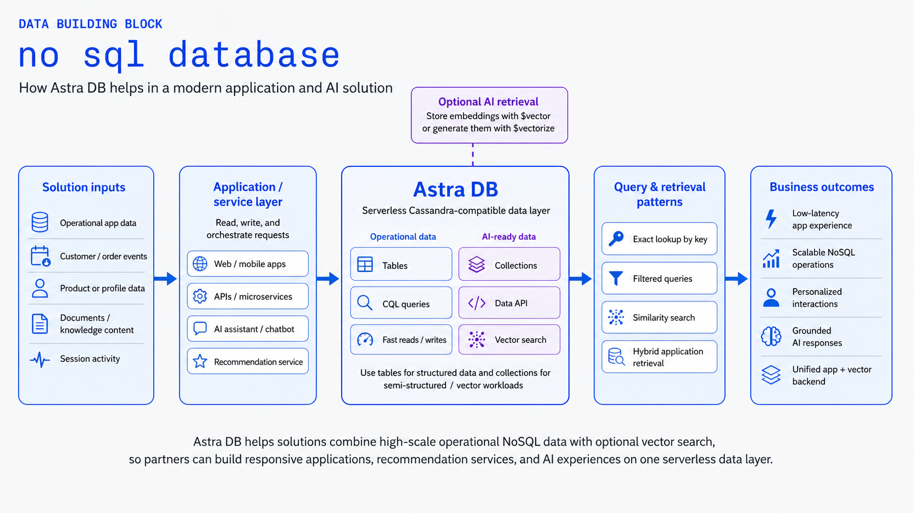
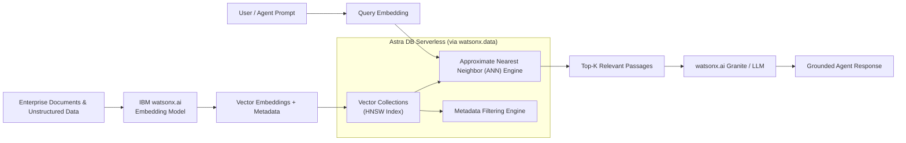

# Serverless Vector

Use **IBM watsonx.data and Astra DB Serverless** for elastic, high-scale vector storage, similarity search, and hybrid retrieval in RAG, semantic search, and AI agent memory patterns without managing vector database infrastructure.

!!! info "Product mapping"
    **IBM watsonx.data, AstraDB** — add an Astra DB service from the watsonx.data infrastructure experience to provision an elastic Serverless Vector database for embeddings and AI retrieval.

!!! info "GitHub Repository"
    The complete source code and examples are available in the GitHub repository:

    [Building Blocks - Serverless Vector](https://github.com/ibm-self-serve-assets/building-blocks/tree/main/data/lakehouse/serverless-vector)

---

## Included Assets

| Asset | Description |
|---|---|
| **[astradb-vector-ingestion](https://github.com/ibm-self-serve-assets/building-blocks/tree/main/data/lakehouse/serverless-vector/assets/astradb-vector-ingestion)** | Vector retrieval reference — Astra DB collection provisioning via `astrapy`, watsonx.ai embedding pipeline integration, approximate nearest-neighbor (ANN) similarity search, and hybrid vector+metadata filtering |
| **[astradb-nosql-crud](https://github.com/ibm-self-serve-assets/building-blocks/tree/main/data/lakehouse/serverless-vector/assets/astradb-nosql-crud)** | FastAPI document CRUD service using the Astra Data API for NoSQL document access patterns |

---

## Bob Skills

| Skill | Description |
|---|---|
| **[astradb-vector-setup](https://github.com/ibm-self-serve-assets/building-blocks/tree/main/data/lakehouse/serverless-vector/bob-skills/astradb-vector-setup.zip)** | Astra DB vector collection creation, IBM watsonx.ai embedding integration, ANN cosine/dot-product search queries via `astrapy` Data API, and metadata filtering patterns |
| **[astradb-nosql-design](https://github.com/ibm-self-serve-assets/building-blocks/tree/main/data/lakehouse/serverless-vector/bob-skills/astradb-nosql-design.zip)** | Astra DB NoSQL document modeling, collection design, CRUD patterns, and IBM watsonx.data integration |

!!! tip "Installing skills"
    Download the skill `.zip` files and copy the skill folders to `~/.bob/skills` (global) or `<project>/.bob/skills` (project-level). See the [Data Skills and Modes](../../bob-skills-and-modes.md) page for full installation instructions.

---

## Why It Matters

Vector search is the foundational retrieval engine powering modern generative AI, Retrieval-Augmented Generation (RAG), and autonomous agent memory. While keyword search matches exact tokens, vector search matches semantic meaning across multi-dimensional embedding space. **Serverless Vector** makes enterprise vector search instantly accessible within the watsonx.data lakehouse platform, scaling compute and storage elastically on demand without requiring teams to provision, shard, or maintain vector clusters.

---

## Business Value

!!! success "Key outcomes"
    | Outcome | What It Means |
    |---|---|
    | **Zero cluster operations** | Fully serverless scaling handles bursty AI retrieval traffic automatically with pay-per-request efficiency |
    | **Ultra-fast similarity search** | Sub-millisecond Approximate Nearest Neighbor (ANN) vector search at billion-vector scale |
    | **Unified vector + document store** | Store embeddings, unstructured text payloads, and structured metadata together in JSON documents |
    | **Native watsonx.data integration** | Provision, manage, and secure Astra DB instances directly within the watsonx.data control plane |
    | **Global multi-cloud placement** | Deploy serverless vector collections across AWS, Azure, or GCP in close proximity to applications |

---

## When to Use

Use Serverless Vector when:

- You need an **elastic vector store** for RAG pipelines, semantic search, or long-term AI agent memory.
- Application developers need **REST/GraphQL/Python Data APIs** for direct document and vector manipulation.
- Workload traffic is unpredictable or variable, making serverless pay-as-you-go economics attractive.
- You want managed vector capability integrated directly alongside your watsonx.data lakehouse environment.

!!! tip "OpenRAG vs Serverless Vector"
    Use **[RAG](../../pipelines/rag/index.md)** for a turnkey, managed enterprise search service with watsonx.data OpenRAG. Use **Serverless Vector** when application code requires direct embedding index access, custom vector collections, or flexible JSON document retrieval.

---

## Core Capabilities

| Capability | Component | What It Does |
|---|---|---|
| **Vector Indexing & Similarity Search** | Astra DB Vector Engine | High-performance ANN search using HNSW indexing with Cosine, Dot Product, and Euclidean distance metrics |
| **Hybrid Document & Vector Storage** | Data API (JSON Documents) | Combines dense vector arrays with structured metadata fields and text payloads in a single document |
| **watsonx.ai Integration** | Embeddings Bridge | Seamlessly accepts vector embeddings generated by IBM Slate or third-party embedding models |
| **Serverless Auto-Scaling** | Elastic Cloud Infrastructure | Automatically adjusts capacity from zero to thousands of queries per second without manual sharding |

---

## Reference Architecture

---

## What to Demonstrate

1. Open the watsonx.data console and view the provisioned Astra DB Serverless instance.
2. Create a vector collection configured with 1536/768 embedding dimensions and cosine similarity.
3. Ingest sample documents along with their vector embeddings generated by watsonx.ai.
4. Execute an Approximate Nearest Neighbor (ANN) query combined with structured metadata filters using the `astrapy` library.
5. Display the retrieved matching documents with similarity scores and pass them to an LLM to generate a grounded answer.

---

## Design Considerations

!!! tip "Vector index best practices"
    - Ensure embedding dimensions and distance metrics match the source embedding model exactly.
    - Index scalar metadata fields that will be used in filter conditions alongside vector similarity queries.
    - Implement batch vector insertion for efficient large-scale document ingestion.
    - Establish automated cleanup and re-embedding pipelines for outdated or modified documents.

---

## IBM Products Used

| Product | Role |
|---|---|
| **[IBM watsonx.data — Adding Astra DB](https://www.ibm.com/docs/en/watsonxdata/saas?topic=watsonxdata-adding-astra-db-service)** | Provision and manage Astra DB Serverless directly within the watsonx.data infrastructure experience |
| **[Astra DB Serverless](https://docs.datastax.com/en/astra-db-serverless/databases/create-database.html)** | Managed serverless vector database providing high-speed similarity search for AI workloads |
| **[IBM watsonx.ai](https://www.ibm.com/products/watsonx-ai)** | Generates dense embeddings and provides foundation models grounded by vector retrieval |
