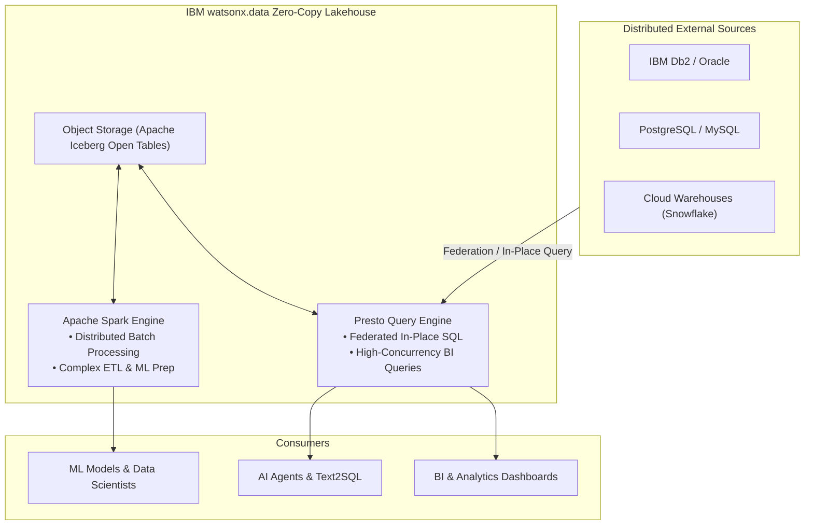

# Zero-Copy Lakehouse

Use **IBM watsonx.data** with **Presto, Spark, and Apache Iceberg** to query, process, and govern distributed data in place with zero unnecessary copying and to keep analytic data open and interoperable across multiple engines.

!!! info "Product mapping"
    **IBM watsonx.data (Presto, Spark, Iceberg)** — Presto (high-concurrency interactive SQL and federation) + Apache Spark (large-scale data processing and transformation) + Apache Iceberg (open table format).

!!! info "GitHub Repository"
    The complete source code and examples are available in the GitHub repository:

    [Building Blocks - Zero-Copy Lakehouse](https://github.com/ibm-self-serve-assets/building-blocks/tree/main/data/lakehouse/zero-copy-lakehouse)

---

## Included Assets

| Asset | Description |
|---|---|
| **[setup-lakehouse](https://github.com/ibm-self-serve-assets/building-blocks/tree/main/data/lakehouse/zero-copy-lakehouse/assets/setup-lakehouse)** | Reference setup — Presto federated query configurations, multi-catalog connections (DB2, PostgreSQL, Snowflake, S3), Spark ETL jobs, and Iceberg table optimization scripts |

---

## Bob Skills

| Skill | Description |
|---|---|
| **[watsonxdata-lakehouse](https://github.com/ibm-self-serve-assets/building-blocks/tree/main/data/lakehouse/zero-copy-lakehouse/bob-skills/watsonxdata-lakehouse.zip)** | Presto SQL optimization, Spark job configuration on watsonx.data, cross-catalog federation design, and Iceberg table maintenance |
| **[iceberg-table-management](https://github.com/ibm-self-serve-assets/building-blocks/tree/main/data/lakehouse/zero-copy-lakehouse/bob-skills/iceberg-table-management.zip)** | Apache Iceberg table operations — schema evolution, partition management, time travel, snapshot expiry, and compaction on watsonx.data |

!!! tip "Installing skills"
    Download the skill `.zip` files and copy the skill folders to `~/.bob/skills` (global) or `<project>/.bob/skills` (project-level). See the [Data Skills and Modes](../../bob-skills-and-modes.md) page for full installation instructions.

---

## Why It Matters

Enterprise data is fragmented across dozens of databases, object stores, cloud data warehouses, and legacy platforms. Traditional approaches require building complex ETL pipelines to duplicate data into a centralized repository, creating high storage costs, data drift, and governance complexity. **Zero-Copy Lakehouse** allows analytics, BI, and AI workloads to query data directly where it resides using Presto federation and Apache Iceberg open tables without redundant copying.

---

## Business Value

!!! success "Key outcomes"
    | Outcome | What It Means |
    |---|---|
    | **Zero unnecessary data movement** | Query external databases and object stores in place without creating duplicate copies |
    | **Real-time freshness** | Direct federated access avoids batch synchronization latency for interactive analytics |
    | **Eliminate proprietary lock-in** | Apache Iceberg open table format ensures data is accessible by Presto, Spark, Flink, and third-party tools |
    | **Fit-for-purpose compute** | Run fast, interactive ANSI SQL via Presto; run heavy batch transformations and ML jobs via Spark |
    | **Unified data governance** | Apply centralized access policies and metadata definitions consistently across all connected catalogs |

---

## When to Use

Use Zero-Copy Lakehouse when:

- Data resides across multiple external databases and copying it adds unacceptable latency or cost.
- Multiple compute engines (Presto, Spark, Flink) require **concurrent access to the same open tables**.
- You need to run high-concurrency SQL analytics across **Apache Iceberg tables** in object storage.
- You want to replace brittle, single-purpose ETL extract pipelines with **in-place query federation**.

!!! warning "Federation vs Materialization"
    For high-concurrency, sub-second reporting where sources cannot push down queries efficiently, materializing data into optimized Iceberg tables is recommended over continuous remote federation.

---

## Core Engine Roles

| Engine | Best For |
|---|---|
| **Presto Engine** | Interactive, high-concurrency SQL analytics and cross-catalog query federation |
| **Apache Spark Engine** | Large-scale batch processing, complex transformations, cleansing, and ML feature preparation |
| **Apache Iceberg** | High-performance open table format providing ACID transactions, time travel, schema evolution, and partition evolution |

---

## Reference Architecture

---

## What to Demonstrate

1. Register an external database catalog (e.g., PostgreSQL or Db2) in watsonx.data.
2. Execute a federated SQL query with Presto joining external tables with native Iceberg tables in object storage with zero data copying.
3. Submit a Spark batch job that processes large-scale data and writes optimized Iceberg files.
4. Demonstrate Apache Iceberg features such as schema evolution, partition evolution, or snapshot time-travel.
5. Query the newly created Iceberg table simultaneously using Presto.

---

## Design Considerations

!!! tip "Lakehouse optimization practices"
    - Push predicates and column projections down to source engines to minimize network data transfer.
    - Organize Iceberg table partitioning based on the most frequent query filter patterns.
    - Schedule recurring Iceberg table maintenance (compaction, snapshot expiration, orphan file cleanup) for peak performance.
    - Separate interactive BI workloads from batch processing jobs to ensure consistent user query latencies.

---

## IBM Products Used

| Product | Role |
|---|---|
| **[IBM watsonx.data](https://www.ibm.com/products/watsonx-data)** | Open hybrid lakehouse platform hosting Presto, Spark, Iceberg, and federated catalog connections |
| **[Accessing external data platforms (Zero-Copy)](https://www.ibm.com/docs/en/watsonxdata/saas?topic=components-accessing-data-in-external-data-platforms)** | Native federation capability enabling query-in-place across connected enterprise databases |
| **[IBM watsonx.data Spark](https://www.ibm.com/docs/en/watsonxdata/saas?topic=spark-introduction-watsonxdata)** | Managed Spark service for scalable data processing and machine learning workflows |
