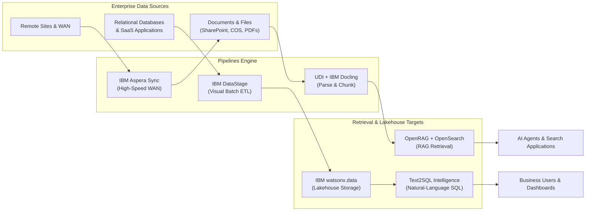

# Pipelines – Building Blocks

The **Pipelines** use case prepares, transforms, moves, and indexes structured and unstructured data for enterprise analytics, Retrieval-Augmented Generation (RAG), search, and AI applications.

!!! info "Key principle"
    The quality of AI output depends directly on the quality of data going in. Pipelines are where that quality is established — through visual ETL/ELT, high-speed WAN synchronization, unstructured document parsing, chunking, enrichment, and natural-language query interfaces before data reaches retrieval, analytics, or agent layers.

---

## Available Building Blocks

| Capability | Products | Best Fit |
|---|---|---|
| **[RAG](rag/index.md)** | IBM watsonx.data (OpenRAG / OpenSearch) | Enterprise document retrieval, agent grounding, and hybrid vector+keyword search |
| **[UDI](udi/index.md)** | IBM watsonx.data integration, IBM Docling | Document ingestion, layout-aware parsing, transformation, chunking, and enrichment |
| **[Text2SQL](text2sql/index.md)** | IBM watsonx.data intelligence | Convert natural-language questions into SQL queries using enriched metadata context |
| **[ETL](etl/index.md)** | IBM watsonx.data (DataStage) | Governed visual batch integration flows and data transformations across enterprise sources and lakehouse targets |
| **[Data Sync](data-sync/index.md)** | Aspera | High-speed, secure synchronization of large file sets and repositories across hybrid WAN environments |

---

## Business Value

!!! success "Why Pipelines matter"
    - **Shorten the path from raw data to AI readiness** — structured pipelines eliminate ad-hoc scripting and manual file manipulation between source systems and AI applications.
    - **Improve RAG retrieval quality** — document-aware parsing (Docling) and visual chunking pipelines (UDI) ensure high-fidelity context for vector embeddings.
    - **Democratize data access** — Text2SQL enables non-technical business users to ask questions in natural language while maintaining governed SQL execution.
    - **Standardize enterprise batch movement** — DataStage flows, enterprise connectors, and scheduling provide repeatable, auditable batch ETL/ELT operations.
    - **Global multi-site synchronization** — Aspera Sync overcomes WAN latency to move terabyte-scale datasets globally at wire speed.

---

## When to Use

| If you need to… | Use… |
|---|---|
| Ground AI applications and autonomous agents in enterprise documents and knowledge bases | [RAG](rag/index.md) |
| Ingest, parse, and chunk complex PDFs, tables, scanned images, or presentations for AI | [UDI](udi/index.md) |
| Allow business users to query governed relational and lakehouse data in plain English | [Text2SQL](text2sql/index.md) |
| Build governed, visual batch ETL/ELT flows across databases, SaaS, and lakehouse targets | [ETL](etl/index.md) |
| Synchronize large file repositories or training datasets across high-latency WAN links | [Data Sync](data-sync/index.md) |

---

## Typical Pattern

---

## IBM Products Used

| Product | Role in Pipelines |
|---|---|
| **[IBM watsonx.data OpenRAG](https://www.ibm.com/products/watsonx-data/ai-enterprise-search)** | Managed enterprise RAG service orchestrating vector retrieval, search indexing, and agent grounding |
| **[IBM watsonx.data integration — UDI](https://www.ibm.com/docs/en/watsonx/wdi/2.4.x?topic=data-integrating-unstructured-documents)** | Visual drag-and-drop pipeline for document ingestion, transformation, chunking, and enrichment |
| **[Docling for IBM watsonx](https://www.ibm.com/products/docling)** | Deep learning document conversion preserving tables, layouts, and reading order for complex documents |
| **[IBM watsonx.data intelligence — Text2SQL](https://www.ibm.com/docs/en/watsonx/wdi/2.4.x?topic=tools-data-intelligence)** | Natural-language query generation using vectorized metadata as context |
| **[IBM DataStage](https://www.ibm.com/docs/en/watsonx/wdi/2.4.x?topic=datastage-designing-flows)** | Visual ETL/ELT flow design with hundreds of pre-built enterprise connectors (part of watsonx.data integration) |
| **[IBM Aspera Sync](https://www.ibm.com/products/aspera/sync)** | High-speed WAN file and repository synchronization using the patented FASP transport protocol |

---

## Design Principles

!!! tip "Pipeline engineering best practices"
    - **Separate data preparation from retrieval** — invest in high-fidelity document parsing and cleaning (Docling) before tuning vector embeddings or prompts.
    - **Prefer governed visual flows over scripts** — use DataStage and UDI flows for auditability, enterprise scheduling, and built-in error handling.
    - **Maintain metadata alongside payloads** — always preserve source identifiers, document versions, ACLs, and timestamps with indexed chunks.
    - **Design for incremental processing** — ensure pipelines process only modified files and updated database rows rather than full reprocessing.
