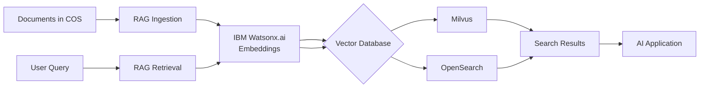

# RAG (Retrieval-Augmented Generation)

Complete RAG pipeline with document ingestion, embedding generation, vector storage, and semantic search capabilities. Supports both Milvus and OpenSearch as vector databases with IBM Watsonx embeddings.

---

## Overview

The RAG building block provides a complete end-to-end pipeline for implementing Retrieval-Augmented Generation systems. It handles document processing, embedding generation, vector storage, and semantic search to enable AI applications to access and retrieve relevant information from large document collections.

**Key Capabilities:**

- Document ingestion from IBM Cloud Object Storage (COS)
- Embedding generation with IBM Watsonx.ai
- Vector storage in Milvus or OpenSearch
- Semantic search with vector similarity
- Keyword search with BM25 algorithm
- Hybrid search combining semantic and keyword approaches
- FastAPI-based REST API
- Docker deployment ready
- MCP server integration for AI assistants

---

## What's Included

### Assets

#### [RAG Accelerator](https://github.com/ibm-self-serve-assets/building-blocks/tree/main/data/retrieval/RAG/assets/rag-accelerator)

Complete RAG pipeline with document processing, embedding, and querying capabilities.

**Features:**

- Ingest documents from IBM Cloud Object Storage (COS)
- Generate embeddings with IBM Watsonx.ai
- Store vectors in **Milvus** or **OpenSearch**
- Perform semantic search with vector similarity
- Keyword search with BM25 algorithm
- Hybrid search combining semantic and keyword approaches
- FastAPI-based REST API
- Docker deployment ready

---

#### [RAG Ingestion MCP Server](https://github.com/ibm-self-serve-assets/building-blocks/tree/main/data/retrieval/RAG/assets/rag-ingestion-sse-mcp-server)

MCP server for document ingestion from IBM COS.

**Features:**

- Deploy as remote MCP server via SSE transport
- Integrate with AI assistants (IBM Bob, Claude, etc.)
- Support for multiple document formats
- Batch ingestion capabilities

---

#### [RAG Retrieval MCP Server](https://github.com/ibm-self-serve-assets/building-blocks/tree/main/data/retrieval/RAG/assets/rag-retrieval-sse-mcp-server)

MCP server for semantic and keyword search.

**Features:**

- Semantic retrieval with Watsonx embeddings
- Keyword search with BM25
- Hybrid search combining both approaches
- Works with both Milvus and OpenSearch backends
- Configurable reranking options

---

### Bob Modes

#### [Base Modes](https://github.com/ibm-self-serve-assets/building-blocks/tree/main/data/retrieval/RAG/bob-modes/base-modes)

AI assistant modes specialized for RAG development.

**Available Modes:**

- **RAG Builder Mode**: Guidance for building RAG pipelines
- **Data Generator Mode**: Help with test data generation
- Vector database configuration (Milvus/OpenSearch)
- Document processing and chunking strategies
- MCP server development assistance
- Embedding model selection and optimization

---

## Vector Database Support

### Milvus

High-performance vector database optimized for similarity search.

**Features:**

- High-performance vector similarity search
- Scalable distributed architecture
- Support for multiple index types (IVF_FLAT, HNSW, etc.)
- Rich filtering capabilities
- Ideal for large-scale deployments

---

### OpenSearch

Combines vector search with full-text search capabilities.

**Features:**

- Combines vector search with full-text search
- Built-in BM25 keyword search
- Powerful aggregations and analytics
- Familiar Elasticsearch-compatible API
- Excellent for hybrid search scenarios

---

## Quick Start

### 1. For Complete RAG Pipeline

Navigate to [`assets/rag-accelerator`](https://github.com/ibm-self-serve-assets/building-blocks/tree/main/data/retrieval/RAG/assets/rag-accelerator) and follow the README:

- Configure your vector database (Milvus or OpenSearch)
- Set up IBM Watsonx credentials
- Deploy via Docker or run locally

### 2. For MCP Servers

Choose from ingestion or retrieval MCP servers in the Assets directory:

- Deploy as remote SSE-based MCP servers
- Integrate with AI coding assistants
- Enable RAG capabilities in your AI workflows

### 3. For AI Assistance

Use the Bob Mode configurations in [`bob-modes/base-modes`](https://github.com/ibm-self-serve-assets/building-blocks/tree/main/data/retrieval/RAG/bob-modes/base-modes) with IBM Bob:

- Import the RAG Builder or Data Generator modes
- Get expert guidance on RAG implementation
- Optimize your RAG pipeline design

---

## Use Cases

!!! example "Common RAG Applications"

    **Question Answering**: Build intelligent Q&A systems over your documents
    
    **Semantic Search**: Find relevant information based on meaning, not just keywords
    
    **Document Analysis**: Extract insights from large document collections
    
    **Knowledge Management**: Create searchable knowledge bases from unstructured data
    
    **AI Assistant Integration**: Add RAG capabilities to AI coding assistants via MCP
    
    **Hybrid Search**: Combine semantic understanding with keyword precision

---

## Architecture

---

## IBM Products Used

- **IBM Watsonx.ai**: Embedding generation and LLM capabilities
- **IBM Cloud Object Storage (COS)**: Document storage and ingestion
- **Milvus**: High-performance vector database (optional)
- **OpenSearch**: Hybrid vector and keyword search (optional)

---

## Resources

- [GitHub Repository - RAG Building Block](https://github.com/ibm-self-serve-assets/building-blocks/tree/main/data/retrieval/RAG)
- [RAG Accelerator](https://github.com/ibm-self-serve-assets/building-blocks/tree/main/data/retrieval/RAG/assets/rag-accelerator)
- [RAG Ingestion MCP Server](https://github.com/ibm-self-serve-assets/building-blocks/tree/main/data/retrieval/RAG/assets/rag-ingestion-mcp-server)
- [RAG Retrieval MCP Server](https://github.com/ibm-self-serve-assets/building-blocks/tree/main/data/retrieval/RAG/assets/rag-retrieval-mcp-server)
- [IBM Watsonx.ai Documentation](https://www.ibm.com/docs/en/watsonx-as-a-service)
- [Milvus Documentation](https://milvus.io/docs)
- [OpenSearch Documentation](https://opensearch.org/docs/latest/)

---

## Support

For issues or questions, please refer to the [GitHub repository](https://github.com/ibm-self-serve-assets/building-blocks/tree/main/data/retrieval/RAG) or contact IBM support.
