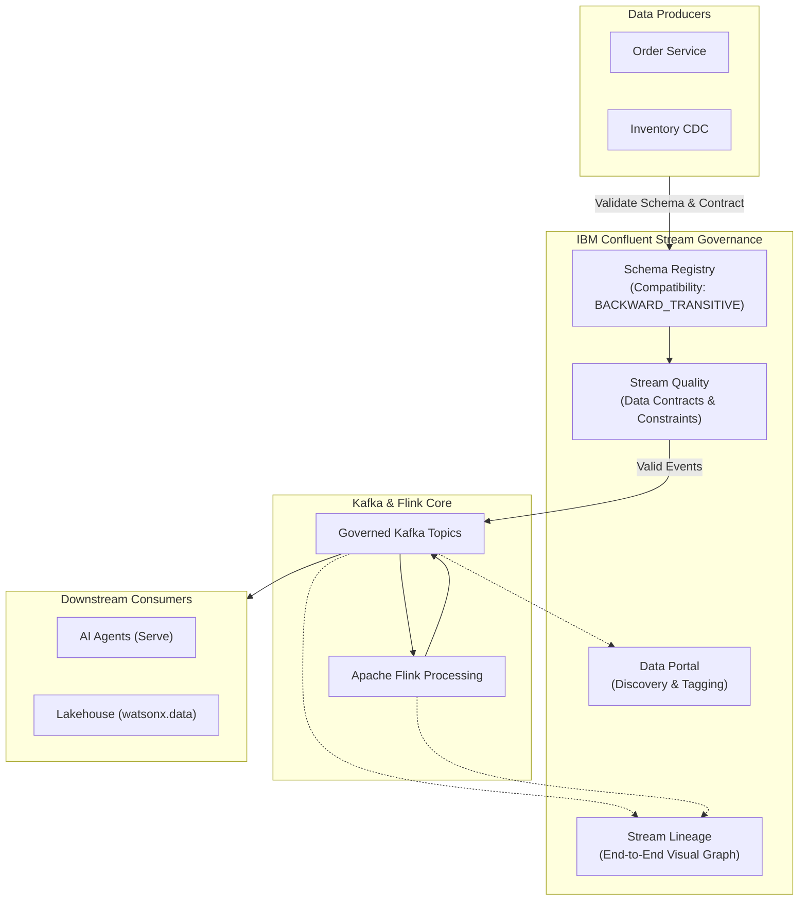

# Govern

Use **IBM Confluent Stream Governance** to establish end-to-end trust, strict data contracts, automatic stream lineage, data quality validation, and self-service discoverability across all streaming assets in the Streamhouse architecture.

!!! info "Product mapping"
    **IBM Confluent — Stream Governance** — Schema Registry, Stream Lineage, Stream Quality (Data Contracts), and Confluent Data Portal.

!!! info "GitHub Repository"
    The complete source code and examples are available in the GitHub repository:

    [Building Blocks - Stream Governance](https://github.com/ibm-self-serve-assets/building-blocks/tree/main/data/streamhouse/govern)

---

## Included Assets

*Coming soon*

---

## Bob Skills

| Skill | Description |
|---|---|
| **[data-streaming-confluent](https://github.com/ibm-self-serve-assets/building-blocks/blob/main/ibm-bob/skills/data-streaming-confluent/SKILL.md)** | Configures Confluent Schema Registry, defines Avro/JSON Schema contracts, sets compatibility modes (BACKWARD, FORWARD, FULL), and tracks stream lineage |

!!! tip "Installing skills"
    Download the skill `.zip` files and copy the skill folders to `~/.bob/skills` (global) or `<project>/.bob/skills` (project-level). See the [Data Skills and Modes](../../bob-skills-and-modes.md) page for full installation instructions.

---

## Why It Matters

As real-time event streaming expands across an organization, uncoordinated changes to schemas can break downstream applications, analytics dashboards, and AI agents. Without governance, streams become opaque, undocumented data silos. **Govern** ensures that data in motion is governed by enforceable contracts, easily discoverable via a centralized portal, traceable through end-to-end lineage, and validated for quality before consumption.

---

## Business Value

!!! success "Key outcomes"
    | Outcome | What It Means |
    |---|---|
    | **Prevent downstream application breakage** | Schema Registry enforces schema compatibility rules to ensure producer changes never break consumers |
    | **Enforce data contracts** | Stream Quality applies declarative rules to validate message contents and block corrupt data |
    | **Complete operational transparency** | Stream Lineage maps data flows from source connectors through Kafka topics and Flink queries to sinks |
    | **Self-service discovery** | Confluent Data Portal makes streaming data products easily searchable with ownership and documentation |
    | **Auditability & compliance** | Track where data originated, how it transformed in flight, and who consumed it for regulatory compliance |

---

## When to Use

Use Govern when:

- Multiple engineering teams produce and consume from shared Kafka topics.
- Event schemas evolve frequently and require **backward/forward compatibility enforcement**.
- Downstream AI models or analytics need guarantees on data structure, types, and quality.
- You need a visual map of **data dependencies and pipeline lineage** across streaming applications.
- You want to publish discoverable streaming data products across business units.

---

## Core Capabilities

| Capability | Component | What It Does |
|---|---|---|
| **Schema Management & Contracts** | Confluent Schema Registry | Centralized schema repository supporting Avro, JSON Schema, and Protobuf with compatibility rules |
| **Stream Lineage** | Stream Lineage | Interactive visual graph depicting data flow, throughput rates, and dependencies across topics, connectors, and Flink jobs |
| **Stream Quality** | Data Contracts & Rules | Evaluates business rules, constraints, and data validations at the producer or topic level |
| **Data Portal** | Confluent Data Portal | Catalog interface to search, tag, document, and manage access to streaming data products |

---

## Reference Architecture



---

## Example Data Contract (JSON Schema)

```json
{
  "$schema": "http://json-schema.org/draft-07/schema#",
  "title": "SupplierRiskEvent",
  "type": "object",
  "properties": {
    "event_id": { "type": "string", "format": "uuid" },
    "supplier_id": { "type": "string" },
    "risk_score": { "type": "number", "minimum": 0.0, "maximum": 100.0 },
    "severity": { "type": "string", "enum": ["LOW", "MEDIUM", "HIGH", "CRITICAL"] },
    "timestamp": { "type": "integer" }
  },
  "required": ["event_id", "supplier_id", "risk_score", "severity", "timestamp"],
  "additionalProperties": false
}
```

---

## What to Demonstrate

1. Register an Avro or JSON Schema contract in Confluent Schema Registry.
2. Attempt to publish an incompatible message from a producer and demonstrate that the Registry rejects it.
3. Open **Stream Lineage** to view the live topology graph showing connectors, topics, and Flink queries.
4. Show how **Stream Quality** rules identify and route invalid payloads to a dead-letter queue.
5. Search and browse streaming assets in the **Confluent Data Portal**.

---

## Design Considerations

!!! tip "Governance best practices"
    - Choose a strict compatibility mode (e.g., `FULL_TRANSITIVE` or `BACKWARD_TRANSITIVE`) for enterprise public topics.
    - Decouple schema evolution cycles between independent producer and consumer squads.
    - Tag sensitive fields (e.g., PII) in the Schema Registry to integrate with enterprise security policies.
    - Combine stream lineage with downstream data cataloging tools for end-to-end data tracing.

---

## IBM Products Used

| Product | Role |
|---|---|
| **[IBM Confluent — Stream Governance](https://www.ibm.com/products/confluent)** | Managed suite delivering Schema Registry, Stream Lineage, Stream Quality, and Data Portal |
| **[Confluent Stream Governance Documentation](https://docs.confluent.io/cloud/current/stream-governance/overview.html)** | Configuration guides for schemas, contracts, lineage tracking, and catalog access |
