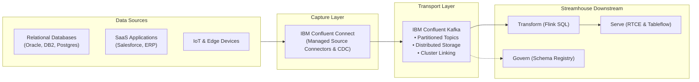

# Real-Time streaming

Use **IBM Confluent Connectors and Apache Kafka** to capture and transport high-throughput enterprise event streams from databases, applications, SaaS platforms, mainframes, and IoT devices into a durable, scalable streaming backbone.

!!! info "Product mapping"
    **IBM Confluent — Connectors and Kafka** — fully managed source/sink connectors, Change Data Capture (CDC), and durable Apache Kafka event streaming.

!!! info "GitHub Repository"
    The complete source code and examples are available in the GitHub repository:

    [Building Blocks - Real-Time Streaming](https://github.com/ibm-self-serve-assets/building-blocks/tree/main/data/streamhouse/real-time-streaming)

---

## Included Assets

| Asset | Description |
|---|---|
| **[supply-chain-risk-control-tower](https://github.com/ibm-self-serve-assets/building-blocks/tree/main/data/streamhouse/real-time-streaming/assets/supply-chain-risk-control-tower)** | Real-time event streaming reference — managed Kafka topics, producer scripts, CDC simulation, and enterprise event ingestion |

---

## Bob Skills

| Skill | Description |
|---|---|
| **[data-streaming-confluent](https://github.com/ibm-self-serve-assets/building-blocks/blob/main/ibm-bob/skills/data-streaming-confluent/SKILL.md)** | Works with IBM Confluent for Kafka topic provisioning, partition sizing, retention policies, and event producer/consumer configuration |
| **[confluent-iac-terraform](https://github.com/ibm-self-serve-assets/building-blocks/blob/main/ibm-bob/skills/data-streaming-confluent-terraform/SKILL.md)** | Infrastructure-as-Code guidance for automated provisioning of Confluent Cloud Kafka clusters, service accounts, and managed connectors |

!!! tip "Installing skills"
    Download the skill `.zip` files and copy the skill folders to `~/.bob/skills` (global) or `<project>/.bob/skills` (project-level). See the [Data Skills and Modes](../../bob-skills-and-modes.md) page for full installation instructions.

---

## Why It Matters

Traditional data movement relies on batch polling or scheduled ETL jobs that introduce hours or days of latency. In modern enterprises, events happen continuously: orders are placed, sensors detect anomalies, inventory updates, and transactions clear. **Real-Time streaming** establishes the capture and transport foundation of the Streamhouse architecture, streaming changes the instant they occur with strict ordering and persistence guarantees.

---

## Business Value

!!! success "Key outcomes"
    | Outcome | What It Means |
    |---|---|
    | **Sub-second data freshness** | Replace polling and nightly batch delays with continuous event capture and transport |
    | **Eliminate custom integration glue** | Pre-built managed connectors for databases (Oracle, PostgreSQL, DB2, MongoDB), SaaS, and message queues |
    | **Reliable event persistence** | Distributed, fault-tolerant Kafka topic logs ensure zero data loss with replay capabilities |
    | **Decentralized data access** | Tap into live data streams at the source without forcing monolithic data consolidation |
    | **Production-grade scalability** | Scale from gigabytes to terabytes per day with guaranteed throughput and low latency |

---

## When to Use

Use Real-Time streaming when:

- You need **Change Data Capture (CDC)** from relational databases or mainframes into event streams.
- Applications, IoT sensors, or microservices generate high-frequency operational events.
- Multiple downstream consumers need access to the same event stream with independent read positions.
- You want to decouple source systems from downstream consumers using a resilient event buffer.

!!! tip "Batch vs Streaming"
    If data freshness requirements are measured in hours or days and real-time triggers are not needed, a batch pipeline with DataStage may suffice. See [ETL / ELT](../../pipelines/etl/index.md).

---

## Core Capabilities

| Capability | Component | What It Does |
|---|---|---|
| **Capture** | Confluent Managed Connectors | 120+ pre-built connectors capturing data from databases, SaaS (Salesforce, ServiceNow), messaging systems, and object stores |
| **Capture** | Change Data Capture (CDC) | Captures row-level database inserts, updates, and deletes in real time without impacting source DB performance |
| **Transport** | Apache Kafka Topics | High-throughput, distributed, ordered event logs with configurable retention and partitioning |
| **Transport** | Multi-Region & Hybrid Sync | Cluster Linking securely mirrors topics across clouds and on-premises environments without extra proxies |

---

## Reference Architecture

---

## What to Demonstrate

1. Connect a database or simulated event generator using a Confluent managed connector.
2. Publish transactional business events into a partitioned Kafka topic.
3. Observe real-time ingestion metrics, throughput, and consumer lag in the Confluent Cloud console.
4. Demonstrate event replay by rewinding a consumer offset to reprocess historical events.
5. Show topic mirroring or cross-region replication using Cluster Linking.

---

## Design Considerations

!!! tip "Topic and partition planning"
    - Choose partition counts based on expected peak throughput and downstream parallel consumer requirements.
    - Set event keys intentionally to ensure strict in-order processing for related entities (e.g., `order_id` or `customer_id`).
    - Define topic retention policies (time-based vs compaction) according to downstream consumption models.
    - Implement dead-letter queues (DLQ) for unparseable or malformed source messages.

---

## IBM Products Used

| Product | Role |
|---|---|
| **[IBM Confluent](https://www.ibm.com/products/confluent)** | Fully managed Kafka service, connectors, enterprise security, and multi-cloud streaming infrastructure |
| **[Confluent Cloud Connectors](https://docs.confluent.io/cloud/current/connectors/overview.html)** | Managed source and sink connectors for enterprise data capture |
| **[Confluent Cloud Apache Kafka](https://docs.confluent.io/cloud/current/kafka/overview.html)** | Durable, scalable event-streaming backbone for the Streamhouse transport layer |
