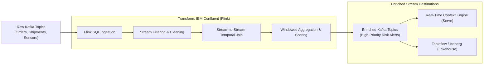

# Transform

Use **IBM Confluent (Flink)** to perform serverless, real-time stream processing, stateful computations, continuous event enrichment, filtering, and windowed aggregations directly on data in motion.

!!! info "Product mapping"
    **IBM Confluent (Flink)** — fully managed, serverless Apache Flink SQL stream processing engine integrated directly with Kafka topics.

!!! info "GitHub Repository"
    The complete source code and examples are available in the GitHub repository:

    [Building Blocks - Transform](https://github.com/ibm-self-serve-assets/building-blocks/tree/main/data/streamhouse/transform)

---

## Included Assets

*Coming soon*

---

## Bob Skills

| Skill | Description |
|---|---|
| **[confluent-iac-terraform](https://github.com/ibm-self-serve-assets/building-blocks/blob/main/ibm-bob/skills/data-streaming-confluent-terraform/SKILL.md)** | Expert guidance for authoring and deploying Apache Flink SQL statements, compute pools, and stream processing pipelines on Confluent Cloud |
| **[data-streaming-confluent](https://github.com/ibm-self-serve-assets/building-blocks/blob/main/ibm-bob/skills/data-streaming-confluent/SKILL.md)** | Provides Flink SQL syntax templates, stateful stream processing patterns, and Kafka topic integration |

!!! tip "Installing skills"
    Download the skill `.zip` files and copy the skill folders to `~/.bob/skills` (global) or `<project>/.bob/skills` (project-level). See the [Data Skills and Modes](../../bob-skills-and-modes.md) page for full installation instructions.

---

## Why It Matters

Raw data streams are often noisy, fragmented, and lack contextual enrichment. Batch processing delays transformations until data lands on disk, missing critical real-time decision windows. **Transform** runs stream processing queries continuously over unbounded data streams, allowing organizations to filter out noise, join disparate event streams, compute rolling metrics, and produce high-value derived streams with sub-second latency.

---

## Business Value

!!! success "Key outcomes"
    | Outcome | What It Means |
    |---|---|
    | **Instant stream processing** | Execute continuous computations over data streams the instant new events arrive |
    | **Simplified SQL interface** | Write standard ANSI SQL queries over unbounded streams instead of complex Java/Scala stream processing code |
    | **Serverless elasticity** | Auto-scales compute capacity (Confluent Flink Units) up and down based on stream throughput without cluster management |
    | **Stateful event correlation** | Track temporal context, session windows, and multi-stream joins with exactly-once consistency |
    | **Enriched data products** | Produce clean, high-signal event streams ready for consumption by AI agents, operational systems, and lakehouse storage |

---

## When to Use

Use Transform when:

- You need to **filter, mask, normalize, or enrich** incoming Kafka events in flight.
- You require **temporal aggregations** (e.g., 5-minute tumbling average, sliding window transaction counts).
- You must **join multiple event streams** in real time (e.g., matching payment events with fraud detection signals).
- You are calculating **real-time risk scores, anomaly detections, or operational KPIs**.

---

## Core Capabilities

| Capability | Component | What It Does |
|---|---|---|
| **Continuous SQL Processing** | Apache Flink SQL | ANSI SQL syntax for queries, projections, filtering, and complex CASE transformations over streams |
| **Windowed Aggregations** | Tumbling, Hopping, Session Windows | Computes time-bound statistics and aggregations over streaming time-series data |
| **Stream-to-Stream Joins** | Temporal & Interval Joins | Combines separate event streams based on common keys within defined time boundaries |
| **Dynamic Table & Stream Duality** | Flink Dynamic Tables | Seamlessly converts streaming append logs into queryable dynamic state tables and back |

---

## Reference Architecture



---

## Example Flink SQL Pattern

```sql
-- Compute rolling 10-minute supplier risk score by joining shipment updates and weather alerts
CREATE TABLE enriched_supply_risk AS
SELECT 
    s.supplier_id,
    s.shipment_id,
    w.severity AS weather_severity,
    COUNT(s.event_id) AS event_count,
    AVG(s.delay_minutes) AS avg_delay,
    CURRENT_WATERMARK(s.event_time) AS calculation_time
FROM shipments /*+ WATERMARK FOR event_time AS event_time - INTERVAL '5' SECOND */ s
JOIN weather_alerts /*+ WATERMARK FOR alert_time AS alert_time - INTERVAL '5' SECOND */ w
    ON s.region_code = w.region_code
    AND s.event_time BETWEEN w.alert_time - INTERVAL '1' HOUR AND w.alert_time + INTERVAL '1' HOUR
GROUP BY 
    s.supplier_id, 
    s.shipment_id, 
    w.severity, 
    TUMBLE(s.event_time, INTERVAL '10' MINUTE);
```

---

## What to Demonstrate

1. Open the Confluent Cloud Flink workspace.
2. Author an interactive Flink SQL query against an active Kafka stream.
3. Show live updating query results as new events stream into the topic.
4. Create a persistent Flink statement that writes enriched results to an output Kafka topic.
5. Demonstrate windowed aggregations and time-based stream joins in real time.

---

## Design Considerations

!!! tip "Stream processing best practices"
    - Define clear **watermark strategies** to handle out-of-order or late-arriving events accurately.
    - Set appropriate **state retention time-to-live (TTL)** for stateful joins to avoid unbounded state growth.
    - Optimize Flink compute pool allocation (CFUs) based on workload burstiness and latency requirements.
    - Validate downstream schema contracts before emitting new transformed event structures.

---

## IBM Products Used

| Product | Role |
|---|---|
| **[IBM Confluent (Flink)](https://www.ibm.com/products/confluent)** | Serverless, fully managed Apache Flink stream processing engine |
| **[Confluent Cloud Flink Documentation](https://docs.confluent.io/cloud/current/flink/overview.html)** | Reference for Flink SQL statements, built-in functions, and compute pool management |
