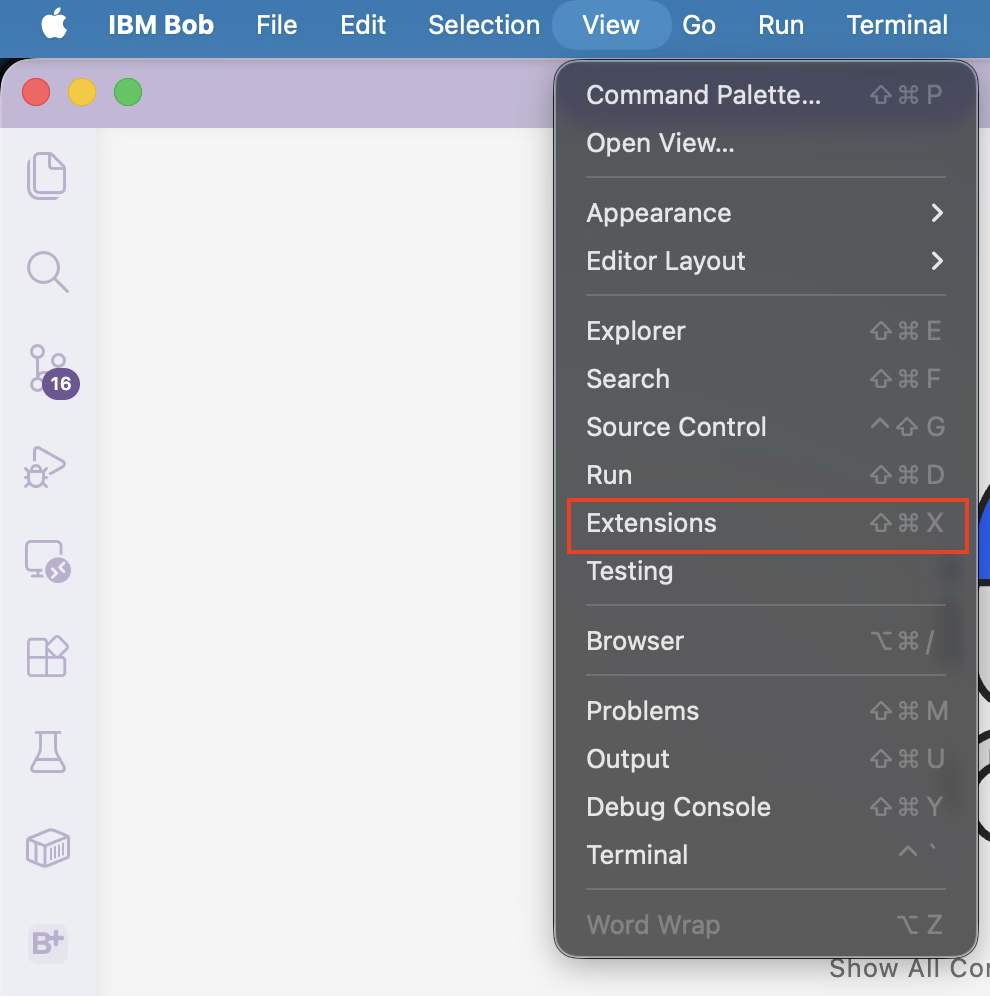
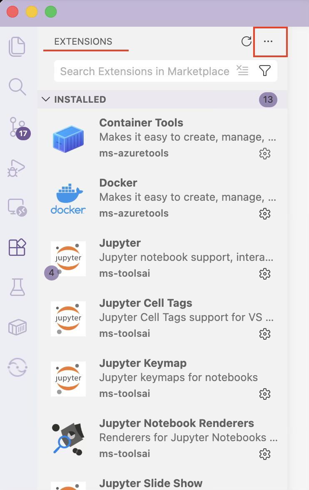
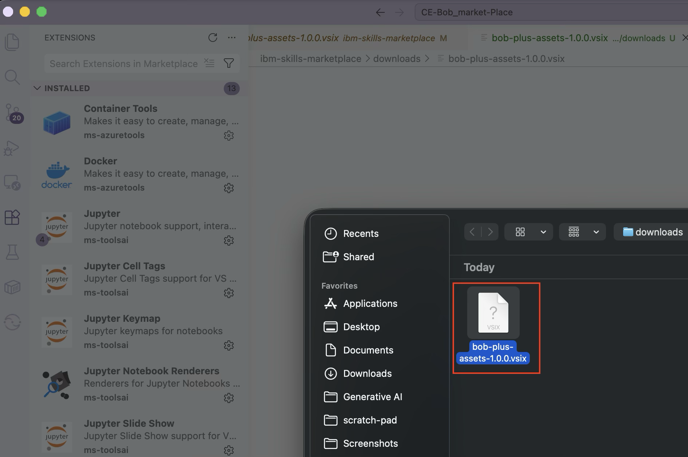
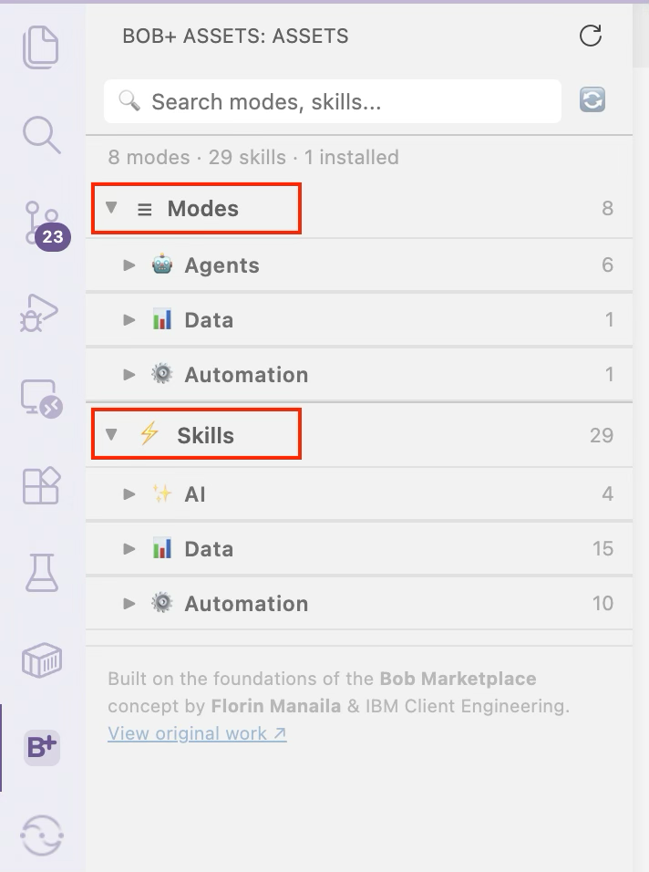

# Installing the Bob+ Extension

The **Bob+ extension** brings the Building Blocks Marketplace directly into IBM Bob — letting you browse, install, and manage curated Skills and Modes without leaving your IDE.

!!! tip "Before you begin"
    Make sure you have a **project folder open** in IBM Bob before installing assets from the Marketplace.

## What's Covered

| Step | What You'll Do |
|------|---------------|
| **[Step 1 — Download the VSIX](#step-1-download-the-vsix)** | Get the extension package from GitHub |
| **[Step 2 — Install in IBM Bob](#step-2-install-in-ibm-bob)** | Install the `.vsix` via the Extensions panel |
| **[Step 3 — Open Bob+](#step-3-open-bob-span-stylecolor0f62fespan)** | Access the Marketplace from the Activity Bar |
| **[Step 4 — Install Skills and Modes](#step-4-install-skills-and-modes)** | Browse and install assets into your workspace |

---

## Step 1 — Download the VSIX

1. Go to the [**building-blocks extension page**](https://github.com/ibm-self-serve-assets/building-blocks/tree/main/ibm-bob/extension) on GitHub.
2. Download the latest `.vsix` file listed under Assets (e.g. `bob-plus-assets-1.0.0.vsix`).
3. Save the file locally — you will use it in Step 2.

{ width=720 }

---

## Step 2 — Install in IBM Bob

1. Open **IBM Bob**.
2. Open the **Extensions** panel using either option:
    - Click the **Extensions** icon in the Activity Bar, or press `Cmd+Shift+X` (Mac) / `Ctrl+Shift+X` (Windows/Linux)
    - Go to **View → Extensions** from the menu bar

    { width=480 height=150 }

    { width=360 height=150 }

3. Click the **three-dots menu** (`···`) in the top right of the Extensions panel.
4. Select **Install from VSIX…**

    { width=480 }

5. Choose the downloaded `.vsix` file and click **Open**.

    { width=480 }

6. **Reload** the window when prompted:
    - Click **Reload** if a notification appears, or
    - Press `Cmd+Shift+P` (Mac) / `Ctrl+Shift+P` (Windows/Linux), type **Developer: Reload Window**, and press `Enter`

    { width=480 }

!!! info ""
    You only need to install the extension once.

---

## Step 3 — Open Bob+

1. Click the **B+** icon in the Activity Bar on the left.

    { width=360 }

2. Bob+ opens showing **Modes** and **Skills**, grouped by domain.

    { width=360 }

3. Browse the items and click **Install** on anything you want to use — see [Step 4](#step-4-install-skills-and-modes) below.

!!! info ""
    No GitHub token required — uses the public GitHub API.

---

## Step 4 — Install Skills and Modes

1. Click **Install** on any Mode or Skill card.
2. A progress notification shows download status.
3. Skills land in `.bob/skills/` and modes merge into `.bob/custom_modes.yaml`.

{ width=360 }

!!! info ""
    All assets are installed into your current workspace `.bob/` folder. To remove an asset, click the **Uninstall** button on its card.

---

## Next Steps

You're all set — start building with the Building Blocks Marketplace for IBM Bob+.

!!! tip ""
    Use the search bar in Bob+ to find Skills and Modes by name or domain.

- Browse available assets on the **[Skills](../skills/index.md)** page
- Explore **[Bob Modes](../index.md)** to tailor Bob's behaviour for your domain

---

## Updating the Extension

When a new version is released:

1. Download the new `.vsix` from the [**building-blocks extension page**](https://github.com/ibm-self-serve-assets/building-blocks/tree/main/ibm-bob/extension).
2. Repeat **Step 2** — install the new `.vsix` over the existing one.
3. Reload the window when prompted.

!!! info ""
    Your installed Skills and Modes in `.bob/` are not affected by extension updates.
