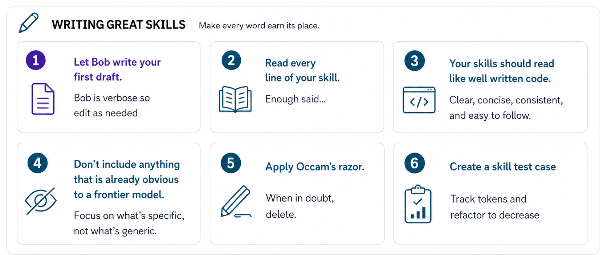
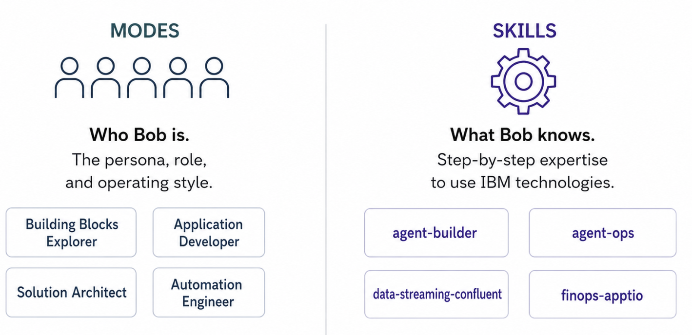

<link rel="stylesheet" href="./skills.css">

# Skills for the IBM Building Blocks

This collection of [Skills for IBM Bob](https://bob.ibm.com/docs/ide/features/skills) provides IBM Bob with the expertise to quickly build applications using the [IBM Building Blocks](../../index.md).   Each skill focuses on a specific Building Block and contains task-specific instructions, code patterns, examples and constraints Bob should follow when doing engineering work.

 - [Skill Taxonomy](#skill-taxonomy)
 - [Contributing to Skills for IBM Building Blocks](#contributing-to-skills-for-ibm-building-blocks)
 - [Skills vs Modes](#skills-vs-modes)

## Quick Start  
The Skills have been packed into a single .zip that you can easily download and install.

1. Go to the [skills.zip page](https://github.com/ibm-self-serve-assets/building-blocks/blob/main/ibm-bob/skills/skills.zip) 
2. Click the `Download raw file` icon at the upper-right of the page.
   

4. Copy all skill folders into either your global or project-level `.bob` folder:
    - global = `~/.bob/skills`
    - project = `<project>/.bob/skills`

5. Bob will automatically activate the appropriate skill when working on related tasks.

## Skill Taxonomy

Each Skill for IBM Building Blocks often aligns with an IBM product but not always.  For specifics on how each skill works, read through the associated SKILL.md.  

  <table class="skill-card" style="--accent:#6adada; --header:#e8fbfb; --th:#d7f7f7; --first-td:#f0fdfd; --grid:#b8eeee; --text:#021f1f;">
    <tbody>
      <thead><tr><th colspan="2">
        
AI Skills

      </th></tr></thead>
      <tr>
        <td>
Agents
</td>
        <td>
            <a href="https://github.com/ibm-self-serve-assets/building-blocks/blob/main/ibm-bob/skills/agent-builder/SKILL.md">agent-builder</a>
             Build and deploy multi-agent systems with tools (MCP servers) using watsonx Orchestrate's Agent Development Kit (ADK), CLI and REST API.
        </td>
      </tr>
      <tr>
        <td>
AI Trust
</td>
        <td>
            
<a href="https://github.com/ibm-self-serve-assets/building-blocks/blob/main/ibm-bob/skills/agent-ops/SKILL.md">agent-ops</a>
             Coming soon

        </td>
      </tr>
    </tbody>
  </table>

  <table class="skill-card" style="--accent:#aacaff; --header:#edf4ff; --th:#dfeaff; --first-td:#f3f7ff; --grid:#c9dcff; --text:#031040;">
    <tbody>
      <thead><tr><th colspan="2">
        
Data Skills

      </th></tr></thead>
      <tr>
        <td>
Integration
</td>
        <td>
            
<a href="https://github.com/ibm-self-serve-assets/building-blocks/tree/main/ibm-bob/skills/data-streaming-confluent">data-streaming-confluent</a>
             Works with the Confluent Platform for real-time data streaming, Kafka topic management, stream processing configuration, and data pipeline setup for event-driven architectures.

            
<a href="https://github.com/ibm-self-serve-assets/building-blocks/blob/main/ibm-bob/skills/data-streaming-confluent-terraform/SKILL.md">data-streaming-confluent-terraform</a>
             Expert guidance for building real-time streaming systems on Confluent Cloud using Infrastructure-as-Code (Terraform), Apache Flink SQL, and Python producers. Adapts to any streaming use case (IoT, finance, retail, healthcare, logistics) while maintaining production-ready quality.

        </td>
      </tr>
      <tr>
        <td>
Intelligence
</td>
        <td>
            
<a href="https://github.com/ibm-self-serve-assets/building-blocks/blob/main/ibm-bob/skills/data-enrichment/SKILL.md">data-enrichment</a>
             Coming soon

        </td>
      </tr>
      <tr>
        <td>
Query
</td>
        <td>
            
<a href="https://github.com/ibm-self-serve-assets/building-blocks/blob/main/ibm-bob/skills/no-sql-astradb/SKILL.md">no-sql-astradb</a>
             Coming soon

        </td>
      </tr>
    </tbody>
  </table>

  <table class="skill-card" style="--accent:#d5acff; --header:#f7efff; --th:#eedcff; --first-td:#fbf6ff; --grid:#e4c9ff; --text:#160040;">
    <tbody>
      <thead><tr><th colspan="2">
        
Automation Skills

      </th></tr></thead>
      <tr>
        <td>
Build
</td>
        <td>
            
<a href="https://github.com/ibm-self-serve-assets/building-blocks/blob/main/ibm-bob/skills/infrastructure-as-code-ansible/SKILL.md">infrastructure-as-code-ansible</a>
             Coming soon

        </td>
      </tr>
      <tr>
        <td>
Modernize
</td>
        <td>
            
<a href="https://github.com/ibm-self-serve-assets/building-blocks/blob/main/ibm-bob/skills/code-modernization-java/SKILL.md">code-modernization-java</a>
             Coming soon

        </td>
      </tr>
      <tr>
        <td>
Optimize
</td>
        <td>
            
<a href="https://github.com/ibm-self-serve-assets/building-blocks/blob/main/ibm-bob/skills/automated-resource-mgmt-turbonomic/SKILL.md">automated-resource-management-turbonomics</a>
             Automates application resource management at scale with the precision required to assure application performance. It continuously analyzes and optimizes compute, storage, and network resources in real time, helping organizations improve application resiliency, maximize infrastructure utilization, reduce operational costs, and ensure applications always receive the resources.

        </td>
      </tr>
    </tbody>
  </table>

## Contributing to Skills for IBM Building Blocks

Start by reading [Bob's Skills documentation](https://bob.ibm.com/docs/ide/features/skills) plus these [skill authoring best practices](https://platform.claude.com/docs/en/agents-and-tools/agent-skills/best-practices).  

Skills are not meant to restate generic programming, architecture or cloud development concepts. IBM Bob is a frontier model with PhD-level knowledge across most engineering domains, so these Skills skip reiterating the basics.  

Instead, these Skills encode the local, up-to-date know-how that does-not-yet reside in Bob's memory, mostly because it's too new, like code library updates, API endpoints or CLI command syntax for IBM' latest product releases. 

A well-written skill captures the parts of engineering practice that are usually scattered across docs, repos, examples, Slack threads, and senior-engineer muscle memory. A good Skill tells Bob what inputs are required, what rules to follow, necessary syntax elements, but most important, a good skill ensures Bob let's IBM engineers, partners and customers focus more on the use case and less on the underlying complexity of modern agentic applications.

If you want to contribute to Skills for IBM Building Blocks, please open a pull request with your edits/submissions. Any other questions, contact us on [#build-engineering-ww](https://ibm.enterprise.slack.com/archives/C08HV6MN4RE)

## Skills vs Modes

IBM Bob uses both [Modes](https://bob.ibm.com/docs/ide/features/modes) and [Skills](https://bob.ibm.com/docs/ide/features/skills), but they solve different problems.

A **Mode** defines the role Bob is operating in. It sets the posture, behavior, tool usage, and level of autonomy Bob should apply to the work. A Mode answers the question: *What kind of engineer is Bob acting as right now?*

A **Skill** defines the specific engineering knowledge Bob should use while doing the work. It provides task-level instructions, implementation patterns, examples, constraints, and known-good approaches for a particular Building Block. A Skill answers the question: *What does Bob need to know to do this task correctly?*

Put another way: **Modes shape how Bob thinks. Skills shape what Bob knows how to do.** For example, an `AI Solution Architect` mode could use multiple Building Block Skills to design an agentic application architecture: `agent-builder + agent-ops` and `no-sql-astradb`. A `Data Engineer` mode might also use the `no-sql-astradb` skill but also use the `data-pipeline-wxdata` and `data-streaming-confluent` skills too.
