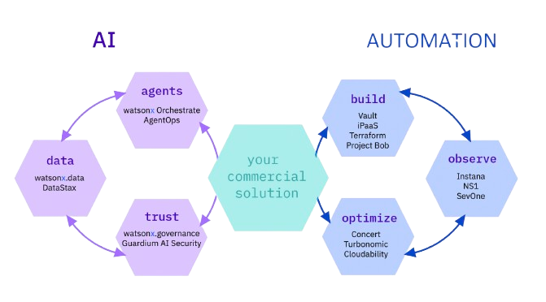

# IBM Building Blocks – Documentation

Welcome to the **IBM Building Blocks**.

**Building Blocks** are pre-built, embeddable application capabilities that span AI (Agents, Trust, and Data) and Automation (Build, Observe, and Optimize). They are designed to accelerate innovation by enabling teams to rapidly infuse advanced IBM capabilities directly into their applications.

These **ready-to-use components** simplify the entire lifecycle—development, integration, deployment, and operation—allowing teams to deliver solutions faster and with significantly less complexity. Each Building Block acts as a reference implementation, demonstrating how IBM’s Data & AI and Automation platforms integrate seamlessly within real-world enterprise applications.

By adopting these **proven and tested** patterns, organizations can reduce engineering effort, minimize risk, and achieve a faster time-to-value while maintaining enterprise-grade scalability, security, and governance.

Today, we offer a **portfolio of 20 Building Blocks**, purpose-built to deliver IBM technology in a modular, flexible, and composable manner. This approach empowers partners and development teams to selectively integrate the exact capabilities they need, enabling them to create tailored, differentiated solutions for their customers without reinventing foundational components.

## Capability Areas

- **AI Core Capabilities**

**Agents**
Reusable, enterprise-ready AI building blocks that accelerate agent adoption by enabling the design, orchestration, and deployment of intelligent agents across business workflows.

**Trust**
Capabilities that evaluate, tune, and compare prompts and models to optimize outcomes. These building blocks help teams select the most appropriate models for each use case while ensuring transparency, compliance, and responsible AI practices.

**Data**
Data for AI Building Blocks accelerate decision-making and improve productivity by enabling intelligent access to enterprise data. They unlock new ways to interact with complex systems—driving smarter, faster, and more efficient operations across the organization.

- **Automation Core Capabilities**

**Build**
Enables secure, automated integration and workflow orchestration across applications and clouds. These building blocks deliver identity and access control, infrastructure automation, and AI-assisted development to support faster, governed deployments.

**Observe**
Provides end-to-end visibility across applications and infrastructure, detecting dependencies and performance issues in real time. Advanced network analytics help monitor data flows, optimize connectivity, and ensure reliable performance across hybrid environments.

**Optimize**
Delivers continuous monitoring, policy enforcement, and self-healing workflows. These building blocks enable cost-efficient operations, dynamic resource management, and real-time observability to maintain optimal performance, governance, and financial efficiency across hybrid and multicloud environments.

Use the navigation to explore each building block in detail.