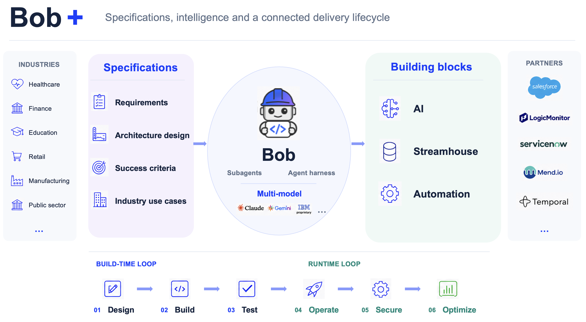

# Bob+

**Bob+** provide a unified digital experience for discovering, adopting, and implementing reusable IBM capabilities across AI (Agents, Trust, Data) and Automation (Operate, Secure, Optimize).

Powered by **IBM Bob**, technical teams receive AI-assisted guidance across the entire development lifecycle—from solution design and coding to modernization, deployment, and optimization—accelerating time-to-value while ensuring enterprise-grade security, governance, and consistency.

# Digital Experience with Bob+

Bob+ combines Generative AI with IBM technology expertise to serve as an intelligent engineering companion across the software lifecycle. Instead of navigating fragmented documentation and APIs, teams interact with a single assistant that recommends the right Building Blocks, abstracts implementation complexity, and accelerates building, modernizing, and operating applications.

## Capability Areas

**[AI Core Capabilities](ai-core/index.md)**

- **[Agents](ai-core/agents/index.md)**
  Enterprise-ready building blocks for creating, orchestrating, and deploying autonomous AI agents that integrate with enterprise systems and business workflows.

    | Building Block | What It Enables |
    |---|---|
    | [Agent Builder](ai-core/agents/agent-builder.md) | Create and deploy LLM-backed, tool-calling agents — from local development to production |
    | [Multi-Agent Orchestration](ai-core/agents/multi-agent-orchestration.md) | Coordinate agents and route LLM calls across providers via open standards (A2A, MCP, AI Gateway) |

- **[AI Control Plane](ai-core/ai-control-plane/index.md)**
  Evaluate, observe, govern, and enforce policy across every AI agent and model in production — making AI safe and compliant at enterprise scale.

    | Building Block | What It Enables |
    |---|---|
    | [Agent Ops](ai-core/ai-control-plane/agent-ops.md) | Evaluate, observe, and govern agents — benchmarking, red-teaming, runtime guardrails, cost tracking |
    | [AI Cost Management](ai-core/ai-control-plane/ai-cost-management.md) | Track, allocate, and optimize the cost of AI workloads across the enterprise |
    | [AI Compliance](ai-core/ai-control-plane/ai-compliance.md) | Map AI use cases to regulations, manage risk assessments, and report compliance posture |
    <!-- Hidden for now: | [Lifecycle Management](ai-core/ai-control-plane/lifecycle-management.md) | Manage AI models and agents from onboarding through retirement | -->

- **[AI Engineering](ai-core/ai-engineering/index.md)**
  Accelerates every phase of software delivery — building new systems with AI assistance and systematically modernizing legacy applications.

    | Building Block | What It Enables |
    |---|---|
    | [Agentic SDLC](ai-core/ai-engineering/agentic-sdlc.md) | IDE-native AI agent spanning planning, coding, testing, documentation, modernization, and CI/CD |
    | [Code Modernization](ai-core/ai-engineering/code-modernization.md) | Transform legacy Java, mainframe, IBM Z, and IBM i applications into modern cloud-native systems |
    | [Integration as Code](ai-core/ai-engineering/integration-as-code.md) | Connect SaaS apps, on-premise systems, APIs, and event streams through a low-code iPaaS model |
    | [Headless Bob](ai-core/ai-engineering/headless-bob.md) | Run Bob autonomously in CI/CD pipelines, scheduled jobs, and event-driven automations |
    

**[Data Core Capabilities](data-core/index.md)**

- **[Streamhouse](data-core/streamhouse/index.md)**
  Captures, transports, transforms, governs, and serves the continuously current state of enterprise business events to production applications, analytics, and AI agents at sub-second latency.

    | Building Block | What It Enables |
    |---|---|
    | [Real-Time streaming](data-core/streamhouse/real-time-streaming/index.md) | Capture and transport enterprise event streams and CDC from databases, SaaS, and IoT |
    | [Transform](data-core/streamhouse/transform/index.md) | Real-time stream processing, event enrichment, filtering, and windowed aggregations in motion |
    | [Govern](data-core/streamhouse/govern/index.md) | Enforce schema contracts, trace stream lineage, evaluate data quality rules, and catalog data products |
    | [Serve](data-core/streamhouse/serve/index.md) | Deliver low-latency live state to AI agents (MCP/REST) and open Iceberg tables for lakehouse analytics |

- **[Pipelines](data-core/pipelines/index.md)**
  Prepares, transforms, moves, and indexes structured and unstructured data into AI-ready representations — covering RAG, document parsing, Text2SQL, visual batch ETL, and high-speed WAN synchronization.

    | Building Block | What It Enables |
    |---|---|
    | [RAG](data-core/pipelines/rag/index.md) | Ground applications and agents with governed enterprise documents and hybrid retrieval |
    | [UDI](data-core/pipelines/udi/index.md) | Ingest, parse, cleanse, chunk, and structure complex unstructured documents for RAG and AI |
    | [Text2SQL](data-core/pipelines/text2sql/index.md) | Convert natural-language questions into SQL using enriched metadata context |
    | [ETL](data-core/pipelines/etl/index.md) | Build governed visual batch integration flows across enterprise sources and lakehouse targets |
    | [Data Sync](data-core/pipelines/data-sync/index.md) | Synchronize large file sets, media, and AI repositories securely across WAN at wire speed |

- **[Lakehouse](data-core/lakehouse/index.md)**
  Unified lakehouse analytics, multi-engine compute, metadata governance, data observability, and serverless vector retrieval without data duplication.

    | Building Block | What It Enables |
    |---|---|
    | [Meta Data Enrichment and Quality](data-core/lakehouse/metadata-enrichment/index.md) | Add business terms, descriptions, profiling, quality rules, and lineage to lakehouse assets |
    | [Data Observability](data-core/lakehouse/data-observability/index.md) | Detect pipeline failures, data drift, volume anomalies, and SLA breaches before users notice |
    | [Zero-Copy Lakehouse](data-core/lakehouse/zero-copy-lakehouse/index.md) | Query and process distributed data in place without copying using open Apache Iceberg tables |
    | [Serverless Vector](data-core/lakehouse/serverless-vector/index.md) | Elastic serverless vector storage for semantic search, RAG, and AI agent memory |

---

**[Automation Core Capabilities](automation-core/index.md)**

- **[Operate](automation-core/operate/index.md)**
  Automates infrastructure provisioning, configuration management, and workload scheduling to deliver consistent, repeatable pipelines across hybrid cloud environments — reducing manual toil and enabling teams to focus on higher-value work.

    | Building Block | What It Enables |
    |---|---|
    | [Infrastructure as Code](automation-core/operate/infrastructure-as-code.md) | Declarative, version-controlled provisioning across hybrid and multi-cloud environments |
    | [Configure & Automate](automation-core/operate/configure-automate.md) | Agentless, idempotent configuration management and IT automation at enterprise scale |
    | [Workload Orchestration & Scheduling](automation-core/operate/workload-orchestration.md) | Unified scheduling of containers, VMs, batch jobs, and binaries under a single control plane |

- **[Secure](automation-core/secure/index.md)**
  Protects enterprise applications, data, and infrastructure through comprehensive identity management, continuous compliance monitoring, and quantum-safe cryptographic capabilities.

    | Building Block | What It Enables |
    |---|---|
    | [Non-human Identity & Secret Management](automation-core/secure/non-human-identity.md) | Centralized identity governance and dynamic secrets management across hybrid environments |
    | [Application Risk & Continuous Compliance](automation-core/secure/application-risk.md) | Unified application risk visibility, CVE monitoring, and automated compliance posture management |
    | [Cryptographic & Quantum-Safe Readiness](automation-core/secure/cryptographic-readiness.md) | Discover, govern, and migrate cryptographic assets to quantum-safe algorithms |

- **[Optimize](automation-core/optimize/index.md)**
  Continuously improves observability, application performance, cost efficiency, and network health through intelligent automation and analytics across hybrid cloud environments.

    | Building Block | What It Enables |
    |---|---|
    | [Full-Stack Application Observability](automation-core/optimize/full-stack-observability.md) | Automated, real-time visibility across every tier of hybrid applications |
    | [Application Performance](automation-core/optimize/application-performance.md) | Demand-driven resource optimization balancing performance and cost continuously |
    | [Technology Financial Management & FinOps](automation-core/optimize/technology-financial-management.md) | Granular cloud spend visibility, cost allocation, and forecasting |
    | [Network Performance Management](automation-core/optimize/network-performance.md) | High-frequency network monitoring, capacity planning, and AI-powered anomaly detection |

---

!!! info "Get started — install the Bob+ extension"
    The **Bob+ extension** brings the Building Blocks Marketplace directly into IBM Bob, letting you browse and install Skills and Modes without leaving your IDE. [**→ Extension Installation Guide**](ibm-bob/extension/install.md)
