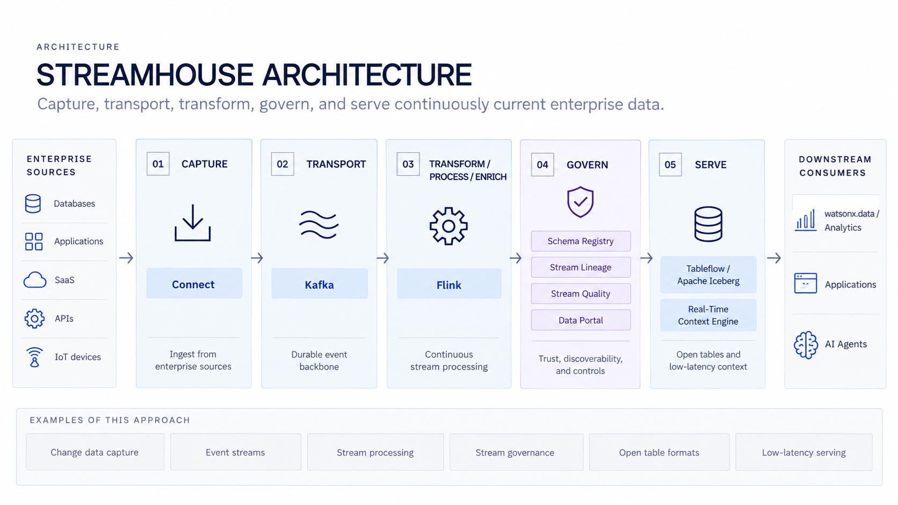
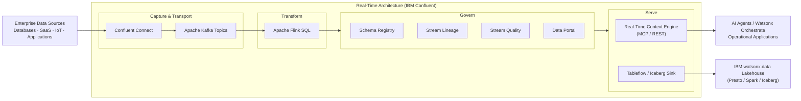

# Real-Time – Building Blocks

The **Real-Time** use case provides a real-time, production-native, and decentralized data architecture that keeps the **continuously current state of a business** available to production applications, analytics, and AI agents.

!!! info "Category Definition"
    **Real-Time** is an open, vendor-neutral category for data architectures that empower organizations to **capture, transport, transform, govern, and serve** data in motion at production service levels. IBM delivers the complete Real-Time architecture through **IBM Confluent**.

---

## Available Building Blocks

| Capability | Products | Best Fit |
|---|---|---|
| **[Stream](stream/index.md)** | IBM Confluent — Connectors & Kafka | Capture and transport enterprise event streams from databases, SaaS, IoT, and applications |
| **[Transform](transform/index.md)** | IBM Confluent (Flink) | Real-time stream processing, stateful computation, windowing, filtering, and event enrichment |
| **[Govern](govern/index.md)** | IBM Confluent — Stream Governance | Enforce schema contracts, end-to-end stream lineage, data quality rules, and catalog discovery |
| **[Serve](serve/index.md)** | IBM Confluent — RTCE & Tableflow | Expose live state to AI agents via Real-Time Context Engine (MCP/REST) and open Iceberg tables for lakehouse analytics |

---

## Business Value

!!! success "Why Real-Time matters"
    - **Real-time freshness** — data remains continuously current as business events occur, replacing stale batch snapshots.
    - **Production-native reliability** — engineered to mission-critical SLAs so production applications and autonomous AI agents can depend on it continuously.
    - **Decentralized data access** — meets data where it already lives across databases, applications, cloud services, and edge devices.
    - **Single stream for ops and analytics** — powers both real-time operational applications and open-table lakehouse analytics without redundant ETL pipelines.
    - **Governed and trustworthy AI context** — grounds AI agents in live operational facts with strict data contracts and end-to-end lineage.

---

## When to Use

| Scenario | Recommended Building Block |
|---|---|
| Ingesting CDC from databases, SaaS, mainframes, or IoT feeds into durable event streams | [Stream](stream/index.md) |
| Filtering, aggregating, or joining high-volume streams continuously in motion | [Transform](transform/index.md) |
| Enforcing schema compatibility, tracking stream lineage, and setting data quality contracts | [Govern](govern/index.md) |
| Delivering low-latency live state to AI agents via MCP/REST or streaming to Apache Iceberg tables | [Serve](serve/index.md) |

---

## Reference Architecture

---

## IBM Products Used

| Product | Role in Real-Time |
|---|---|
| **[IBM Confluent](https://www.ibm.com/products/confluent)** | Complete managed Real-Time platform delivering Connectors, Kafka, Apache Flink, Stream Governance, Tableflow, and Real-Time Context Engine |
| **[IBM watsonx.data](https://www.ibm.com/products/watsonx-data)** | Open hybrid lakehouse platform consuming Iceberg tables published by Real-Time for multi-engine SQL analytics |
| **[IBM watsonx Orchestrate & AI Agents](https://www.ibm.com/products/watsonx-orchestrate)** | Operational AI agents consuming live business state from the Real-Time Context Engine via Model Context Protocol (MCP) |
