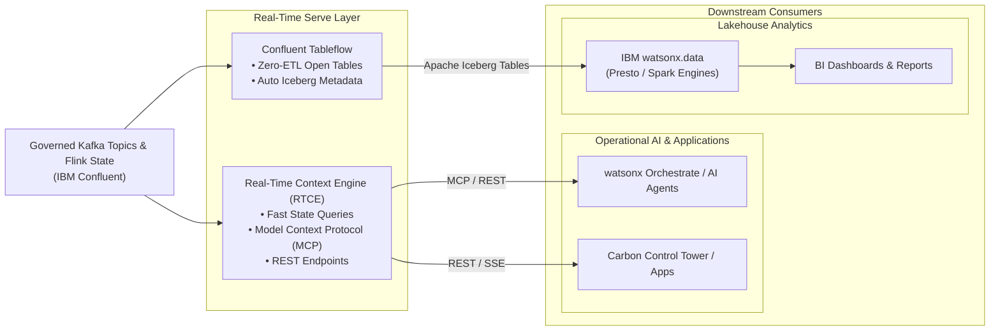
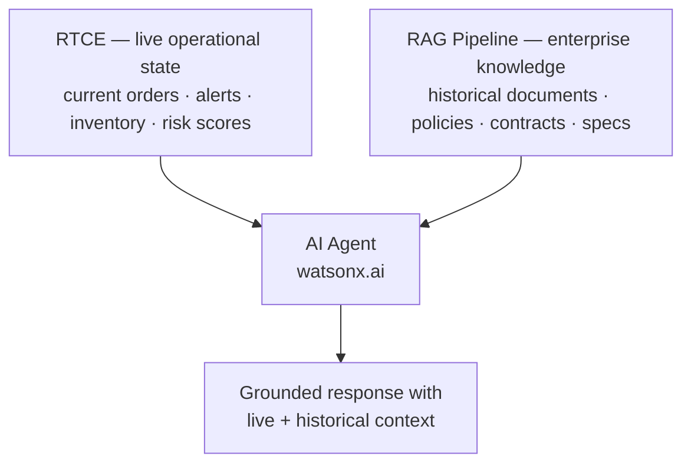

# Serve

Use **IBM Confluent Real-Time Context Engine (RTCE)** and **Tableflow** to serve continuously current business state to operational applications, AI agents, and open lakehouse query engines with sub-second latency.

!!! info "Product mapping"
    **IBM Confluent — RTCE & Tableflow** — Real-Time Context Engine (low-latency state serving via Model Context Protocol / REST for AI agents) and Confluent Tableflow (zero-ETL materialization of Kafka topics as Apache Iceberg tables).

!!! info "GitHub Repository"
    The complete source code and examples are available in the GitHub repository:

    [Building Blocks - Real-Time Serve](https://github.com/ibm-self-serve-assets/building-blocks/tree/main/streamhouse/real-time/serve)

---

## Included Assets

| Asset | Description |
|---|---|
| **[live-context-for-supply-chain-resilience](https://github.com/ibm-self-serve-assets/building-blocks/tree/main/streamhouse/real-time/serve/assets/live-context-for-supply-chain-resilience)** | Full-stack operational AI application combining Confluent Real-Time Context Engine, watsonx Orchestrate AI agents, and an IBM Carbon React control tower |
| **[streamhouse-continous-rag](https://github.com/ibm-self-serve-assets/building-blocks/tree/main/streamhouse/real-time/serve/assets/streamhouse-continous-rag)** | FactoryPulse Continuous RAG demo — Kafka/Flink RAG profiles, FastAPI backend, IBM Carbon UI, and IBM Code Engine deployment |

---

## Quick Start

**Live Context for Supply Chain Resilience:**

```bash
cd data/streamhouse/serve/assets/live-context-for-supply-chain-resilience/backend
cp .env.example .env
# Configure IBM Confluent, watsonx.ai, and watsonx Orchestrate credentials
pip install -r requirements.txt
python run.py
```

See [`assets/live-context-for-supply-chain-resilience/README.md`](https://github.com/ibm-self-serve-assets/building-blocks/tree/main/streamhouse/real-time/serve/assets/live-context-for-supply-chain-resilience) for full setup including the React UI and agent configuration.

**Streamhouse Continuous RAG:**

```bash
cd data/streamhouse/serve/assets/streamhouse-continous-rag
cp .env.example .env
# Configure Confluent Cloud, watsonx.ai embedding model, and IBM COS
pip install -r requirements.txt
python -m app.main
```

See [`assets/streamhouse-continous-rag/README.md`](https://github.com/ibm-self-serve-assets/building-blocks/tree/main/streamhouse/real-time/serve/assets/streamhouse-continous-rag) for Flink RAG profile setup and UI options.

---

## Bob Skills

| Skill | Description |
|---|---|
| **[data-streaming-confluent](https://github.com/ibm-self-serve-assets/building-blocks/blob/main/ibm-bob/skills/data-streaming-confluent/SKILL.md)** | Configures Confluent Tableflow, Apache Iceberg sink integrations, and RTCE endpoints for application consumption |
| **[streamhouse-continuous-rag](https://github.com/ibm-self-serve-assets/building-blocks/blob/main/streamhouse/real-time/serve/bob-skills/streamhouse-continuous-rag.zip)** | Combines Real-Time live operational state with RAG enterprise knowledge — designs and implements continuous RAG pipelines that ground AI agents in real-time context |

!!! tip "Installing skills"
    Download the skill `.zip` files and copy the skill folders to `~/.bob/skills` (global) or `<project>/.bob/skills` (project-level). See the [Data Skills and Modes](../../bob-skills-and-modes.md) page for full installation instructions.

---

## Why It Matters

Data is only as valuable as the decisions it empowers. In the Real-Time architecture, **Serve** provides the dual consumption layer that bridges data in motion with both **operational AI/applications** and **analytical lakehouses**:

1. **For AI Agents & Operational Apps**: The Real-Time Context Engine provides sub-second query access to the latest state of any business entity (e.g., current location of a shipment, real-time risk score, latest fraud alert) via standard protocols like Model Context Protocol (MCP) and REST.
2. **For Lakehouse Analytics**: Confluent Tableflow automatically materializes Kafka topics as open Apache Iceberg tables without custom ETL pipelines, making streaming data instantly queryable in IBM watsonx.data, Presto, and Apache Spark.

---

## Business Value

!!! success "Key outcomes"
    | Outcome | What It Means |
    |---|---|
    | **Ground AI in real-time truth** | AI agents receive live operational facts rather than stale batch data when formulating recommendations and taking actions |
    | **Zero-ETL lakehouse ingestion** | Tableflow converts streaming topics into Apache Iceberg tables in object storage with zero code |
    | **Standardized agent integration (MCP)** | Expose real-time state directly as Model Context Protocol (MCP) tools for LLMs and watsonx Orchestrate |
    | **Unified data architecture** | A single streaming pipeline feeds both low-latency operational systems and analytical data engines simultaneously |
    | **Open formats & no vendor lock-in** | Apache Iceberg tables generated by Tableflow are readable by any Iceberg-compatible query engine |

---

## When to Use

Use Serve when:

- AI agents or applications need **low-latency access to the current state** of business entities.
- You are building **Continuous RAG** architectures combining live streaming facts with document embeddings.
- You want to eliminate custom batch ETL pipelines to get streaming data into **Apache Iceberg tables in watsonx.data**.
- Real-time operational dashboards require sub-second state queries.

---

## Core Capabilities

| Capability | Component | What It Does |
|---|---|---|
| **Live State Serving for AI** | Real-Time Context Engine (RTCE) | Exposes entity state from stream tables to AI agents and apps via low-latency REST and Model Context Protocol (MCP) |
| **Zero-ETL Table Materialization** | Confluent Tableflow | Automatically writes Kafka event streams as Apache Iceberg tables in object storage with continuous catalog synchronization |
| **Iceberg Sink Integration** | Confluent Apache Iceberg Sink | Connects Kafka topics directly to IBM watsonx.data Apache Iceberg catalogs |
| **Continuous RAG Grounding** | RTCE + OpenRAG Integration | Merges real-time operational context from streams with semantic retrieval from enterprise documents |

---

## Reference Architecture



---

## Continuous RAG Pattern: Real-Time + Lakehouse

| Context Type | Provider | Characteristics | Example |
|---|---|---|---|
| **Static / Unstructured Context** | OpenRAG / OpenSearch | Long-term enterprise documents, policies, product guides | "What is our standard supplier SLA agreement?" |
| **Live / Operational Context** | Real-Time RTCE | Real-time events, current sensor metrics, live transit delays | "Where is supplier shipment #8942 right now and what is its risk status?" |

Combining both layers gives AI agents full contextual awareness — what the enterprise knows plus what is happening right now.



---

## What to Demonstrate

1. Configure **Tableflow** on an active Kafka topic to automatically create and sync an Apache Iceberg table in object storage.
2. Query the generated Iceberg table in **IBM watsonx.data** using Presto SQL to show zero-ETL data availability.
3. Launch the **Real-Time Context Engine (RTCE)** exposing live stream state as an MCP server.
4. Connect an AI agent (e.g., watsonx Orchestrate or IBM Bob) to the MCP server.
5. Ask the AI agent for current operational status and show it retrieving real-time state directly from the stream.

---

## Design Considerations

!!! tip "Serving design guidelines"
    - Use RTCE for point lookups and low-latency state retrieval; use Tableflow/Iceberg for multi-record analytics and aggregation queries.
    - Tune Iceberg table compaction and snapshot retention settings to balance write performance and query speed.
    - Secure RTCE endpoints with mutual TLS (mTLS) or API keys when integrating with external AI agent runtimes.
    - Structure MCP tool parameters clearly so LLMs can easily formulate accurate state queries.

---

## IBM Products Used

| Product | Role |
|---|---|
| **[IBM Confluent — RTCE](https://www.ibm.com/products/confluent)** | Real-Time Context Engine delivering low-latency operational state for applications and AI agents |
| **[Confluent Tableflow](https://docs.confluent.io/cloud/current/tableflow/overview.html)** | Converts Kafka topics into Apache Iceberg tables for lakehouse analytics |
| **[IBM watsonx.data](https://www.ibm.com/products/watsonx-data)** | Open hybrid lakehouse querying Iceberg tables generated by Tableflow via Presto and Spark |
| **[IBM watsonx Orchestrate](https://www.ibm.com/products/watsonx-orchestrate)** | AI agent platform consuming live state from RTCE via Model Context Protocol (MCP) |
